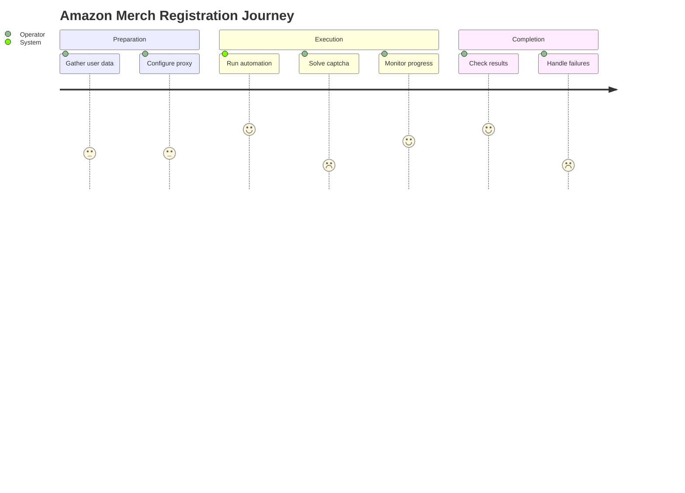
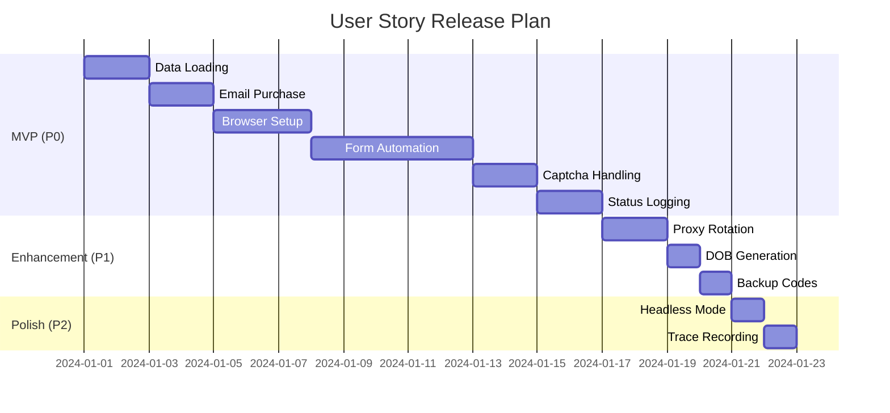

# User Story Map
## Amazon Merch Registration Automation

---

## 1. Overview

### User Persona

| Attribute | Details |
|-----------|---------|
| **Name** | Alex - POD Entrepreneur |
| **Role** | Operator (người chạy automation) |
| **Goal** | Đăng ký nhiều Amazon Merch accounts nhanh chóng |
| **Pain Points** | Tốn thời gian, bị block IP, quản lý nhiều emails |
| **Tech Level** | Intermediate (biết dùng CLI) |

### User Journey Overview



---

## 2. Epic Breakdown

### Epic Map View

```mermaid
flowchart LR
    subgraph E1[Epic 1: Data Preparation]
        F1[User Data Management]
        F2[Email Acquisition]
    end
    
    subgraph E2[Epic 2: Browser Automation]
        F3[Anti-Detection Setup]
        F4[Form Automation]
        F5[OTP Handling]
    end
    
    subgraph E3[Epic 3: Verification]
        F6[Email Verification]
        F7[Phone Verification]
        F8[Captcha Handling]
    end
    
    subgraph E4[Epic 4: Reporting]
        F9[Status Tracking]
        F10[Error Logging]
    end
    
    E1 --> E2
    E2 --> E3
    E3 --> E4
```



---

## 3. User Stories by Epic

### Epic 1: Data Preparation

#### Feature: User Data Management

| ID | User Story | Priority | Status |
|----|------------|----------|--------|
| US-1.1 | As an Operator, I want to **load user data from a text file** so that I don't have to enter information manually | P0 | ✅ Done |
| US-1.2 | As an Operator, I want the system to **automatically generate a valid DOB** so that age requirements are met | P0 | ✅ Done |
| US-1.3 | As an Operator, I want **used data to be removed from the file** so that I don't accidentally use the same data twice | P1 | ✅ Done |
| US-1.4 | As an Operator, I want to see **clear error messages** when data is missing or invalid | P1 | ✅ Done |

**Acceptance Criteria for US-1.1:**
```gherkin
Given I have a file "info_text.txt" with user data
When I run the automation
Then the system should read the first line
And parse 12 fields correctly (fullname, password, address...)
And display the parsed data in logs
```

**Traceability to Code:**
- File: `task2_data_manager.py`
- Function: `get_user_data()`
- Lines: 62-163

---

#### Feature: Email Acquisition

| ID | User Story | Priority | Status |
|----|------------|----------|--------|
| US-1.5 | As an Operator, I want the system to **buy a Hotmail email automatically** so that I don't need to create emails manually | P0 | ✅ Done |
| US-1.6 | As an Operator, I want to receive **email credentials (mail, password, token)** for later use | P0 | ✅ Done |
| US-1.7 | As an Operator, I want to see **API response details** for debugging | P2 | ✅ Done |

**Acceptance Criteria for US-1.5:**
```gherkin
Given I have a valid API key configured
When the system calls the email purchase API
Then I should receive a valid Hotmail email
And the email should have password and OAuth token
And the response should be logged
```

**Traceability to Code:**
- File: `task3_mail_service.py`
- Function: `buy_hotmail()`
- Lines: 26-124

---

### Epic 2: Browser Automation

#### Feature: Anti-Detection Setup

| ID | User Story | Priority | Status |
|----|------------|----------|--------|
| US-2.1 | As an Operator, I want to use **Camoufox browser** so that Amazon doesn't detect automation | P0 | ✅ Done |
| US-2.2 | As an Operator, I want to configure **proxy settings** to avoid IP blocking | P0 | ✅ Done |
| US-2.3 | As an Operator, I want **random proxy rotation** from a pool of IPs | P1 | ✅ Done |
| US-2.4 | As an Operator, I want the option to run in **headless mode** for background execution | P2 | ✅ Done |

**Acceptance Criteria for US-2.1:**
```gherkin
Given Camoufox is installed
When I start the automation
Then a Camoufox browser should launch
And the browser should have humanize mode enabled
And browser fingerprint should be masked
```

**Traceability to Code:**
- File: `task4_camoufox_workflow.py`
- Function: `start_browser()`
- Lines: 879-916

---

#### Feature: Form Automation

| ID | User Story | Priority | Status |
|----|------------|----------|--------|
| US-2.5 | As an Operator, I want the system to **auto-fill the registration form** with user data | P0 | ✅ Done |
| US-2.6 | As an Operator, I want **human-like typing** to avoid bot detection | P0 | ✅ Done |
| US-2.7 | As an Operator, I want **random delays between actions** to mimic human behavior | P0 | ✅ Done |
| US-2.8 | As an Operator, I want the system to **auto-fill Tax Interview** form | P0 | ✅ Done |
| US-2.9 | As an Operator, I want the system to **auto-complete the Questionnaire** | P0 | ✅ Done |

**Acceptance Criteria for US-2.5:**
```gherkin
Given I have valid user data loaded
When the registration form appears
Then the system should fill fullname, email, password
And type each character with random delay (50-150ms)
And wait random time (1-3s) between fields
```

**Traceability to Code:**
- File: `task4_camoufox_workflow.py`
- Functions: `step_1_create_account()`, `step_7_fill_profile_bank()`, `step_8_tax_interview()`, `step_9_questionnaire()`

---

#### Feature: OTP Handling

| ID | User Story | Priority | Status |
|----|------------|----------|--------|
| US-2.10 | As an Operator, I want the system to **automatically retrieve OTP from email** | P0 | ✅ Done |
| US-2.11 | As an Operator, I want **configurable polling interval and timeout** for OTP retrieval | P1 | ✅ Done |
| US-2.12 | As an Operator, I want to see **real-time OTP retrieval progress** | P2 | ✅ Done |

**Acceptance Criteria for US-2.10:**
```gherkin
Given an OTP email has been sent to the purchased email
When the system polls the OTP API
Then it should retrieve the OTP within 120 seconds
And automatically fill the OTP field
And continue to the next step
```

**Traceability to Code:**
- File: `task3_mail_service.py`
- Function: `get_otp()`
- Lines: 126-194

---

### Epic 3: Verification Handling

#### Feature: Captcha Handling

| ID | User Story | Priority | Status |
|----|------------|----------|--------|
| US-3.1 | As an Operator, I want the system to **pause and notify me** when Captcha appears | P0 | ✅ Done |
| US-3.2 | As an Operator, I want the system to **auto-detect Captcha completion** and continue | P0 | ✅ Done |
| US-3.3 | As an Operator, I want **clear instructions** on how to solve the Captcha | P1 | ✅ Done |

**Acceptance Criteria for US-3.1:**
```gherkin
Given the Amazon page shows a Captcha
When the system detects the Captcha
Then it should display "PAUSE: HÃY GIẢI CAPTCHA THỦ CÔNG"
And wait until the Captcha is solved
And automatically continue after detection
```

**Traceability to Code:**
- File: `task4_camoufox_workflow.py`
- Function: `step_2_handle_captcha()`
- Lines: 301-324

---

#### Feature: Phone Verification

| ID | User Story | Priority | Status |
|----|------------|----------|--------|
| US-3.4 | As an Operator, I want the system to **detect when phone verification is required** | P0 | ✅ Done |
| US-3.5 | As an Operator, I want to receive **a notification and pause** for manual phone verification | P0 | ✅ Done |
| US-3.6 | As an Operator, I want to **press Enter to continue** after completing phone verification | P0 | ✅ Done |

**Acceptance Criteria for US-3.4:**
```gherkin
Given the Amazon page requires phone verification
When the system detects the phone verification page
Then it should display instructions
And pause for manual verification
And wait for operator to press Enter
And take a screenshot for records
```

**Traceability to Code:**
- File: `task4_camoufox_workflow.py`
- Function: `step_6_verify_phone()`
- Lines: 466-503

---

### Epic 4: Reporting & Logging

#### Feature: Status Tracking

| ID | User Story | Priority | Status |
|----|------------|----------|--------|
| US-4.1 | As an Operator, I want **registration status logged to Excel** | P0 | ✅ Done |
| US-4.2 | As an Operator, I want to see **PENDING status** when automation starts | P0 | ✅ Done |
| US-4.3 | As an Operator, I want status updated to **SUCCESS or FAILED** when complete | P0 | ✅ Done |
| US-4.4 | As an Operator, I want to store **backup codes** in Excel | P1 | ✅ Done |
| US-4.5 | As an Operator, I want **timestamps** for all status changes | P1 | ✅ Done |

**Acceptance Criteria for US-4.1:**
```gherkin
Given I run the automation
When the process starts
Then a new row should be added to Excel with status "PENDING"
And include email, user data, profile name, timestamp
When the process completes successfully
Then status should be updated to "SUCCESS"
When the process fails
Then status should be updated to "FAILED" with error message
```

**Traceability to Code:**
- File: `task5_excel_reporter.py`
- Functions: `save_pending()`, `update_success()`, `update_failed()`, `update_status()`

---

#### Feature: Error Logging

| ID | User Story | Priority | Status |
|----|------------|----------|--------|
| US-4.6 | As an Operator, I want **detailed error messages** in console and log file | P0 | ✅ Done |
| US-4.7 | As an Operator, I want **screenshots on error** for debugging | P1 | ✅ Done |
| US-4.8 | As an Operator, I want **Playwright trace files** for replay | P2 | ✅ Done |

**Acceptance Criteria for US-4.6:**
```gherkin
Given an error occurs during automation
When the error is caught
Then a detailed error message should be logged
And a screenshot should be taken
And the Excel status should be updated to FAILED
And error details should be stored in Error_Message column
```

---

## 4. Story Map Summary

### Priority Matrix

| Priority | Stories Count | Status |
|----------|---------------|--------|
| P0 (Must Have) | 18 | ✅ 18/18 Done |
| P1 (Should Have) | 8 | ✅ 8/8 Done |
| P2 (Nice to Have) | 4 | ✅ 4/4 Done |
| **Total** | **30** | **✅ 30/30 Done** |

### Release Planning



---

**Document Version:** 1.0  
**Last Updated:** 2024-12-28  
**Author:** Business Analyst
