# Use Case Diagram
## Amazon Merch Registration Automation

---

## 1. System Boundary

```mermaid
flowchart TB
    subgraph SystemBoundary["🖥️ Amazon Merch Automation System"]
        UC1([UC-01: Run Full Automation])
        UC2([UC-02: Load User Data])
        UC3([UC-03: Purchase Email])
        UC4([UC-04: Configure Proxy])
        UC5([UC-05: Create Amazon Account])
        UC6([UC-06: Handle Captcha])
        UC7([UC-07: Verify Email OTP])
        UC8([UC-08: Handle Phone Verification])
        UC9([UC-09: Complete Tax Interview])
        UC10([UC-10: Submit Questionnaire])
        UC11([UC-11: Track Status in Excel])
        UC12([UC-12: Run Step-by-Step Test])
        UC13([UC-13: View Playwright Trace])
    end
    
    Operator["👤 Operator"]
    EmailAPI["📧 Email API\n(DongvanFB)"]
    ProxyAPI["🌐 Proxy Service\n(Decodo)"]
    Amazon["🛒 Amazon\nPlatform"]
    
    Operator --> UC1
    Operator --> UC6
    Operator --> UC8
    Operator --> UC12
    Operator --> UC13
    
    UC1 --> UC2
    UC1 --> UC3
    UC1 --> UC4
    UC1 --> UC5
    UC1 --> UC7
    UC1 --> UC9
    UC1 --> UC10
    UC1 --> UC11
    
    UC3 --> EmailAPI
    UC7 --> EmailAPI
    UC4 --> ProxyAPI
    UC5 --> Amazon
    UC6 --> Amazon
    UC9 --> Amazon
    UC10 --> Amazon
```

---

## 2. Actors Definition

### 2.1 Primary Actors

| Actor | Type | Description |
|-------|------|-------------|
| **Operator** | Human | Người chạy automation script. Có trách nhiệm: khởi động script, giải captcha, xử lý phone verification |

### 2.2 Secondary Actors (External Systems)

| Actor | Type | Description |
|-------|------|-------------|
| **Email API (DongvanFB)** | System | Cung cấp email và lấy OTP. Endpoints: /user/buy, /api/get_code_oauth2 |
| **Proxy Service (Decodo)** | System | Cung cấp proxy servers để tránh IP blocking |
| **Amazon Platform** | System | Hệ thống đăng ký Amazon Merch on Demand |

---

## 3. Use Case List

### 3.1 Core Use Cases (P0)

| ID | Use Case | Actor(s) | Priority |
|----|----------|----------|----------|
| UC-01 | Run Full Automation | Operator | P0 |
| UC-02 | Load User Data | System | P0 |
| UC-03 | Purchase Email | System, Email API | P0 |
| UC-05 | Create Amazon Account | System, Amazon | P0 |
| UC-07 | Verify Email OTP | System, Email API | P0 |
| UC-09 | Complete Tax Interview | System, Amazon | P0 |
| UC-10 | Submit Questionnaire | System, Amazon | P0 |
| UC-11 | Track Status in Excel | System | P0 |

### 3.2 Support Use Cases (P1)

| ID | Use Case | Actor(s) | Priority |
|----|----------|----------|----------|
| UC-04 | Configure Proxy | System, Proxy Service | P1 |
| UC-06 | Handle Captcha | Operator, Amazon | P1 |
| UC-08 | Handle Phone Verification | Operator, Amazon | P1 |

### 3.3 Utility Use Cases (P2)

| ID | Use Case | Actor(s) | Priority |
|----|----------|----------|----------|
| UC-12 | Run Step-by-Step Test | Operator | P2 |
| UC-13 | View Playwright Trace | Operator | P2 |

---

## 4. Use Case Relationships

### 4.1 Include Relationships

### 4.2 Extend Relationships

**Extension Points:**
- **UC-06 extends UC-05**: When Amazon displays Captcha challenge
- **UC-08 extends UC-07**: When Amazon requires phone verification

---

## 5. Detailed Use Case Diagram

### 5.1 Full Automation Flow

```mermaid
flowchart TB
    subgraph Actors
        OP["👤 Operator"]
    end
    
    subgraph External
        EA["📧 Email API"]
        PA["🌐 Proxy API"]
        AZ["🛒 Amazon"]
    end
    
    subgraph PhasePrep["Phase 1: Preparation"]
        UC2([UC-02: Load User Data])
        UC3([UC-03: Purchase Email])
        UC4([UC-04: Configure Proxy])
    end
    
    subgraph PhaseReg["Phase 2: Registration"]
        UC5([UC-05: Create Account])
        UC6([UC-06: Handle Captcha])
        UC7([UC-07: Verify Email OTP])
        UC8([UC-08: Phone Verification])
    end
    
    subgraph PhaseProfile["Phase 3: Profile"]
        UC9([UC-09: Tax Interview])
        UC10([UC-10: Questionnaire])
    end
    
    subgraph PhaseLog["Phase 4: Logging"]
        UC11([UC-11: Track Status])
    end
    
    OP --> UC2
    UC3 -.-> EA
    UC4 -.-> PA
    UC5 -.-> AZ
    UC6 -.-> AZ
    UC7 -.-> EA
    UC8 -.-> AZ
    UC9 -.-> AZ
    UC10 -.-> AZ
    
    UC2 --> UC3 --> UC4 --> UC5
    UC5 --> UC6
    UC6 --> UC7
    UC7 --> UC8
    UC8 --> UC9
    UC9 --> UC10
    UC10 --> UC11
    
    OP --> UC6
    OP --> UC8
```

### 5.2 Step-by-Step Testing

```mermaid
flowchart TB
    OP["👤 Operator"]
    
    UC12([UC-12: Step-by-Step Test])
    
    subgraph Steps["Individual Steps"]
        S0([Step 0: Setup])
        S1([Step 1: Create Account])
        S2([Step 2: Captcha])
        S3([Step 3: Email OTP])
        S4([Step 4: Accept Terms])
        S5([Step 5: 2FA Setup])
        S6([Step 6: Phone Verify])
        S7([Step 7: Profile & Bank])
        S8([Step 8: Tax Interview])
        S9([Step 9: Questionnaire])
        SC([Codegen Mode])
    end
    
    OP --> UC12
    UC12 --> S0
    UC12 --> S1
    UC12 --> S2
    UC12 --> S3
    UC12 --> S4
    UC12 --> S5
    UC12 --> S6
    UC12 --> S7
    UC12 --> S8
    UC12 --> S9
    UC12 --> SC
```

---

## 6. Traceability Matrix

### Use Case to Code Mapping

| Use Case | Primary File | Primary Function(s) |
|----------|--------------|---------------------|
| UC-01 | `main.py` | `main()` |
| UC-02 | `task2_data_manager.py` | `get_user_data()` |
| UC-03 | `task3_mail_service.py` | `buy_hotmail()` |
| UC-04 | `proxy_config.py` | `generate_random_proxy()` |
| UC-05 | `task4_camoufox_workflow.py` | `step_1_create_account()` |
| UC-06 | `task4_camoufox_workflow.py` | `step_2_handle_captcha()` |
| UC-07 | `task4_camoufox_workflow.py` | `step_3_verify_email()` |
| UC-08 | `task4_camoufox_workflow.py` | `step_6_verify_phone()` |
| UC-09 | `task4_camoufox_workflow.py` | `step_8_tax_interview()` |
| UC-10 | `task4_camoufox_workflow.py` | `step_9_questionnaire()` |
| UC-11 | `task5_excel_reporter.py` | `save_pending()`, `update_success()`, `update_failed()` |
| UC-12 | `test_steps.py` | Interactive menu |
| UC-13 | N/A | `playwright show-trace` command |

---

**Document Version:** 1.0  
**Last Updated:** 2024-12-28  
**Author:** Business Analyst
