# Activity Diagram
## Amazon Merch Registration Automation

---

## 1. Main Workflow Activity Diagram

### 1.1 Full Automation Flow

```mermaid
flowchart TB
    Start([🚀 Start: python main.py])
    
    subgraph Phase1["📋 Phase 1: Preparation"]
        A1[Task 2: Read info_text.txt]
        A2{Data valid?}
        A3[Parse 12 fields + Generate DOB]
        A4[Task 3: Call Buy Email API]
        A5{Email purchased?}
        A6[Extract mail, password, token, clientid]
        A7[Generate Random Proxy]
    end
    
    subgraph Phase2["📝 Phase 2: Logging"]
        B1[Task 5: Initialize Excel]
        B2[Write PENDING row]
        B3[Get row_index for later update]
    end
    
    subgraph Phase3["🤖 Phase 3: Automation"]
        C1[Start Camoufox Browser]
        C2[Navigate to Amazon Merch]
        C3[Step 1: Fill Registration Form]
        C4[Step 2: Handle Captcha]
        C5[Step 3: Verify Email OTP]
        C6{Phone required?}
        C7[Step 4: Accept Terms]
        C8[Step 5: Setup 2FA]
        C9[Step 6: Manual Phone Verify]
        C10[Step 7: Fill Profile & Bank]
        C11[Step 8: Tax Interview]
        C12[Step 9: Submit Questionnaire]
    end
    
    subgraph Phase4["✅ Phase 4: Completion"]
        D1{Success?}
        D2[Update Excel: SUCCESS]
        D3[Update Excel: FAILED]
        D4[Close Browser]
        D5[Save Playwright Trace]
    end
    
    EndSuccess([✅ Exit Code 0])
    EndFail([❌ Exit Code 1])
    
    Start --> A1
    A1 --> A2
    A2 -->|No| EndFail
    A2 -->|Yes| A3
    A3 --> A4
    A4 --> A5
    A5 -->|No| EndFail
    A5 -->|Yes| A6
    A6 --> A7
    A7 --> B1
    B1 --> B2
    B2 --> B3
    B3 --> C1
    C1 --> C2
    C2 --> C3
    C3 --> C4
    C4 --> C5
    C5 --> C6
    C6 -->|Yes| C9
    C6 -->|No| C7
    C9 --> C7
    C7 --> C8
    C8 --> C10
    C10 --> C11
    C11 --> C12
    C12 --> D1
    D1 -->|Yes| D2
    D1 -->|No| D3
    D2 --> D4
    D3 --> D4
    D4 --> D5
    D5 --> EndSuccess
    D3 --> EndFail
    
    style Phase1 fill:#E8F5E9
    style Phase2 fill:#FFF3E0
    style Phase3 fill:#E3F2FD
    style Phase4 fill:#FCE4EC
```



---

## 2. Detailed Step Activities

### 2.1 Step 1: Create Account Activity

```mermaid
flowchart TB
    Start([Start Step 1])
    
    A[Log: "BƯỚC 1: TẠO TÀI KHOẢN AMAZON"]
    B[Navigate to merch.amazon.com/register]
    C[Wait for page load - 5s]
    D[Find "Create your Amazon account" link]
    E[Click the link]
    F[Wait for registration form]
    
    G[Find fullname input]
    H[Type fullname with human-like delay]
    I[Random delay 1-3s]
    
    J[Find email input]
    K[Type email with human-like delay]
    L[Random delay 1-3s]
    
    M[Find password input]
    N[Type password with human-like delay]
    O[Random delay 1-3s]
    
    P[Find confirm password input]
    Q[Type password again]
    R[Random delay 1-3s]
    
    S[Find Submit button]
    T[Click Submit]
    
    End([End Step 1 - Go to Step 2])
    
    Start --> A --> B --> C --> D --> E --> F
    F --> G --> H --> I --> J --> K --> L
    L --> M --> N --> O --> P --> Q --> R
    R --> S --> T --> End
```

### 2.2 Step 3: Email OTP Verification Activity

```mermaid
flowchart TB
    Start([Start Step 3])
    
    A[Initialize: timeout=120s, interval=10s]
    B[Start timer]
    
    C{elapsed > timeout?}
    D[Call OTP API]
    E{status == true?}
    F[Extract OTP code]
    G[Log: "OTP Received"]
    H[Find OTP input field]
    I[Type OTP with delay]
    J[Click Verify button]
    K[Wait for page transition]
    
    L[Log waiting message]
    M[Sleep 10 seconds]
    
    N[Log: Timeout Error]
    O[Return None]
    
    End([End Step 3])
    
    Start --> A --> B --> C
    C -->|Yes| N --> O --> End
    C -->|No| D --> E
    E -->|Yes| F --> G --> H --> I --> J --> K --> End
    E -->|No| L --> M --> C
```

### 2.3 Step 8: Tax Interview Activity

```mermaid
flowchart TB
    Start([Start Step 8])
    
    A[Log: "BƯỚC 8: PHỎNG VẤN THUẾ"]
    B[Wait for Tax Interview page]
    
    C[Select Country: United Kingdom]
    D[Click Continue]
    
    E[Select Tax Classification: Individual]
    F[Click Continue]
    
    G[Click "I am an individual" radio]
    H[Enter UTR number]
    I[Click Continue]
    
    J[Enter Fullname]
    K[Enter Date of Birth MM/DD/YYYY]
    L[Enter Address]
    M[Enter City]
    N[Enter Postal Code]
    O[Click Continue]
    
    P[Accept No US Activities]
    Q[Click Continue]
    
    R[Review Tax Information]
    S[Click Submit Interview]
    
    T{Interview Complete?}
    U[Log: Success]
    V[Log: Error]
    
    End([End Step 8])
    
    Start --> A --> B --> C --> D --> E --> F --> G --> H --> I
    I --> J --> K --> L --> M --> N --> O --> P --> Q --> R --> S --> T
    T -->|Yes| U --> End
    T -->|No| V --> End
```

---

## 3. Error Handling Activity

### 3.1 Timeout Handling Flow


### 3.2 Exception Handling Flow


---

## 4. Parallel Activities

### 4.1 Browser + Trace Recording


---

## 5. State Transitions During Activity

### 5.1 Registration Status States


---

## 6. Swimlane Activity Diagram

### 6.1 Responsibility Distribution


---

## 7. Activity Metrics

### 7.1 Time Estimates per Activity

| Activity | Estimated Time | Automated |
|----------|---------------|-----------|
| Load User Data | 1-2 sec | ✅ |
| Buy Email | 2-5 sec | ✅ |
| Generate Proxy | < 1 sec | ✅ |
| Save PENDING | < 1 sec | ✅ |
| Start Browser | 5-10 sec | ✅ |
| Step 1: Create Account | 30-60 sec | ✅ |
| Step 2: Captcha | 30-120 sec | ⏸️ Manual |
| Step 3: Email OTP | 10-120 sec | ✅ |
| Step 4: Accept Terms | 10-20 sec | ✅ |
| Step 5: 2FA Setup | 20-30 sec | ✅ |
| Step 6: Phone Verify | 60-180 sec | ⏸️ Manual (if needed) |
| Step 7: Profile & Bank | 60-90 sec | ✅ |
| Step 8: Tax Interview | 60-90 sec | ✅ |
| Step 9: Questionnaire | 30-60 sec | ✅ |
| Update Excel | < 1 sec | ✅ |
| **Total (no phone)** | **5-8 min** | **85% auto** |
| **Total (with phone)** | **8-12 min** | **70% auto** |

---

**Document Version:** 1.0  
**Last Updated:** 2024-12-28  
**Author:** Business Analyst
