# API Documentation
## Amazon Merch Registration Automation

---

## 1. External APIs Overview

### 1.1 API Integration Architecture

```mermaid
flowchart LR
    subgraph System["🤖 Automation System"]
        M[main.py]
        T3[task3_mail_service.py]
        PC[proxy_config.py]
    end
    
    subgraph External["🌐 External APIs"]
        DV[DongvanFB API]
        DE[Decodo Proxy]
    end
    
    M --> T3
    M --> PC
    T3 -->|HTTP| DV
    PC -->|Config| DE
```



### 1.2 API Summary

| API | Provider | Purpose | Auth Type |
|-----|----------|---------|-----------|
| DongvanFB Buy | dongvanfb.net | Purchase Hotmail emails | API Key |
| DongvanFB OTP | tools.dongvanfb.net | Retrieve email OTP | OAuth Token |
| Decodo Proxy | decodo.com | Residential proxy servers | Username/Password |

---

## 2. DongvanFB Buy Email API

### 2.1 Endpoint Details

| Property | Value |
|----------|-------|
| **Base URL** | `https://api.dongvanfb.net` |
| **Endpoint** | `/user/buy` |
| **Method** | `GET` |
| **Authentication** | API Key (query parameter) |

### 2.2 Request

**Request URL:**
```
GET https://api.dongvanfb.net/user/buy?apikey={API_KEY}&account_type=5&quality=1&type=full
```

**Query Parameters:**

| Parameter | Type | Required | Description | Example |
|-----------|------|----------|-------------|---------|
| apikey | string | Yes | API authentication key | "ghInjVIz8hP6xDvkmVT98nYxr" |
| account_type | int | Yes | Email provider type (5 = Hotmail/Outlook) | 5 |
| quality | int | Yes | Account quality tier | 1 |
| type | string | Yes | Data format | "full" |

**Python Code:**
```python
params = {
    "apikey": API_KEY,
    "account_type": 5,  # Hotmail/Outlook
    "quality": 1,
    "type": "full"
}
response = requests.get(BUY_URL, params=params, timeout=30)
```

### 2.3 Response

**Success Response (HTTP 200):**
```json
{
    "status": true,
    "message": "Success",
    "data": {
        "list_data": [
            "user123@hotmail.com|mailPassword123|0.AQoAxxxx...longtoken...|f44b1140-bc5e-..."
        ]
    }
}
```

**Response Fields:**

| Field | Type | Description |
|-------|------|-------------|
| status | boolean | Request success indicator |
| message | string | Status message |
| data.list_data | array | Array of email strings |
| data.list_data[0] | string | Pipe-delimited: `mail|password|token|clientid` |

**Parsed Data Structure:**

| Index | Field | Example |
|-------|-------|---------|
| 0 | mail | user123@hotmail.com |
| 1 | passmail | mailPassword123 |
| 2 | token | 0.AQoAxxxx... (OAuth refresh token) |
| 3 | clientid | f44b1140-bc5e-... (UUID) |

**Error Response:**
```json
{
    "status": false,
    "message": "Insufficient balance"
}
```

### 2.4 Error Handling

| HTTP Code | status | Meaning | Action |
|-----------|--------|---------|--------|
| 200 | true | Success | Parse data |
| 200 | false | Business error | Log error, return None |
| 4xx | - | Client error | Log error, return None |
| 5xx | - | Server error | Log error, return None |

---

## 3. DongvanFB OTP API

### 3.1 Endpoint Details

| Property | Value |
|----------|-------|
| **Base URL** | `https://tools.dongvanfb.net` |
| **Endpoint** | `/api/get_code_oauth2` |
| **Method** | `POST` |
| **Content-Type** | `application/json` |
| **Authentication** | OAuth Token (from Buy API) |

### 3.2 Request

**Request URL:**
```
POST https://tools.dongvanfb.net/api/get_code_oauth2
```

**Request Body:**
```json
{
    "email": "user123@hotmail.com",
    "refresh_token": "0.AQoAxxxx...longtoken...",
    "client_id": "f44b1140-bc5e-...",
    "type": "amazon"
}
```

**Body Parameters:**

| Parameter | Type | Required | Description | Source |
|-----------|------|----------|-------------|--------|
| email | string | Yes | Email address | mail_data['mail'] |
| refresh_token | string | Yes | OAuth refresh token | mail_data['token'] |
| client_id | string | Yes | OAuth client ID | mail_data['clientid'] |
| type | string | Yes | Service type | "amazon" |

**Python Code:**
```python
payload = {
    "email": mail_data['mail'],
    "refresh_token": mail_data['token'],
    "client_id": mail_data['clientid'],
    "type": "amazon"
}
response = requests.post(OTP_URL, json=payload, timeout=10)
```

### 3.3 Response

**Success Response - OTP Available:**
```json
{
    "status": true,
    "code": "123456"
}
```

**Success Response - Waiting:**
```json
{
    "status": false,
    "data": "Đang chờ mail..."
}
```

**Response Fields:**

| Field | Type | Description |
|-------|------|-------------|
| status | boolean | OTP availability |
| code | string | 6-digit OTP (only when status=true) |
| data | string | Status message (only when status=false) |

### 3.4 Polling Strategy


**Polling Configuration:**

| Parameter | Value | Configurable |
|-----------|-------|--------------|
| Interval | 10 seconds | Yes (parameter) |
| Timeout | 120 seconds | Yes (parameter) |
| Max attempts | 12 | Calculated |

### 3.5 Error Handling

| Scenario | Action | Logging |
|----------|--------|---------|
| HTTP error | Sleep and retry | "⚠️ HTTP {code}, thử lại..." |
| Network error | Sleep and retry | "⚠️ Lỗi: {error}, thử lại..." |
| Timeout | Return None | "❌ Timeout!" |
| Success | Return OTP | "✅ Nhận được OTP: {code}" |

---

## 4. Proxy API (Decodo)

### 4.1 Configuration Details

| Property | Value |
|----------|-------|
| **Provider** | Decodo (decodo.com) |
| **Type** | Residential Proxy |
| **Protocol** | HTTP |
| **Authentication** | Username/Password |

### 4.2 Proxy Format

**Configuration:**
```python
PROXY_HOSTS = ["gb.decodo.com"]
PROXY_PORT_RANGE = (30001, 30100)
PROXY_USERNAME = "user-khuong5989-sessionduration-30"
PROXY_PASSWORD = "outOZJ4BqNTov1+N9t"
```

**Generated Proxy Config:**
```python
{
    "server": "http://gb.decodo.com:30045",
    "username": "user-khuong5989-sessionduration-30",
    "password": "outOZJ4BqNTov1+N9t"
}
```

### 4.3 Proxy Selection Logic


**Python Code:**
```python
def generate_random_proxy():
    host = random.choice(PROXY_HOSTS)
    port = random.randint(30001, 30100)
    return {
        "server": f"http://{host}:{port}",
        "username": PROXY_USERNAME,
        "password": PROXY_PASSWORD
    }
```

### 4.4 Usage in Browser

**Camoufox Configuration:**
```python
browser = await AsyncNewBrowser(
    config=BrowserConfig(
        humanize=True,
    ),
    proxy={
        "server": proxy_config["server"],
        "username": proxy_config["username"],
        "password": proxy_config["password"]
    }
)
```

---

## 5. API Integration Code Reference

### 5.1 Task 3: Mail Service

**File:** `task3_mail_service.py`

| Function | API | Purpose |
|----------|-----|---------|
| `buy_hotmail()` | DongvanFB Buy | Purchase new email |
| `get_otp(mail_data, interval, timeout)` | DongvanFB OTP | Retrieve OTP with polling |

### 5.2 Proxy Config

**File:** `proxy_config.py`

| Function | Purpose |
|----------|---------|
| `generate_random_proxy()` | Get random proxy from pool |
| `get_proxy_by_index(index)` | Get specific proxy (for testing) |
| `get_proxy_list(count)` | Get multiple proxies (for multi-threading) |

---

## 6. API Rate Limits & Best Practices

### 6.1 Rate Limits

| API | Rate Limit | Notes |
|-----|------------|-------|
| DongvanFB Buy | Unknown (reasonable use) | One request per automation |
| DongvanFB OTP | No hard limit | Polling every 10s is safe |
| Decodo Proxy | Per subscription | 100 concurrent connections |

### 6.2 Best Practices

| Practice | Implementation |
|----------|----------------|
| Timeout handling | All requests have 10-30s timeout |
| Retry on failure | Built into OTP polling |
| Logging | All API calls logged |
| Error handling | Try-catch with detailed logging |
| Credential security | Stored in code (should be env vars) |

---

## 7. API Sequence Diagram

### 7.1 Complete API Flow


---

## 8. API Error Codes Reference

### 8.1 DongvanFB Errors

| Error Message | Cause | Solution |
|---------------|-------|----------|
| "Insufficient balance" | No credits | Top up account |
| "Invalid API key" | Wrong key | Check API_KEY constant |
| "No accounts available" | Out of stock | Try later |
| "Rate limit exceeded" | Too many requests | Wait and retry |

### 8.2 HTTP Status Codes

| Code | Meaning | Action |
|------|---------|--------|
| 200 | Success | Parse response |
| 400 | Bad request | Check parameters |
| 401 | Unauthorized | Check API key |
| 403 | Forbidden | Check permissions |
| 500 | Server error | Retry later |
| 503 | Service unavailable | Retry later |

---

**Document Version:** 1.0  
**Last Updated:** 2024-12-28  
**Author:** Business Analyst
