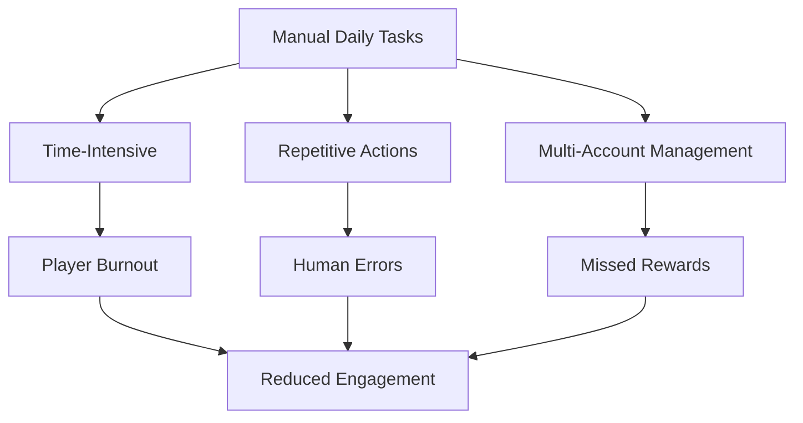
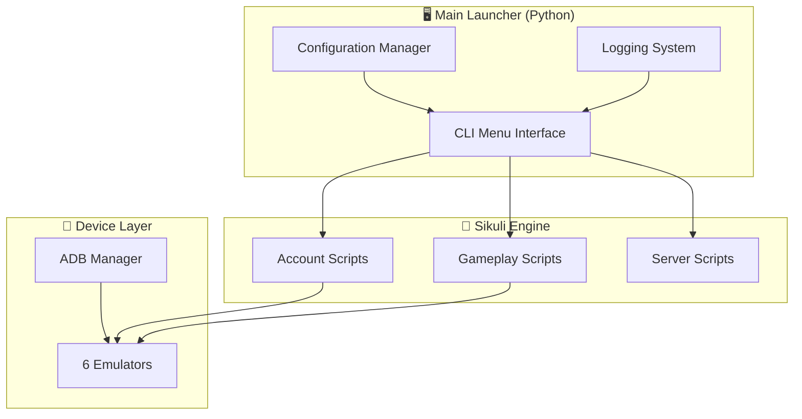
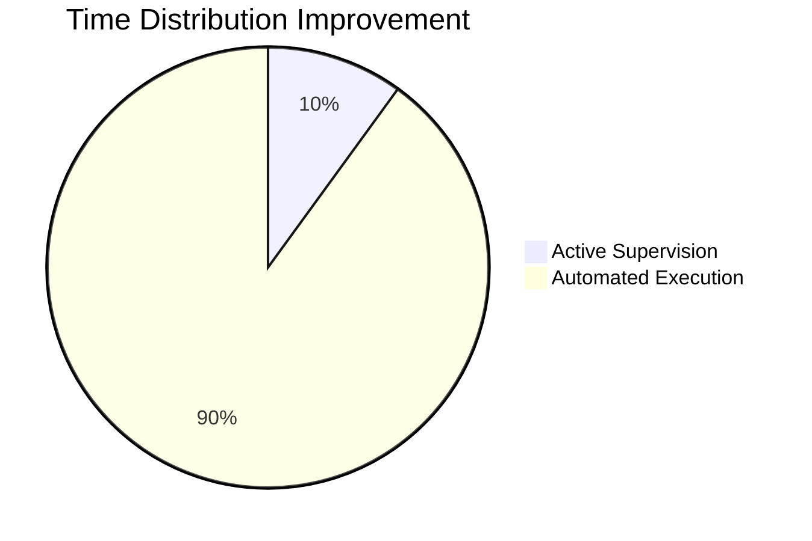

# 📊 Business Case Document
## MapleStory M Auto Flow Launcher

---

## 1. Executive Summary

| Attribute | Description |
|-----------|-------------|
| **Project Name** | MapleStory M Auto Flow Launcher |
| **Document Version** | 1.0 |
| **Created Date** | December 2024 |
| **Author** | Business Analyst |
| **Status** | Production |

---

## 2. BACCM Framework Analysis 🎯

### 2.1 Context (Bối cảnh)
| Aspect | Description |
|--------|-------------|
| **Industry** | Mobile Gaming / Game Automation |
| **Platform** | Windows PC với Android Emulators |
| **Current State** | Players thực hiện daily tasks thủ công, tốn 2-3 giờ/ngày |
| **Business Environment** | Game mobile MMORPG với daily reward system |

### 2.2 Needs (Nhu cầu/Vấn đề)
| Need ID | Need Description | Priority |
|---------|------------------|----------|
| N-01 | Giảm thời gian thực hiện daily tasks | High |
| N-02 | Quản lý tập trung nhiều accounts/servers | High |
| N-03 | Đảm bảo không bỏ sót daily rewards | Medium |
| N-04 | Tránh phát hiện automation (anti-detection) | Medium |

### 2.3 Solution (Giải pháp)
| Component | Technology | Purpose |
|-----------|------------|---------|
| **Main Launcher** | Python CLI | Điều khiển tập trung, menu navigation |
| **Automation Engine** | Sikuli (Java) | Image recognition, auto-click |
| **Device Controller** | ADB | Multi-emulator management |
| **Configuration** | JSON | Persistent settings |

### 2.4 Value (Giá trị mang lại)
| Value | Metric | Business Impact |
|-------|--------|-----------------|
| **Time Savings** | 90% reduction | 2.5h → 15min daily |
| **Completion Rate** | 98% | Maximize daily rewards |
| **Error Reduction** | 95% | Consistent execution |
| **Scalability** | 4 servers, 3 groups | Multi-account support |

### 2.5 Stakeholder (Các bên liên quan)
| Stakeholder | Role | Interest | Influence |
|-------------|------|----------|-----------|
| Player/User | End User | Automation, time savings | High |
| Sikuli Engine | System | Script execution | Medium |
| Game Server | External | Detect automation | Low |

---

## 3. Problem Statement 🎯

### 2.1 Current Situation (AS-IS)
MapleStory M players phải thực hiện nhiều tác vụ **lặp đi lặp lại hàng ngày** trên nhiều tài khoản và server:

| Pain Point | Impact |
|------------|--------|
| **Manual Repetition** | Thực hiện cùng một flow 4-6 lần/ngày trên mỗi server (A1, US, EU, A2) |
| **Time Consuming** | Mỗi flow mất 15-30 phút thủ công, tổng ~2-3 giờ/ngày |
| **Human Error** | Bỏ sót daily quests, click sai, quên đổi character |
| **Multi-Device Management** | Khó quản lý 6 emulators cùng lúc |
| **Inconsistent Execution** | Thực hiện không đều đặn → mất rewards |

### 2.2 Root Cause Analysis

---

## 3. Proposed Solution 💡

### 3.1 Solution Overview
Xây dựng **MapleStory M Auto Flow Launcher** - hệ thống tự động hóa:

| Component | Technology | Purpose |
|-----------|------------|---------|
| **Main Launcher** | Python CLI | Giao diện điều khiển, menu trees |
| **Script Engine** | Sikuli (Java) | Image recognition-based automation |
| **Device Manager** | ADB | Multi-emulator control |
| **Configuration** | JSON | Persistent user settings |

### 3.2 Solution Architecture

---

## 4. Project Scope 📋

### 4.1 In Scope ✅

| Category | Features |
|----------|----------|
| **Account Management** | Login automation cho 4 servers (A1, US, EU, A2), 3 account groups |
| **Daily Tasks** | Auto Battle, Guild, Guild Dungeon, Dimension, Elite, Mulung, Daily Chaos/Hell |
| **Character Flow** | Multi-character rotation (2 switches per session) |
| **Server Flow** | Sequential server execution với customizable order |
| **Configuration** | Optional script toggling, delay settings, path configuration |
| **Device Control** | ADB-based app launching trên multiple emulators |
| **Randomization** | Random delays và optional script selection (anti-detection) |

### 4.2 Out of Scope ❌

| Feature | Reason |
|---------|--------|
| Mobile App | Chỉ hỗ trợ emulator trên Windows |
| Account Creation | Manual setup required |
| In-Game Purchases | No automation cho transactions |
| PvP Content | Chỉ focus vào PvE daily tasks |
| Error Auto-Recovery | Manual intervention cho edge cases |

---

## 5. Success Criteria & KPIs 📈

### 5.1 Key Performance Indicators

| KPI | Target | Measurement |
|-----|--------|-------------|
| **Time Savings** | 80% reduction | From ~2.5hrs to ~30mins supervision |
| **Task Completion Rate** | 95%+ | Daily tasks completed successfully |
| **Error Rate** | <5% | Scripts requiring manual intervention |
| **Multi-Server Coverage** | 4 servers | A1, US, EU, A2 all supported |
| **Account Support** | 3 groups | accounts_1, accounts_2, accounts_3 |

### 5.2 Success Metrics

| Metric | Before | After | Improvement |
|--------|--------|-------|-------------|
| Daily Task Time | 2.5 hours | 15 minutes | **90% ↓** |
| Missed Dailies | 20%/week | <2%/week | **90% ↓** |
| Human Clicks | 500+/session | 5-10/session | **98% ↓** |

---

## 6. Stakeholders 👥

| Role | Description | Interest |
|------|-------------|----------|
| **Primary User** | Game player managing multiple accounts | Automation, time savings |
| **System** | Sikuli Engine | Script execution |
| **External** | Game Server (Nexon) | Detect automation behavior |

---

## 7. Constraints & Assumptions ⚠️

### 7.1 Constraints

| Type | Constraint |
|------|------------|
| **Technical** | Requires Windows OS với Java Runtime |
| **Hardware** | Cần PC đủ mạnh chạy 6 emulators |
| **Screen Resolution** | Fixed 6-region layout (1280x720 x6 areas) |
| **Game Updates** | Image patterns cần update khi game thay đổi UI |

### 7.2 Assumptions

| Assumption | Risk if False |
|------------|---------------|
| Game UI ổn định | Scripts fail nếu UI thay đổi |
| Emulators hoạt động tốt | ADB commands fail |
| Network stable | Game disconnects |
| Anti-cheat không detect | Account ban risk |

---

## 8. Risk Assessment 🔴

| Risk | Probability | Impact | Mitigation |
|------|-------------|--------|------------|
| Account suspension | Medium | High | Random delays, optional scripts |
| Script failures | Low | Medium | Error handling, user prompts |
| Game UI changes | Medium | High | Modular image patterns |
| Hardware limits | Low | Low | Configurable delays |

---

## 9. Timeline & Milestones ⏱️

| Phase | Status | Deliverables |
|-------|--------|--------------|
| **Phase 1: Core Launcher** | ✅ Complete | Main menu, flow execution |
| **Phase 2: Gameplay Scripts** | ✅ Complete | 12 automation scripts |
| **Phase 3: Multi-Account** | ✅ Complete | 3 account groups support |
| **Phase 4: ADB Integration** | ✅ Complete | Device management |
| **Phase 5: Configuration** | ✅ Complete | Optional scripts, settings |

---

## 10. Conclusion

**MapleStory M Auto Flow Launcher** là giải pháp tự động hóa hoàn chỉnh giúp players:
- ⏰ **Tiết kiệm thời gian** (90%+ reduction)
- ✅ **Đảm bảo daily completion** (không bỏ sót rewards)
- 🎮 **Multi-account management** (3 groups, 4 servers)
- 🛡️ **Anti-detection features** (randomization)

---

*Document maintained in: `BA_Portfolio/01_Business_Context/01_business_case.md`*
