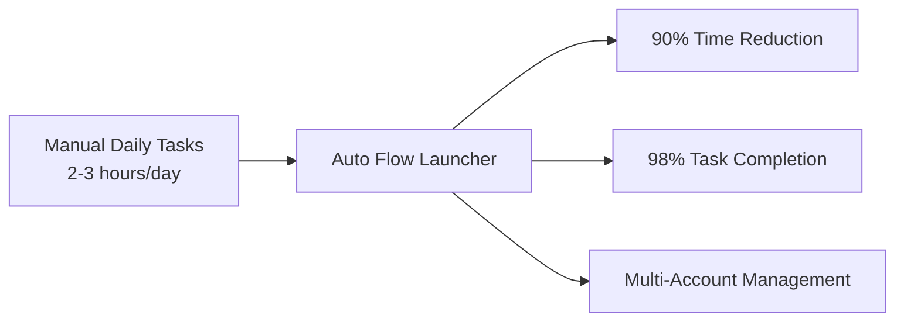
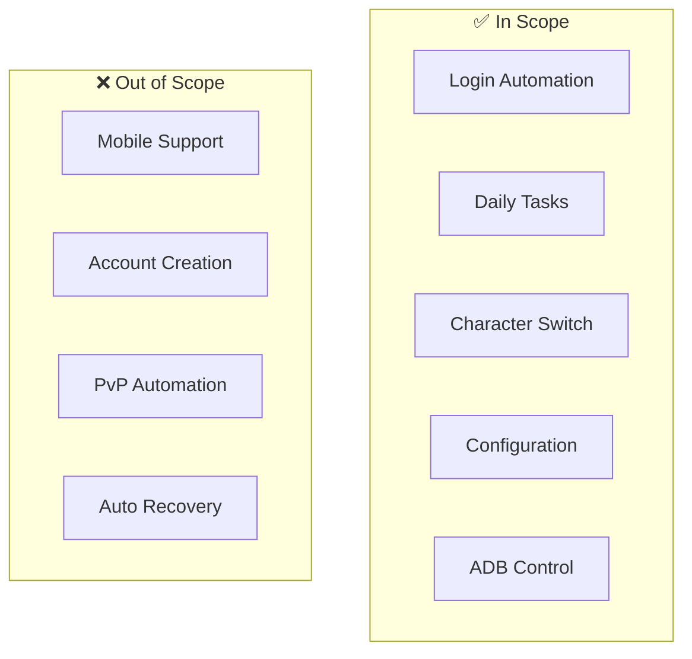
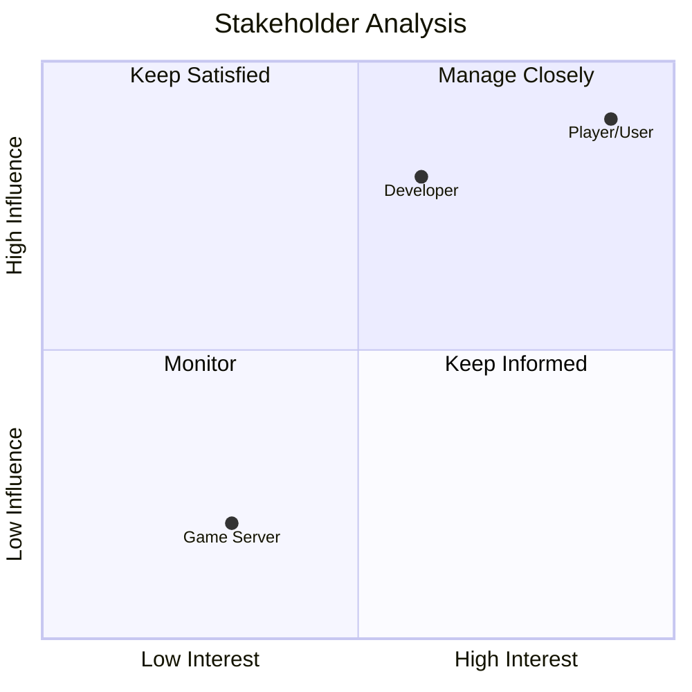

# 📋 Business Requirements Document (BRD)
## MapleStory M Auto Flow Launcher

---

## Document Information

| Attribute | Value |
|-----------|-------|
| **Document ID** | BRD-MSM-001 |
| **Version** | 1.0 |
| **Status** | Approved |
| **Created Date** | December 2024 |
| **Author** | Business Analyst |

---

## 1. Business Case

### 1.1 Background
MapleStory M là game mobile MMORPG phổ biến với hệ thống daily tasks phức tạp. Players quản lý nhiều accounts trên nhiều servers cần thực hiện các nhiệm vụ lặp lại hàng ngày.

### 1.2 Business Need (Vấn đề)

| Problem ID | Problem Description | Business Impact |
|------------|---------------------|-----------------|
| BN-01 | Thực hiện daily tasks thủ công mất 2-3 giờ/ngày | Giảm thời gian giải trí, gây mệt mỏi |
| BN-02 | Quản lý 4 servers, 3 account groups phức tạp | Dễ bỏ sót, mất rewards |
| BN-03 | Thao tác lặp lại 500+ clicks/session | Nguy cơ RSI, giảm hiệu quả |
| BN-04 | Khó duy trì pattern đều đặn | Miss dailies 15-20%/tuần |

### 1.3 Business Opportunity

| Opportunity | Expected Benefit |
|-------------|------------------|
| Tự động hóa daily flow | Giảm 90% thời gian active |
| Multi-account orchestration | Quản lý tập trung, không bỏ sót |
| Anti-detection features | Giảm risk account suspension |
| Configurable execution | Linh hoạt theo preference |

### 1.4 Project Justification

---

## 2. Project Scope

### 2.1 In-Scope (Phạm vi thực hiện)

| ID | Feature | Description |
|----|---------|-------------|
| SC-01 | Account Login Automation | Tự động đăng nhập 4 servers (A1, US, EU, A2) |
| SC-02 | Gameplay Task Automation | Auto Battle, Guild, Dimension, Elite, Mulung, Daily Dungeons |
| SC-03 | Character Rotation | Tự động switch 3 characters per session |
| SC-04 | Server Flow Orchestration | Chạy tuần tự hoặc đơn lẻ servers |
| SC-05 | Configuration Management | Paths, delays, optional scripts |
| SC-06 | ADB Device Control | Khởi động app trên 6 emulators |
| SC-07 | Randomization Features | Random delays, optional script selection |
| SC-08 | Logging & Monitoring | Ghi log execution, hiển thị progress |

### 2.2 Out-of-Scope (Ngoài phạm vi)

| ID | Feature | Reason |
|----|---------|--------|
| OS-01 | Mobile Device Support | Chỉ hỗ trợ emulator trên PC |
| OS-02 | Account Creation | Cần setup thủ công |
| OS-03 | In-App Purchase Automation | Security/legal concerns |
| OS-04 | PvP Content | Focus vào PvE daily tasks |
| OS-05 | Auto Error Recovery | Cần manual intervention |
| OS-06 | Cloud Execution | Local execution only |

### 2.3 Scope Boundaries

---

## 3. Constraints (Ràng buộc)

### 3.1 Budget Constraints

| Constraint | Details |
|------------|---------|
| **Development** | Open-source tools only (Python, Sikuli, ADB) |
| **Infrastructure** | Sử dụng PC cá nhân, không cloud |
| **Licensing** | Free/open-source dependencies |

### 3.2 Time Constraints

| Constraint | Details |
|------------|---------|
| **Execution Window** | Daily tasks reset theo timezone |
| **Script Timeout** | Max 20s per region |
| **Flow Duration** | Target < 20 min/server |

### 3.3 Resource Constraints

| Constraint | Details |
|------------|---------|
| **Hardware** | PC chạy được 6 emulators đồng thời |
| **Memory** | Min 16GB RAM recommended |
| **Storage** | ~100MB for scripts + logs |
| **Network** | Stable connection required |

### 3.4 Technical Constraints

| Constraint | Details |
|------------|---------|
| **Platform** | Windows OS only |
| **Dependencies** | Java Runtime, Python 3.x |
| **Screen Layout** | Fixed 6-region (3x2 grid) |
| **Image Recognition** | Sikuli pattern matching |

### 3.5 Legal/Compliance Constraints

| Constraint | Details |
|------------|---------|
| **Terms of Service** | Game ToS prohibition on automation |
| **Risk Acceptance** | User accepts account suspension risk |
| **No Distribution** | Personal use only |

---

## 4. Regulations & Business Rules

### 4.1 Game Rules

| Rule ID | Rule | Impact |
|---------|------|--------|
| GR-01 | Daily tasks reset at midnight server time | Execution timing critical |
| GR-02 | Some tasks limited per character | Requires character rotation |
| GR-03 | Server-specific accounts | Cannot cross-server login |
| GR-04 | Anti-cheat monitoring | Randomization required |

### 4.2 Business Rules

| Rule ID | Rule | Implementation |
|---------|------|----------------|
| BR-01 | Optional scripts may be random | CONFIG["OPTIONAL_SCRIPTS"] = 0 or 1 |
| BR-02 | Task group order must be randomized | random.shuffle(group) |
| BR-03 | Delays between steps must vary | random.randint(MIN, MAX) |
| BR-04 | Login failure triggers server change | Auto retry mechanism |
| BR-05 | Flow can start from any point | start_point parameter |
| BR-06 | Configuration persists across sessions | JSON file storage |

### 4.3 Operational Rules

| Rule ID | Rule | Description |
|---------|------|-------------|
| OR-01 | User must supervise | Manual intervention for edge cases |
| OR-02 | Emulators must be pre-launched | ADB script helps but not automatic |
| OR-03 | Game must be at login screen | Pre-condition for flow start |

---

## 5. Stakeholders

### 5.1 Stakeholder Register

| ID | Stakeholder | Role | Interest | Influence |
|----|-------------|------|----------|-----------|
| SH-01 | Player/User | Primary User | High - Time savings | High |
| SH-02 | Game Server | External System | Low - Detects automation | Low |
| SH-03 | Developer | Technical Support | Medium - Maintenance | High |

### 5.2 Stakeholder Analysis Matrix

### 5.3 RACI Matrix

| Deliverable | Player | Developer | Game Server |
|-------------|--------|-----------|-------------|
| Requirements | C | R | - |
| Development | I | R | - |
| Testing | A | R | - |
| Operation | R | C | I |
| Maintenance | I | R | - |

*R=Responsible, A=Accountable, C=Consulted, I=Informed*

---

## 6. Business Requirements Summary

| BR-ID | Requirement | Priority | Source |
|-------|-------------|----------|--------|
| BR-001 | Hệ thống phải tự động login vào 4 servers | High | BN-02 |
| BR-002 | Hệ thống phải thực hiện 8+ daily tasks | High | BN-01 |
| BR-003 | Hệ thống phải hỗ trợ 3 account groups | Medium | BN-02 |
| BR-004 | Hệ thống phải có randomization features | High | GR-04 |
| BR-005 | Hệ thống phải lưu configuration | Medium | BR-06 |
| BR-006 | Hệ thống phải có logging và reporting | Low | OR-01 |
| BR-007 | Thời gian execution < 20 min/server | Medium | Time Constraint |

---

## 7. Approval

| Role | Name | Signature | Date |
|------|------|-----------|------|
| Business Owner | _____________ | _____________ | ____/____/____ |
| Business Analyst | _____________ | _____________ | ____/____/____ |
| Project Manager | _____________ | _____________ | ____/____/____ |

---

*Document maintained in: `BA_Portfolio/01_Business_Context/02_BRD_Document.md`*
