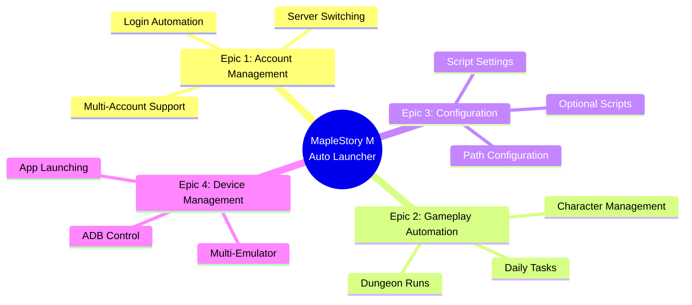
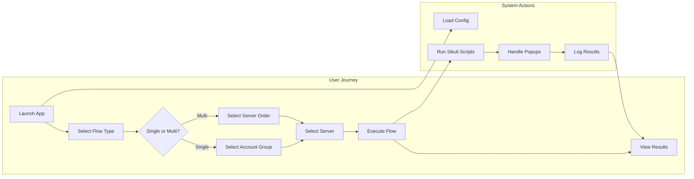

# 📋 User Story Map
## MapleStory M Auto Flow Launcher

---

## 1. Story Map Overview



---

## 2. Epic Breakdown

### 🎯 Epic 1: Account Management

| Story ID | User Story | Acceptance Criteria | Traceability |
|----------|------------|---------------------|--------------|
| ACC-01 | As a player, I want to login automatically to server A1 so that I don't have to manually enter credentials | Login completes within 30s, Character selection screen appears | `scripts/accounts_group/accounts_1/a1.py` |
| ACC-02 | As a player, I want to login to US server so that I can manage my US accounts | US server login successful | `scripts/accounts_group/accounts_1/us.py` |
| ACC-03 | As a player, I want to login to A2 server variants so that I can manage A2, A2_2, A2_3, A2_4 accounts | All A2 variants supported | `scripts/accounts_group/accounts_1/a2.py`, `a2_2.py`, `a2_3.py`, `a2_4.py` |
| ACC-04 | As a player, I want to switch between servers if login fails so that the flow can continue | Auto server change on login failure | `scripts/accounts_group/server/change_server_*.py` |
| ACC-05 | As a player, I want to manage 3 separate account groups so that I can organize by device | Selection menu for accounts_1/2/3 | `new_gui_launcher.py::show_flow_selection_menu()` L1000-1084 |

#### Acceptance Criteria Detail (Given/When/Then)

**ACC-01: Login to Server A1**
```gherkin
Given emulators are running with game at login screen
  And account group is selected (accounts_1/2/3)
When player selects "A1" server from flow menu
Then system executes a1.py script
  And login process completes within 30 seconds
  And character selection screen is displayed
  And system returns exit code 0
```

**ACC-04: Server Change on Login Failure**
```gherkin
Given player initiates login to server
When login script returns exit code != 0 (failure)
Then system automatically executes change_server script
  And server change dialog is navigated
  And login is retried
If server change also fails
Then error message is displayed
  And flow is stopped
```

---

### 🎮 Epic 2: Gameplay Automation

#### 2.1 Daily Tasks

| Story ID | User Story | Acceptance Criteria | Traceability |
|----------|------------|---------------------|--------------|
| GAME-01 | As a player, I want game to start automatically after login so that I don't have to click Start | Start button detected and clicked in all 6 regions | `scripts/game_play/start.py` |
| GAME-02 | As a player, I want Auto Battle to run automatically so that my characters gain EXP | Auto battle button found, clicked, Use button handled | `scripts/game_play/auto_battle.py` |
| GAME-03 | As a player, I want Guild activities completed so that I don't miss guild rewards | Guild script runs successfully | `scripts/game_play/Guild.py` |
| GAME-04 | As a player, I want Dimension dungeons done so that I get dimension rewards | Dimension script completes | `scripts/game_play/dimension.py` |
| GAME-05 | As a player, I want Elite Dungeon runs so that I get elite materials | Elite script runs (optional) | `scripts/game_play/elite.py` |
| GAME-06 | As a player, I want Daily Chaos/Hell completed so that I maximize daily rewards | Chaos and Hell scripts run | `scripts/game_play/daily_chaos.py`, `daily_hell.py` |
| GAME-07 | As a player, I want Mulung Dojo cleared so that I get Mulung rewards | Mulung script completes | `scripts/game_play/mulung.py` |
| GAME-08 | As a player, I want Guild Dungeon completed so that I contribute to guild | Guild Dungeon script runs | `scripts/game_play/guild_dungeon.py` |

#### 2.2 Character Management

| Story ID | User Story | Acceptance Criteria | Traceability |
|----------|------------|---------------------|--------------|
| CHAR-01 | As a player, I want to switch to character 2 after first set of tasks so that all characters benefit | Character switch successful | `scripts/game_play/change_char_1.py` |
| CHAR-02 | As a player, I want to switch to character 3 after second set so that third character gets tasks | Second switch works | `scripts/game_play/change_char_2.py` |
| CHAR-03 | As a player, I want proper logout when flow completes so that session ends cleanly | Logout flow executes | `scripts/game_play/logout.py` |

---

### ⚙️ Epic 3: Configuration Management

| Story ID | User Story | Acceptance Criteria | Traceability |
|----------|------------|---------------------|--------------|
| CFG-01 | As a player, I want to configure SikuliX path so that the engine can be found | Path saved to config file | `new_gui_launcher.py::show_config_menu()` L796-865 |
| CFG-02 | As a player, I want to set min/max delays so that I can control randomization | Delays configurable and saved | `new_gui_launcher.py` L829-858 |
| CFG-03 | As a player, I want to toggle optional scripts so that some tasks run randomly | Toggle saves to JSON config | `new_gui_launcher.py::configure_optional_scripts()` L867-932 |
| CFG-04 | As a player, I want my settings persisted so that I don't reconfigure each time | Settings saved to `launcher_config.json` | `new_gui_launcher.py::save_config()` L66-74 |

---

### 📱 Epic 4: Device Management

| Story ID | User Story | Acceptance Criteria | Traceability |
|----------|------------|---------------------|--------------|
| ADB-01 | As a player, I want to launch app on all devices so that I can start multiple emulators | ADB script launches app on listed devices | `scripts/accounts_group/adb/script_adb.py` |
| ADB-02 | As a player, I want separate device lists for each account group so that devices are organized | devices.txt, devices-2.txt, devices-3.txt supported | `scripts/accounts_group/adb/devices*.txt` |
| ADB-03 | As a player, I want ADB commands accessible from menu so that I don't need command line | ADB menu in launcher | `new_gui_launcher.py::show_adb_scripts_menu()` L713-793 |

---

## 3. Flow Execution Stories

### 🔄 Master Flow

| Story ID | User Story | Acceptance Criteria | Traceability |
|----------|------------|---------------------|--------------|
| FLOW-01 | As a player, I want to run a single server flow so that I can complete one server's dailies | Single flow from selection to logout | `new_gui_launcher.py::show_flow_selection_menu()` |
| FLOW-02 | As a player, I want to run multiple server flows in custom order so that I can chain all servers | Sequential flow execution | `new_gui_launcher.py::run_master_flow()` L611-684 |
| FLOW-03 | As a player, I want to start from any point in the flow so that I can resume after failure | Start point selection menu | `new_gui_launcher.py::show_start_points_menu()` L934-998 |
| FLOW-04 | As a player, I want random delays between steps so that my behavior looks human | Random delays applied | `new_gui_launcher.py::run_common_flow()` L476-479 |
| FLOW-05 | As a player, I want optional scripts randomly skipped so that behavior varies daily | Optional scripts filtered | `new_gui_launcher.py::run_common_flow()` L363-392 |

---

## 4. Story Map Visualization



---

## 5. Priority Matrix

| Priority | Stories | Rationale |
|----------|---------|-----------|
| **P0 - Critical** | FLOW-01, GAME-01, GAME-02, ACC-01 | Core automation functionality |
| **P1 - High** | FLOW-02, CHAR-01, CHAR-02, GAME-03-08 | Complete daily coverage |
| **P2 - Medium** | CFG-01-04, FLOW-03-05 | Configuration and flexibility |
| **P3 - Low** | ADB-01-03 | Device management (optional) |

---

## 6. Traceability Summary

| Component | Files | Story Count |
|-----------|-------|-------------|
| Main Launcher | `new_gui_launcher.py` | 15 |
| Account Scripts | `accounts_*/a*.py, us.py` | 5 |
| Gameplay Scripts | `game_play/*.py` | 11 |
| Server Scripts | `server/change_server_*.py` | 4 |
| ADB Scripts | `adb/script_adb*.py` | 3 |
| Configuration | `launcher_config.json` | 4 |

---

*Document maintained in: `BA_Portfolio/02_Requirements_Analysis/02_user_story_map.md`*
