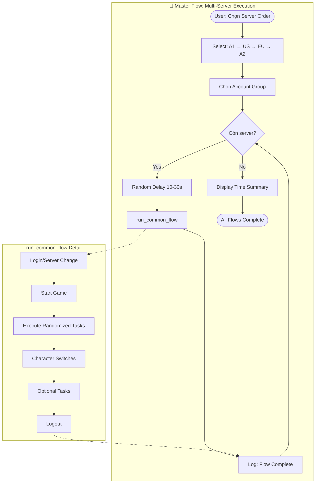
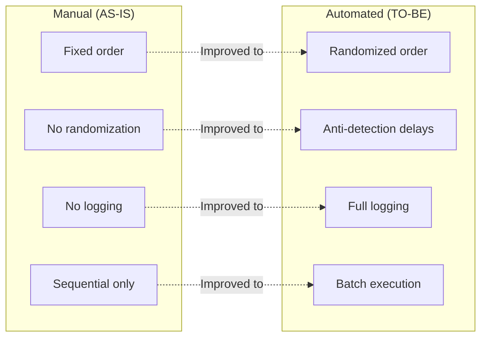
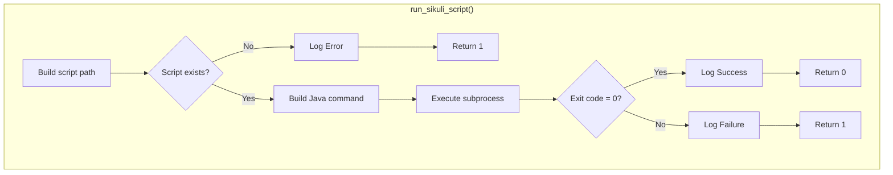
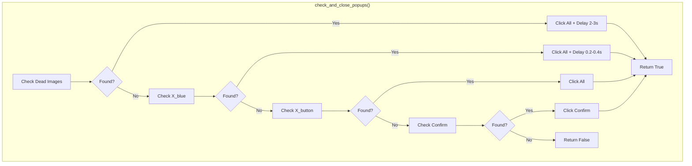

# 📊 BPMN Process Diagrams
## MapleStory M Auto Flow Launcher

---

## 1. Process Overview

Tài liệu này mô tả quy trình AS-IS (thủ công) và TO-BE (tự động hóa) cho việc thực hiện daily tasks trong MapleStory M.

---

## 2. AS-IS Process (Manual)

### 2.1 Daily Tasks - Manual Flow

```mermaid
flowchart TD
    subgraph Manual["🖐️ AS-IS: Manual Daily Flow (Per Server)"]
        Start([Start]) --> Open[Mở Emulator]
        Open --> LaunchApp[Mở Game MapleStory M]
        LaunchApp --> Wait1[Chờ loading 2-3 phút]
        Wait1 --> Login[Đăng nhập thủ công]
        Login --> SelectChar[Chọn nhân vật]
        SelectChar --> ClickStart[Click Start]
        
        ClickStart --> AB1[Auto Battle - Nhân vật 1]
        AB1 --> Guild1[Guild Task - Nhân vật 1]
        Guild1 --> Dim1[Dimension - Nhân vật 1]
        Dim1 --> SwitchChar1[Đổi sang nhân vật 2]
        
        SwitchChar1 --> AB2[Auto Battle - Nhân vật 2]
        AB2 --> Guild2[Guild Task - Nhân vật 2]
        Guild2 --> Dim2[Dimension - Nhân vật 2]
        Dim2 --> SwitchChar2[Đổi sang nhân vật 3]
        
        SwitchChar2 --> AB3[Auto Battle - Nhân vật 3]
        AB3 --> Optional[Optional: Elite, Mulung, Daily]
        Optional --> Logout[Logout]
        
        Logout --> NextServer{Còn server khác?}
        NextServer -->|Yes| ChangeServer[Đổi Server thủ công]
        ChangeServer --> SelectChar
        NextServer -->|No| EndManual([Kết thúc])
    end
    
    style AB1 fill:#ffcccc
    style AB2 fill:#ffcccc
    style AB3 fill:#ffcccc
    style Guild1 fill:#ffcccc
    style Guild2 fill:#ffcccc
    style Dim1 fill:#ffcccc
    style Dim2 fill:#ffcccc
```

### 2.2 Pain Points in AS-IS

| Step | Time | Pain Point |
|------|------|------------|
| Login per server | 2-3 min | Lặp lại 4 lần cho 4 servers |
| Each task cycle | 5-10 min | 500+ clicks per session |
| Character switch | 1-2 min | Dễ bỏ sót nhân vật |
| Server change | 3-5 min | Complex navigation |
| **Total per day** | **2-3 hours** | **Exhausting, error-prone** |

---

## 3. TO-BE Process (Automated)

### 3.1 Automated Flow - Single Server (with Pool/Lane)

```mermaid
flowchart TD
    subgraph Pool["🏢 MapleStory M Auto Launcher Process"]
        subgraph LanePlayer["👤 LANE: Player"]
            Start([Chọn Flow]) --> SelectGroup[Chọn Account Group]
            SelectGroup --> SelectServer[Chọn Server]
        end
        
        subgraph LaneSystem["🖥️ LANE: Main Launcher"]
            SelectServer --> LoadConfig[Load Configuration]
            LoadConfig --> ExecuteLogin
            CheckLogin -->|No| ServerChange[Change Server Script]
            ServerChange --> ExecuteLogin
            CheckLogin -->|Yes| StartGame
            
            RandomizeG1 --> DispatchG1[Dispatch Group 1]
            G1Complete --> ChangeChar1[Dispatch Change Char 1]
            
            RandomizeG2 --> DispatchG2[Dispatch Group 2]
            G2Complete --> ChangeChar2[Dispatch Change Char 2]
            
            FilterOptional --> RandomSelect[Random Select]
            RandomSelect --> DispatchG3[Dispatch Optional]
            G3Complete --> DispatchLogout[Dispatch Logout]
            
            LogoutComplete --> LogResults[Log Results]
            LogResults --> EndAuto([Flow Complete])
        end
        
        subgraph LaneSikuli["🤖 LANE: Sikuli Engine"]
            ExecuteLogin[Execute Login] --> CheckLogin{Login OK?}
            StartGame[Execute Start] --> RandomizeG1[Shuffle Group 1]
            DispatchG1 --> G1[AB + Guild + Dim]
            G1 --> G1Complete([Group 1 Done])
            
            ChangeChar1 --> RandomizeG2[Shuffle Group 2]
            DispatchG2 --> G2[AB2 + Guild2 + Dim2]
            G2 --> G2Complete([Group 2 Done])
            
            ChangeChar2 --> FilterOptional[Filter Optional]
            DispatchG3 --> G3[Optional Tasks]
            G3 --> G3Complete([Group 3 Done])
            
            DispatchLogout --> Logout[Execute Logout]
            Logout --> LogoutComplete([Logout Done])
        end
    end
    
    style LanePlayer fill:#e1f5fe
    style LaneSystem fill:#fff3e0
    style LaneSikuli fill:#e8f5e9
```

### 3.2 Automated Flow - Multi-Server (Master Flow)

---

## 4. Comparison: AS-IS vs TO-BE

### 4.1 Process Metrics

| Metric | AS-IS (Manual) | TO-BE (Automated) | Improvement |
|--------|----------------|-------------------|-------------|
| **Time per server** | 30-45 min | 15-20 min | 50% ↓ |
| **Total daily time** | 2-3 hours | 15-30 min supervision | 85% ↓ |
| **User clicks** | 500+ | 5-10 | 98% ↓ |
| **Error rate** | 15-20% | <5% | 75% ↓ |
| **Missed dailies** | 10-20%/week | <2%/week | 90% ↓ |

### 4.2 Feature Comparison

---

## 5. Subprocess Details

### 5.1 Script Execution Subprocess

### 5.2 Popup Handling Subprocess

---

## 6. Key Process Improvements

| Category | AS-IS Problem | TO-BE Solution |
|----------|---------------|----------------|
| **Automation** | 100% manual clicks | 98% automated via Sikuli |
| **Randomization** | Fixed patterns (detectable) | Random delays + optional scripts |
| **Error Handling** | Manual recovery | Auto-retry + user prompts |
| **Logging** | None | Full logging to `launcher.log` |
| **Multi-device** | Open each manually | ADB batch launching |

---

*Document maintained in: `BA_Portfolio/02_Requirements_Analysis/03_bpmn_diagrams.md`*
