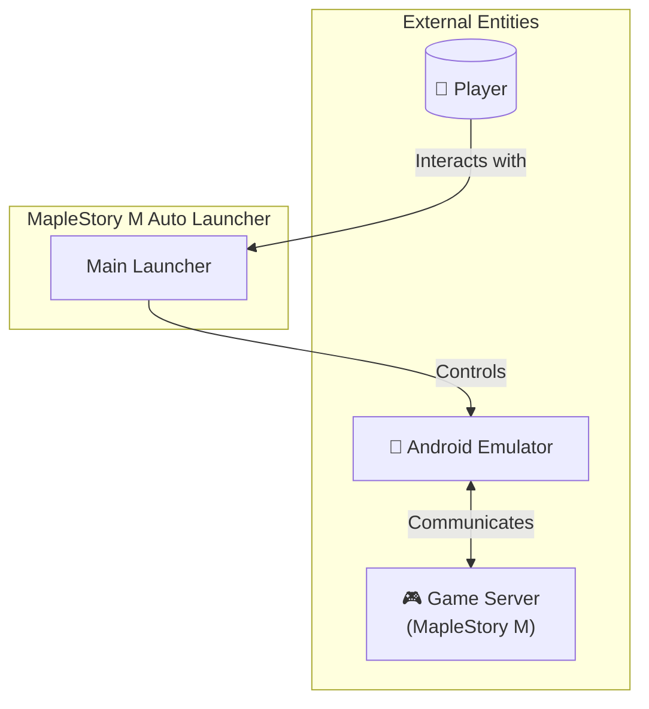
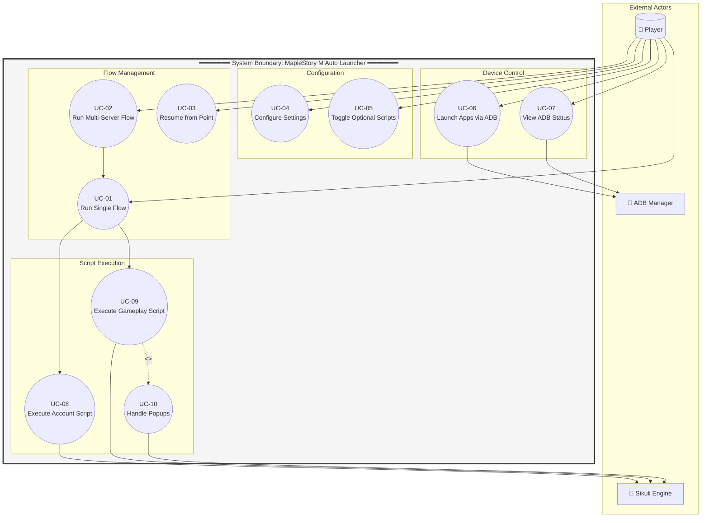
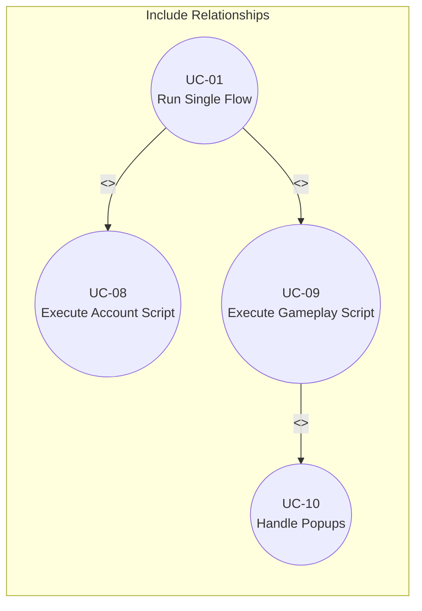
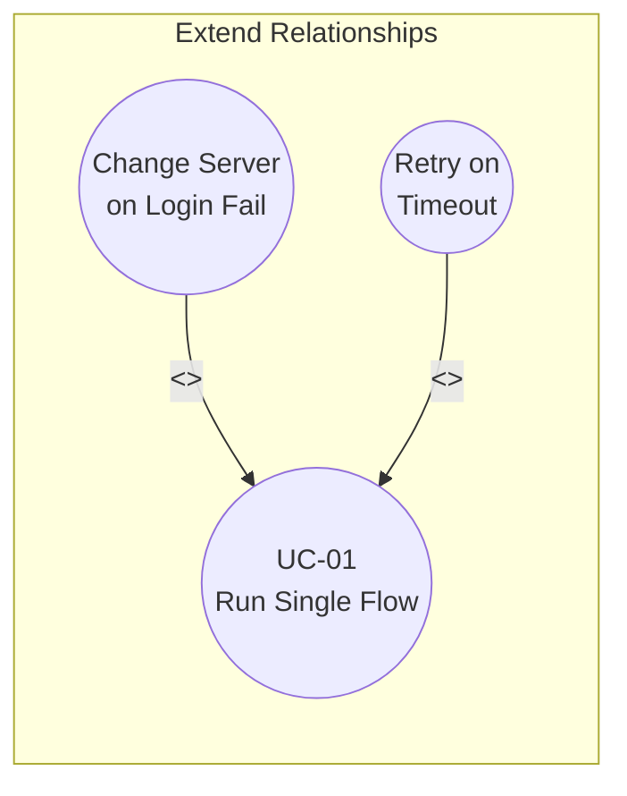
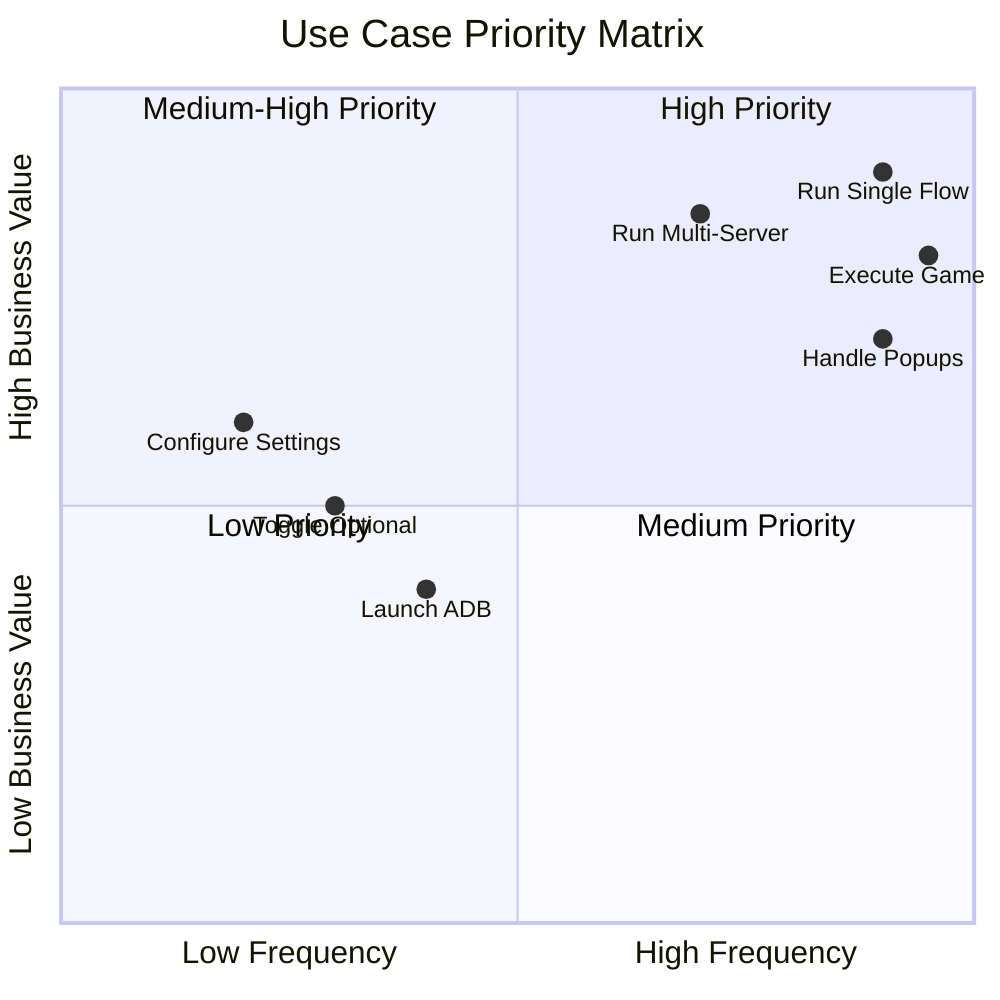
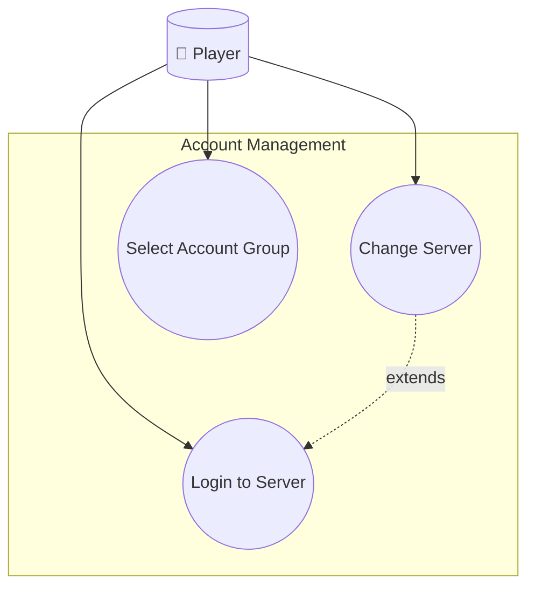
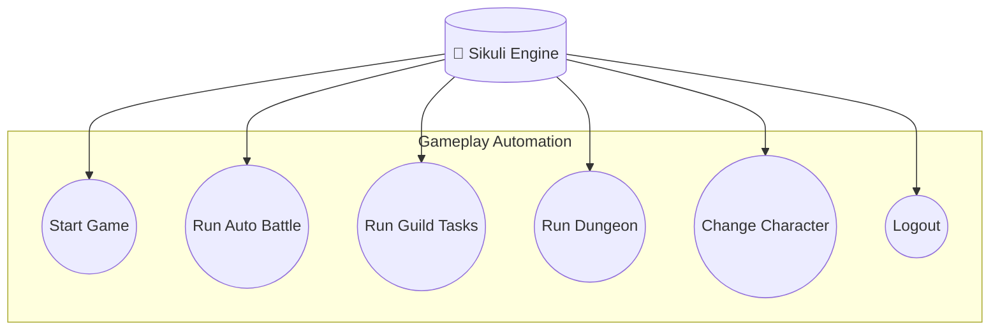

# 🎭 Use Case Diagram
## MapleStory M Auto Flow Launcher

---

## 1. System Context

---

## 2. Main Use Case Diagram (with System Boundary)

---

## 3. Use Case List

| UC ID | Use Case Name | Primary Actor | Description |
|-------|---------------|---------------|-------------|
| UC-01 | Run Single Flow | Player | Chạy automation flow cho một server |
| UC-02 | Run Multi-Server Flow | Player | Chạy tuần tự nhiều server theo thứ tự tùy chọn |
| UC-03 | Resume from Point | Player | Tiếp tục flow từ một điểm cụ thể |
| UC-04 | Configure Settings | Player | Cấu hình đường dẫn và delays |
| UC-05 | Toggle Optional Scripts | Player | Bật/tắt tính năng random cho scripts |
| UC-06 | Launch Apps via ADB | Player | Khởi động app trên emulators qua ADB |
| UC-07 | View ADB Status | Player | Xem trạng thái devices |
| UC-08 | Execute Account Script | Sikuli Engine | Chạy script đăng nhập/đổi server |
| UC-09 | Execute Gameplay Script | Sikuli Engine | Chạy script gameplay (AB, Guild, etc.) |
| UC-10 | Handle Popups | Sikuli Engine | Đóng popups tự động |

---

## 4. Use Case Relationships

### 4.1 Include Relationships

### 4.2 Extend Relationships

---

## 5. Detailed Actor Descriptions

### 5.1 Primary Actors

| Actor | Description | Goals |
|-------|-------------|-------|
| **Player** | Người chơi điều khiển launcher | Tự động hóa daily tasks, tiết kiệm thời gian |

### 5.2 Secondary Actors

| Actor | Description | Role |
|-------|-------------|------|
| **Sikuli Engine** | Java-based image recognition | Thực thi automation scripts |
| **ADB Manager** | Android Debug Bridge | Điều khiển emulators |
| **Game Server** | Nexon MapleStory M server | Xử lý game logic |

---

## 6. Use Case Priority

---

## 7. Subsystem Use Cases

### 7.1 Account Management Subsystem

### 7.2 Gameplay Automation Subsystem

---

*Document maintained in: `BA_Portfolio/03_System_Design/04_use_case_diagram.md`*
