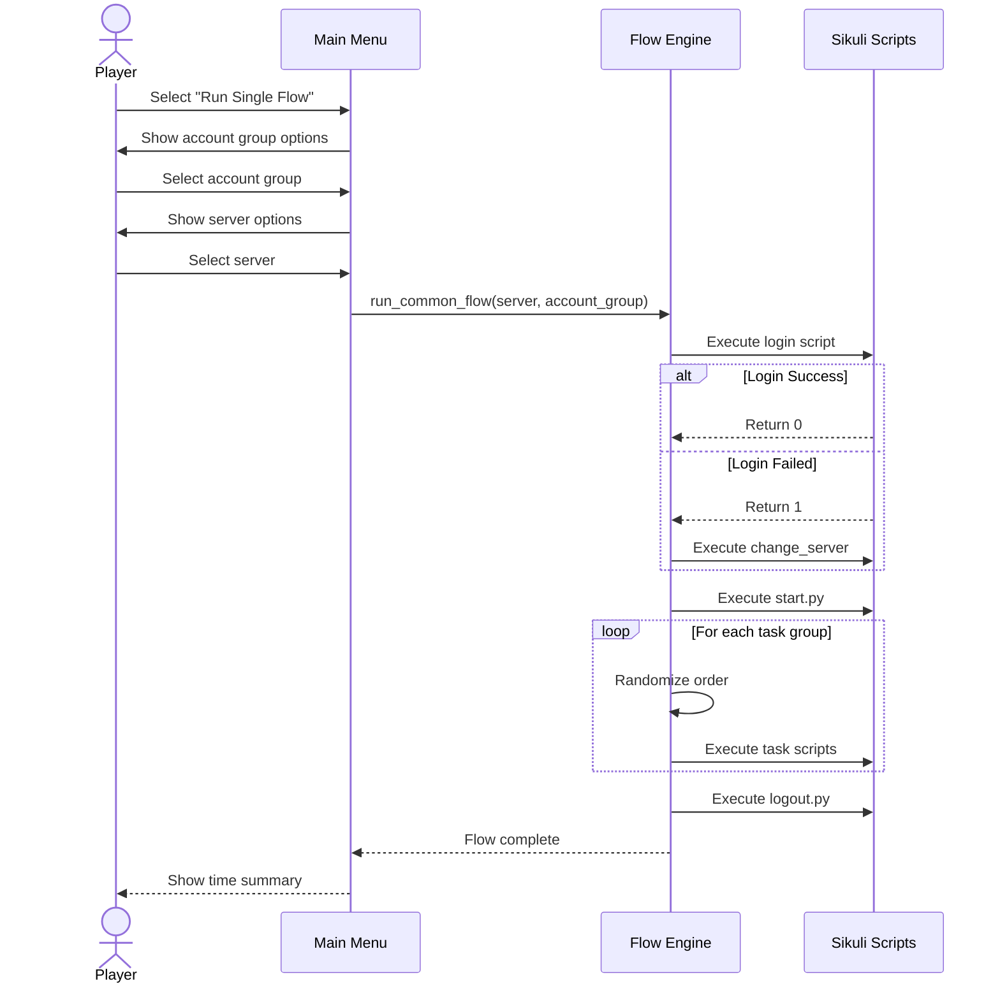
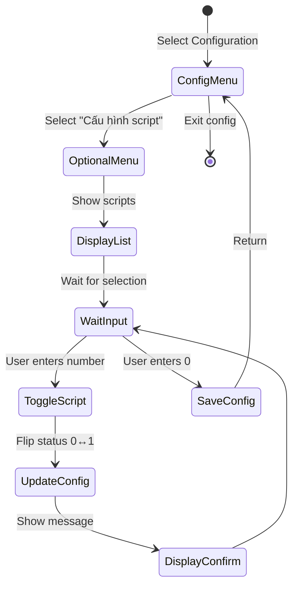
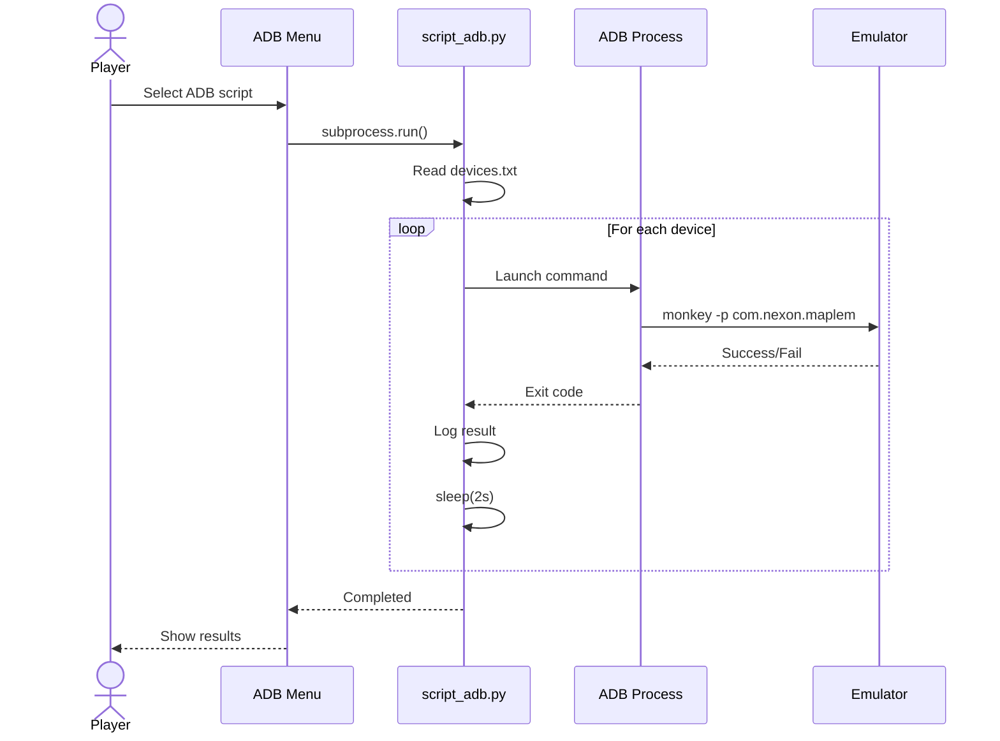

# 📋 Use Case Specifications
## MapleStory M Auto Flow Launcher

---

## Use Case 1: Run Single Flow (UC-01)

### 1.1 Overview

| Attribute | Description |
|-----------|-------------|
| **Use Case ID** | UC-01 |
| **Use Case Name** | Run Single Flow |
| **Primary Actor** | Player |
| **Goal** | Chạy automation flow hoàn chỉnh cho một server |
| **Trigger** | Player chọn "Chạy flow đơn" từ main menu |
| **Priority** | High |

### 1.2 Preconditions

| # | Precondition |
|---|--------------|
| 1 | Launcher đã khởi động và hiển thị main menu |
| 2 | Configuration đã được load từ `launcher_config.json` |
| 3 | Sikuli JAR file tồn tại tại đường dẫn cấu hình |
| 4 | Emulators đang chạy với game đã mở |

### 1.3 Postconditions

| # | Postcondition |
|---|---------------|
| 1 | Flow hoàn thành cho server được chọn |
| 2 | Log file được cập nhật với kết quả |
| 3 | Thời gian thực thi được hiển thị |
| 4 | User được đưa về main menu |

### 1.4 Basic Flow

| Step | Actor | Action | System Response |
|------|-------|--------|-----------------|
| 1 | Player | Chọn option "1" từ main menu | Hiển thị menu chọn account group |
| 2 | Player | Chọn account group (1/2/3) | Load danh sách servers có sẵn |
| 3 | System | - | Hiển thị menu chọn server/flow |
| 4 | Player | Chọn server (A1/US/EU/A2) | Bắt đầu flow execution |
| 5 | System | Chạy Login script | Hiển thị progress: "Running login" |
| 6 | System | Chạy Start script | Click Start button trong tất cả regions |
| 7 | System | Randomize Group 1 (AB, Guild, Dimension) | Shuffle và execute tuần tự |
| 8 | System | Chạy Change Character 1 | Switch sang character 2 |
| 9 | System | Randomize Group 2 | Execute tuần tự |
| 10 | System | Chạy Change Character 2 | Switch sang character 3 |
| 11 | System | Filter và execute optional scripts | Random select từ optional list |
| 12 | System | Chạy Logout script | Logout tất cả characters |
| 13 | System | - | Hiển thị thời gian tổng cộng |
| 14 | Player | Nhấn Enter | Quay về main menu |

### 1.5 Alternative Flows

#### AF-1: Login Failed → Server Change

| Step | Condition | Action |
|------|-----------|--------|
| 5a | Login script returns != 0 | System chạy change_server script |
| 5b | Server change thành công | Continue từ step 6 |
| 5c | Server change thất bại | Hiển thị lỗi, dừng flow |

#### AF-2: A2 Group Selection

| Step | Condition | Action |
|------|-----------|--------|
| 3a | User chọn "A2 Group (All)" | System chạy tuần tự A2, A2_2, A2_3, A2_4 |
| 3b | Mỗi A2 variant | Chạy full flow cho từng variant |

### 1.6 Exception Flows

#### EF-1: Script Not Found

| Step | Action |
|------|--------|
| 1 | System log error: "Script not found: {path}" |
| 2 | Hiển thị lỗi màu đỏ |
| 3 | Return code 1, stop flow |

#### EF-2: Script Timeout

| Step | Action |
|------|--------|
| 1 | Script chạy quá timeout (20s) |
| 2 | Hiển thị popAsk: "Hết thời gian. Thử lại?" |
| 3 | User chọn Yes → Reset timer, continue |
| 4 | User chọn No → Stop region processing |

#### EF-3: Script Execution Error

| Step | Action |
|------|--------|
| 1 | Script returns != 0 |
| 2 | Hiển thị: "Bước {name} thất bại" |
| 3 | Prompt: "Tiếp tục với bước tiếp theo? (y/n)" |
| 4 | y → Continue, n → Stop flow |

### 1.7 Flow Diagram



---

## Use Case 2: Configure Optional Scripts (UC-05)

### 2.1 Overview

| Attribute | Description |
|-----------|-------------|
| **Use Case ID** | UC-05 |
| **Use Case Name** | Toggle Optional Scripts |
| **Primary Actor** | Player |
| **Goal** | Bật/tắt tính năng random cho từng script |
| **Trigger** | Player vào Configuration menu và chọn "Cấu hình script tùy chọn" |
| **Priority** | Medium |

### 2.2 Preconditions

| # | Precondition |
|---|--------------|
| 1 | Launcher đang chạy |
| 2 | Configuration đã load |

### 2.3 Postconditions

| # | Postcondition |
|---|---------------|
| 1 | Settings lưu vào `launcher_config.json` |
| 2 | Thay đổi có hiệu lực cho flows tiếp theo |

### 2.4 Basic Flow

| Step | Actor | Action | System Response |
|------|-------|--------|-----------------|
| 1 | Player | Chọn "4" (Configuration) từ main menu | Hiển thị config menu |
| 2 | Player | Chọn "5" (Cấu hình script tùy chọn) | Hiển thị danh sách scripts |
| 3 | System | - | Hiển thị trạng thái mỗi script (BẬT/TẮT) |
| 4 | Player | Nhập số script muốn toggle | Toggle trạng thái |
| 5 | System | - | Hiển thị thông báo thay đổi |
| 6 | Player | Nhập "0" để quay lại | Save config và return |

### 2.5 Script Status Explanation

| Status | Meaning | Effect |
|--------|---------|--------|
| **BẬT** (1) | Optional/Random | Script có thể chạy hoặc không mỗi ngày |
| **TẮT** (0) | Fixed/Always | Script luôn chạy mỗi lần |

### 2.6 Flow Diagram



---

## Use Case 3: Launch Apps via ADB (UC-06)

### 3.1 Overview

| Attribute | Description |
|-----------|-------------|
| **Use Case ID** | UC-06 |
| **Use Case Name** | Launch Apps via ADB |
| **Primary Actor** | Player |
| **Goal** | Khởi động MapleStory M trên tất cả emulators |
| **Trigger** | Player chọn ADB script từ ADB menu |
| **Priority** | Medium |

### 3.2 Preconditions

| # | Precondition |
|---|--------------|
| 1 | ADB đã được cài đặt (`tools/adb.exe`) |
| 2 | Emulators đang chạy và connected |
| 3 | Device IDs đã được cấu hình trong `devices.txt` |

### 3.3 Postconditions

| # | Postcondition |
|---|---------------|
| 1 | MapleStory M khởi động trên tất cả listed devices |
| 2 | Log file ghi lại các ADB commands |

### 3.4 Basic Flow

| Step | Actor | Action | System Response |
|------|-------|--------|-----------------|
| 1 | Player | Chọn "5" (Công cụ ADB) từ main menu | Hiển thị ADB menu |
| 2 | Player | Chọn script (1/2/3) | Bắt đầu execute |
| 3 | System | Đọc device list từ file | Hiển thị số devices tìm thấy |
| 4 | System | Loop qua từng device | Launch app command |
| 5 | System | - | Log kết quả mỗi device |
| 6 | System | - | Hiển thị "Completed!" |
| 7 | Player | Nhấn Enter | Quay về ADB menu |

### 3.5 ADB Command Detail

```bash
adb -s {device_id} shell monkey -p com.nexon.maplem.global -c android.intent.category.LAUNCHER 1
```

### 3.6 Exception Flows

#### EF-1: Device File Not Found

| Step | Action |
|------|--------|
| 1 | `devices.txt` không tồn tại |
| 2 | Hiển thị: "File not found: {path}" |
| 3 | Return empty list |

#### EF-2: ADB Command Failed

| Step | Action |
|------|--------|
| 1 | ADB command trả về error |
| 2 | Log: "Error launching app on device {id}: {error}" |
| 3 | Continue với device tiếp theo |

### 3.7 Flow Diagram



---

## Summary

| UC-ID | Name | Priority | Complexity |
|-------|------|----------|------------|
| UC-01 | Run Single Flow | High | High |
| UC-05 | Toggle Optional Scripts | Medium | Low |
| UC-06 | Launch Apps via ADB | Medium | Medium |

---

*Document maintained in: `BA_Portfolio/03_System_Design/05_use_case_specs.md`*
