# 📊 Activity Diagrams
## MapleStory M Auto Flow Launcher

---

## 1. Main Flow Execution Activity

### 1.1 Complete Flow Activity Diagram

---

## 2. Script Execution Activity

### 2.1 run_sikuli_script Activity

---

## 3. Auto Battle Process Activity

### 3.1 AutoBattle.run() Activity

---

## 4. Popup Handling Activity

### 4.1 check_and_close_popups Activity

---

## 5. Master Flow Activity

### 5.1 Multi-Server Sequential Execution

---

## 6. Configuration Activity

### 6.1 Configure Optional Scripts Activity

```mermaid
flowchart TD
    Start([Enter Config]) --> ClearScreen[Clear Screen]
    ClearScreen --> PrintHeader[Print Header]
    
    PrintHeader --> EnsureScripts[Ensure All Scripts in Config]
    EnsureScripts --> DisplayList[Display Script List]
    
    DisplayList --> WaitInput[Wait for Input]
    WaitInput --> CheckExit{Input = 0?}
    
    CheckExit -->|Yes| SaveConfig[Save to JSON]
    SaveConfig --> PrintSaved[Print Saved Message]
    PrintSaved --> End([Return])
    
    CheckExit -->|No| ParseIndex[Parse Index]
    ParseIndex --> CheckValid{Valid Index?}
    
    CheckValid -->|No| PrintError[Print Error]
    PrintError --> WaitInput
    
    CheckValid -->|Yes| ToggleStatus[Flip 0↔1]
    ToggleStatus --> PrintMessage{New Status?}
    
    PrintMessage -->|1| PrintOn[Print: BẬT Green]
    PrintMessage -->|0| PrintOff[Print: TẮT Red]
    
    PrintOn --> WaitInput
    PrintOff --> WaitInput
```

---

## 7. Activity Swimlane Diagram

### 7.1 Complete Flow with Actors

---

*Document maintained in: `BA_Portfolio/03_System_Design/06_activity_diagram.md`*
