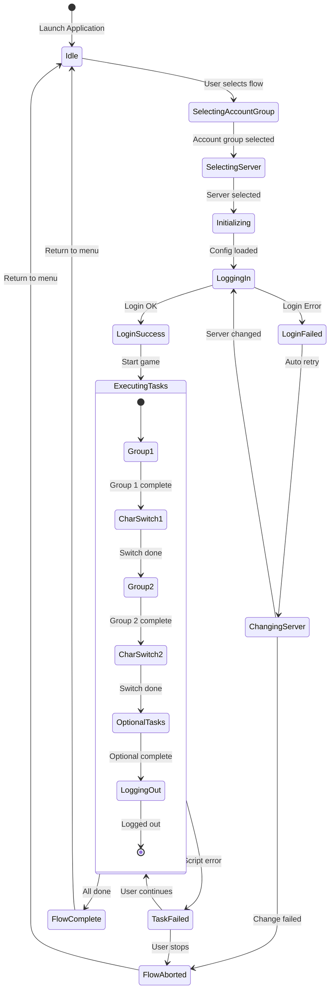
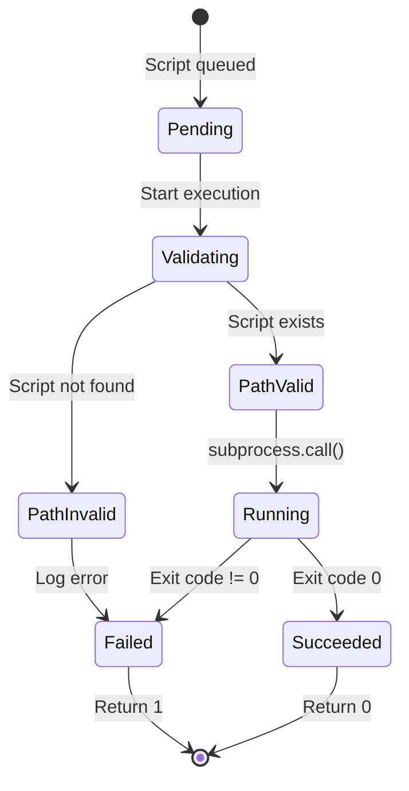
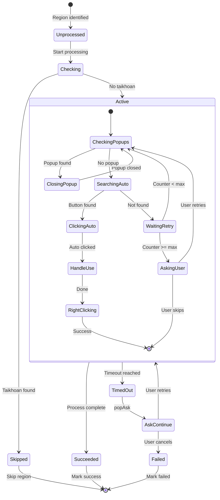
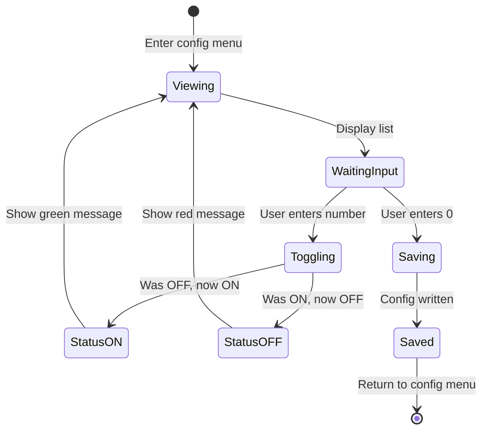
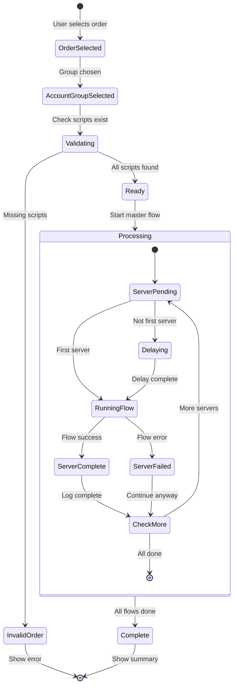
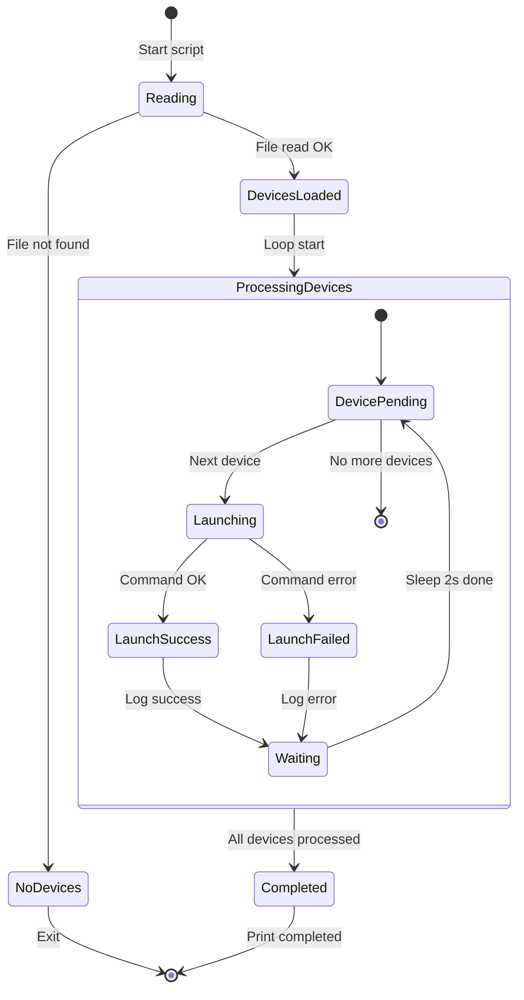
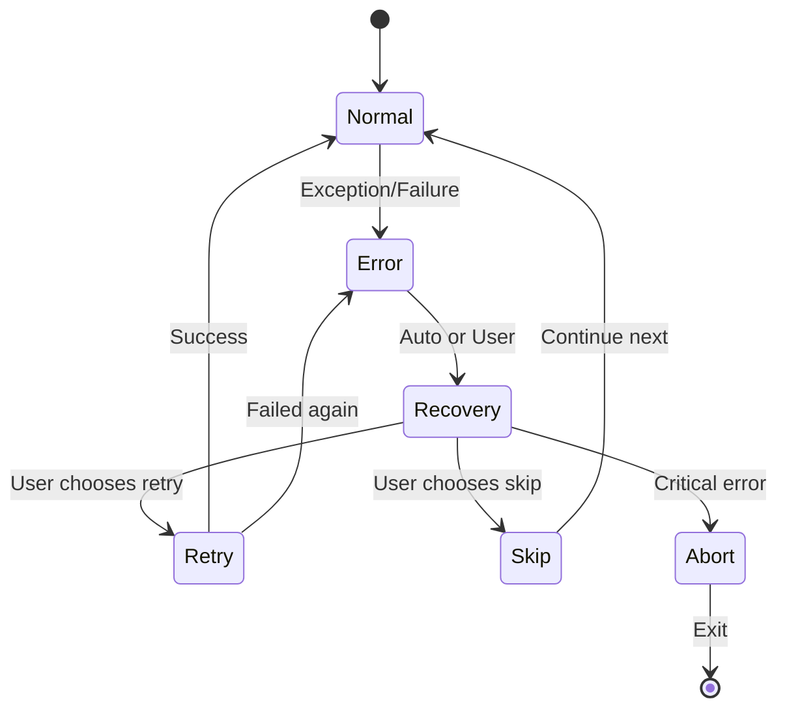

# 🔄 State Diagrams
## MapleStory M Auto Flow Launcher

---

## 1. Flow Execution State Machine

### 1.1 Main Flow States

### 1.2 State Descriptions

| State | Description | Entry Action | Exit Action |
|-------|-------------|--------------|-------------|
| **Idle** | Waiting at main menu | Display menu | Clear screen |
| **SelectingAccountGroup** | User choosing account 1/2/3 | Show options | Store selection |
| **SelectingServer** | User choosing server | Load available servers | Store server |
| **Initializing** | Loading config | Load config.json | Log start |
| **LoggingIn** | Executing login script | Run account script | Check result |
| **LoginFailed** | Login unsuccessful | - | Trigger retry |
| **ChangingServer** | Retrying via server change | Run change_server | - |
| **ExecutingTasks** | Running gameplay scripts | Start timer | Stop timer |
| **TaskFailed** | A script failed | Show error | Ask user |
| **FlowComplete** | All tasks done | Calculate time | Show summary |
| **FlowAborted** | User cancelled or error | Log error | - |

---

## 2. Script Execution State Machine

### 2.1 Single Script States

### 2.2 Transitions

| From | Event | To | Guard |
|------|-------|-----|-------|
| Pending | execute() | Validating | - |
| Validating | path_check | PathValid | os.path.exists() = True |
| Validating | path_check | PathInvalid | os.path.exists() = False |
| Running | complete | Succeeded | exit_code == 0 |
| Running | complete | Failed | exit_code != 0 |

---

## 3. Region Processing State Machine

### 3.1 AutoBattle Region States

---

## 4. Configuration State Machine

### 4.1 Optional Script Config States

### 4.2 Script Status Values

| Status | Value | Meaning | Visual |
|--------|-------|---------|--------|
| **Optional/Random** | 1 | May or may not run | 🟢 BẬT |
| **Fixed/Always** | 0 | Always runs | 🔴 TẮT |

---

## 5. Master Flow State Machine

### 5.1 Multi-Server Execution States

---

## 6. ADB Script State Machine

### 6.1 Device Launch States

---

## 7. State Transition Summary

### 7.1 Critical State Transitions

| State Machine | Critical Transition | Trigger | Fallback |
|---------------|---------------------|---------|----------|
| Main Flow | LoggingIn → LoginFailed | Exit code != 0 | ChangingServer |
| Script Exec | Running → Failed | Exception | Return 1 |
| Region | Searching → WaitingRetry | Pattern not found | Ask user |
| Master Flow | RunningFlow → ServerFailed | Flow error | Continue next |

### 7.2 Error Recovery States

---

*Document maintained in: `BA_Portfolio/03_System_Design/07_state_diagram.md`*
