# 📊 ERD & Data Design
## MapleStory M Auto Flow Launcher

---

## 1. Data Architecture Overview

MapleStory M Auto Launcher sử dụng kiến trúc **file-based storage** thay vì database truyền thống:

| Storage Type | Format | Purpose |
|--------------|--------|---------|
| Configuration | JSON | User settings, optional scripts |
| Device Lists | TXT | ADB device IDs |
| Image Patterns | PNG | Sikuli recognition patterns |
| Logs | TXT | Execution history |

---

## 2. Entity Relationship Diagram

### 2.1 Conceptual ERD


### 2.2 Physical ERD (File-Based)


---

## 3. Data Dictionary

### 3.1 Configuration Entity

| Field | Type | Description | Constraints | Example |
|-------|------|-------------|-------------|---------|
| `SIKULI_PATH` | String | Đường dẫn đến sikuli.jar | Required, valid path | `"tools\\sikuli.jar"` |
| `SCRIPT_PATH` | String | Thư mục chứa scripts | Required, valid directory | `"C:\\Users\\...\\script_new"` |
| `MIN_DELAY` | Integer | Delay tối thiểu (giây) | >= 1 | `5` |
| `MAX_DELAY` | Integer | Delay tối đa (giây) | >= MIN_DELAY | `20` |
| `OPTIONAL_SCRIPTS` | Object | Map script name → status | - | `{"Elite Dungeon": 1}` |

### 3.2 Optional Script Status

| Value | Meaning | Behavior |
|-------|---------|----------|
| `0` | Fixed (TẮT) | Script LUÔN chạy mỗi flow |
| `1` | Optional (BẬT) | Script CÓ THỂ chạy hoặc không (random) |

### 3.3 Device List Entity

| Field | Type | Description | Example |
|-------|------|-------------|---------|
| `device_id` | String | ADB device identifier | `"127.0.0.1:21503"` |

File locations:
- `scripts/accounts_group/adb/devices.txt` → accounts_1
- `scripts/accounts_group/adb/devices-2.txt` → accounts_2
- `scripts/accounts_group/adb/devices-3.txt` → accounts_3

### 3.4 Script Entity Structure

#### Account Scripts

| Field | Type | Description |
|-------|------|-------------|
| `filename` | String | Script identifier (a1.py, us.py, etc.) |
| `search_regions` | Array[Region] | 6 screen regions to scan |
| `image_patterns` | Array[Pattern] | Login-related images |

#### Gameplay Scripts

| Field | Type | Description |
|-------|------|-------------|
| `filename` | String | Script identifier |
| `auto_buttons` | Array[Pattern] | Auto battle button patterns |
| `x_buttons` | Array[Pattern] | Close popup patterns |
| `dead_images` | Array[Pattern] | Character dead patterns |
| `taikhoan_patterns` | Array[Pattern] | Skip account patterns |

### 3.5 Region Structure

| Field | Type | Description | Example |
|-------|------|-------------|---------|
| `x` | Integer | Top-left X coordinate | `0` |
| `y` | Integer | Top-left Y coordinate | `0` |
| `width` | Integer | Region width | `1277` |
| `height` | Integer | Region height | `717` |

**Standard 6-Region Layout:**
```
┌─────────────┬─────────────┬─────────────┐
│  Region 0   │  Region 1   │  Region 2   │
│  (0,0)      │  (1279,0)   │  (2561,0)   │
│  1277x717   │  1275x716   │  1279x718   │
├─────────────┼─────────────┼─────────────┤
│  Region 3   │  Region 4   │  Region 5   │
│  (0,719)    │  (1282,719) │  (2560,720) │
│  1275x720   │  1270x721   │  1280x718   │
└─────────────┴─────────────┴─────────────┘
```

---

## 4. Data Flow Diagram

### 4.1 Configuration Data Flow


### 4.2 Script Data Flow

```mermaid
flowchart LR
    subgraph Input["📥 Input"]
        Images[(Image Patterns)]
        Regions[Region Definitions]
    end
    
    subgraph Processing["⚙️ Processing"]
        Sikuli[Sikuli Engine]
        Match[Pattern Matching]
    end
    
    subgraph Output["📤 Output"]
        Click[Click Actions]
        Log[(Log File)]
    end
    
    Images --> Sikuli
    Regions --> Sikuli
    Sikuli --> Match
    Match --> Click
    Match --> Log
```



---

## 5. File Structure Mapping

### 5.1 Directory to Entity Mapping

| Directory | Entity Type | Files |
|-----------|-------------|-------|
| `/` | Configuration | `launcher_config.json` |
| `/logs` | Log Storage | `launcher.log` |
| `/images/common` | Image Patterns | `*.png, *.PNG` |
| `/scripts/accounts_group/accounts_1` | Account Scripts | `a1.py, a2.py, us.py` |
| `/scripts/accounts_group/server` | Server Scripts | `change_server_*.py` |
| `/scripts/accounts_group/adb` | ADB Scripts | `script_adb*.py, devices*.txt` |
| `/scripts/game_play` | Gameplay Scripts | 12 `.py` files |

### 5.2 Image Pattern Categories

| Category | Path | Files | Purpose |
|----------|------|-------|---------|
| **Common** | `/images/common/` | `ab*.png, start.png, X_*.png` | Shared patterns |
| **Dead** | `/images/common/` | `dead*.png` | Character death detection |
| **Accounts** | `/images/common/` | `taikhoan*.png` | Skip account detection |

---

## 6. Data Relationships Summary

### 6.1 Cardinality

| Relationship | Type | Description |
|--------------|------|-------------|
| Config → OptionalScripts | 1:N | One config has 8 optional scripts |
| AccountGroup → AccountScripts | 1:N | One group has 4-6 login scripts |
| AccountGroup → DeviceList | 1:1 | One group maps to one device file |
| GameplayScript → Regions | 1:6 | One script operates on 6 regions |
| GameplayScript → Patterns | 1:N | One script uses multiple patterns |

### 6.2 Dependencies


---

*Document maintained in: `BA_Portfolio/03_System_Design/08_erd_data_design.md`*
