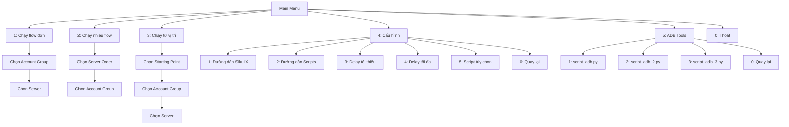

# 🖥️ Interface Specifications
## MapleStory M Auto Flow Launcher

---

## 1. Interface Overview

MapleStory M Auto Launcher sử dụng **Command Line Interface (CLI)** với các đặc điểm:

| Attribute | Specification |
|-----------|---------------|
| **Interface Type** | Text-based CLI |
| **Color Support** | ANSI color codes |
| **Platform** | Windows (primary), Linux/Mac (compatible) |
| **Encoding** | UTF-8 |
| **Input Mode** | Numeric selection + text input |

---

## 2. Main Menu Interface

### 2.1 Layout Specification

```
============================================================
              MapleStory M Auto Flow Launcher               
============================================================
├── 1: Chạy flow đơn (chọn A1/US/A2)
├── 2: Chạy nhiều flow (tùy chọn thứ tự)
├── 3: Chạy từ vị trí tùy chọn
├── 4: Cấu hình launcher
├── 5: Công cụ ADB
└── 0: Thoát

Nhập lựa chọn của bạn: _
```

### 2.2 Visual Elements

| Element | Format | Color Code |
|---------|--------|------------|
| **Header** | Centered, 60 chars wide | Cyan + Bold |
| **Menu Items** | Tree structure (├──, └──) | Green (key) + Cyan (text) |
| **Prompt** | "Nhập lựa chọn của bạn: " | Default |
| **Error** | "[LỖI] message" | Red |
| **Success** | "[THÀNH CÔNG] message" | Green |
| **Info** | "[THÔNG BÁO] message" | Cyan |

### 2.3 Color Constants

```python
class Colors:
    HEADER = '\033[95m'    # Magenta
    BLUE = '\033[94m'      # Blue
    GREEN = '\033[92m'     # Green
    YELLOW = '\033[93m'    # Yellow
    RED = '\033[91m'       # Red
    CYAN = '\033[96m'      # Cyan
    WHITE = '\033[97m'     # White
    BOLD = '\033[1m'       # Bold
    UNDERLINE = '\033[4m'  # Underline
    ENDC = '\033[0m'       # Reset
```

---

## 3. Menu Hierarchy

### 3.1 Navigation Map



### 3.2 Sitemap (CLI Screen Hierarchy)

| Level 1 | Level 2 | Level 3 | Screen ID |
|---------|---------|---------|-----------|
| Main Menu | - | - | SCR-001 |
| Main Menu | Chạy flow đơn | Chọn Account Group | SCR-002 |
| Main Menu | Chạy flow đơn | Chọn Server | SCR-003 |
| Main Menu | Chạy flow đơn | Flow Execution | SCR-004 |
| Main Menu | Chạy nhiều flow | Chọn Server Order | SCR-005 |
| Main Menu | Chạy nhiều flow | Chọn Account Group | SCR-006 |
| Main Menu | Chạy từ vị trí | Chọn Starting Point | SCR-007 |
| Main Menu | Cấu hình | Config Menu | SCR-008 |
| Main Menu | Cấu hình | Optional Scripts | SCR-009 |
| Main Menu | ADB Tools | ADB Menu | SCR-010 |

---

## 4. Input Specifications

### 4.1 Input Types

| Input Type | Format | Validation | Example |
|------------|--------|------------|---------|
| **Menu Selection** | Single digit | Must be in range | `1`, `0` |
| **Path Input** | String | Check exists | `C:\path\to\sikuli.jar` |
| **Delay Value** | Integer | >= 1, numeric | `5`, `20` |
| **Yes/No Prompt** | y/n | Case insensitive | `y`, `N` |
| **Continue Prompt** | Enter key | Any input | `[Enter]` |

### 4.2 Input Validation Messages

| Scenario | Message | Color |
|----------|---------|-------|
| Invalid menu choice | "[LỖI] Lựa chọn không hợp lệ!" | Red |
| Non-numeric input | "[LỖI] Vui lòng nhập số!" | Red |
| Invalid delay | "[LỖI] Thời gian delay phải lớn hơn hoặc bằng 1" | Red |
| Max < Min | "[LỖI] Thời gian delay phải lớn hơn hoặc bằng {MIN}" | Red |

---

## 5. Output Specifications

### 5.1 Progress Display

```
--------------------------------------------------
         Bắt đầu flow A1 từ A1                    
--------------------------------------------------
[THÔNG BÁO] Cần thực hiện 15 bước
[QUY TRÌNH]
├── 1: Login A1
├── 2: Start
├── 3: Auto Battle 1
├── 4: Guild 1
├── 5: Dimension 1
...
└── 15: Logout

[TIẾN TRÌNH] Bước 1/15: Login A1
[KẾT QUẢ] accounts_1/a1.py: Thành công
```

### 5.2 Output Format Patterns

| Pattern | Format | Example |
|---------|--------|---------|
| **Subheader** | Centered, 50 chars, dashes | `--- Flow Starting ---` |
| **Step Progress** | `[TIẾN TRÌNH] Bước X/Y: Name` | `[TIẾN TRÌNH] Bước 1/15: Login` |
| **Result** | `[KẾT QUẢ] path: Status` | `[KẾT QUẢ] game_play/start.py: Thành công` |
| **Countdown** | `Còn lại X giây...` | `Còn lại 5 giây...` |
| **Time Summary** | `Tổng thời gian: Xh Ym Zs` | `Tổng thời gian: 0h 15m 32s` |

---

## 6. Interactive Dialogs

### 6.1 Sikuli PopAsk Dialog

```
┌─────────────────────────────────────────────┐
│ Khong tim thay nut Start trong khu vuc 1    │
│ sau 20 giay. Ban co muon thu lai?           │
│                                             │
│            [ Yes ]    [ No ]                │
└─────────────────────────────────────────────┘
```

| Response | Action |
|----------|--------|
| Yes | Reset timer, continue search |
| No | Stop, exit script |

### 6.2 Console Confirmation

```
Bạn có muốn tiếp tục với bước tiếp theo không? (y/n): _
```

---

## 7. Configuration Menu Interface

### 7.1 Settings Display

```
============================================================
                     Menu Cấu Hình                          
============================================================
├── 1: Đường dẫn SikuliX
├── 2: Đường dẫn Scripts
├── 3: Thời gian delay tối thiểu
├── 4: Thời gian delay tối đa
├── 5: Cấu hình script tùy chọn
└── 0: Quay lại
```

### 7.2 Optional Scripts Display

```
============================================================
                Cấu Hình Script Tùy Chọn                    
============================================================
Tùy chỉnh cách hoạt động của các script trong flow

[TẮT] = LUÔN CHẠY MỖI LẦN (cố định/giống nhau mỗi ngày)
[BẬT] = CÓ THỂ CHẠY HOẶC KHÔNG (ngẫu nhiên/khác nhau mỗi ngày)

Mục đích: Để hệ thống nghĩ bạn là người thật...

├── 1: Auto Battle 3 (Ngẫu nhiên) [BẬT]
├── 2: Guild 3 (Ngẫu nhiên) [BẬT]
├── 3: Guild Dungeon (Luôn chạy) [TẮT]
├── 4: Dimension 3 (Ngẫu nhiên) [BẬT]
├── 5: Elite Dungeon (Ngẫu nhiên) [BẬT]
├── 6: Daily Chaos (Ngẫu nhiên) [BẬT]
├── 7: Daily Hell (Ngẫu nhiên) [BẬT]
├── 8: Mulung (Ngẫu nhiên) [BẬT]
└── 0: Quay lại
```

---

## 8. Error Display Interface

### 8.1 Error Message Formats

| Error Type | Format | Example |
|------------|--------|---------|
| **Script Not Found** | `[LỖI] Không tìm thấy script: {path}` | `[LỖI] Không tìm thấy script: game_play/start.py` |
| **Execution Failed** | `[LỖI] Không thể chạy {path}: {error}` | `[LỖI] Không thể chạy: Permission denied` |
| **Flow Error** | `[LỖI] {message}` | `[LỖI] Bước Start thất bại` |

### 8.2 Error Recovery Interface

```
[LỖI] Bước Guild thất bại

Bạn có muốn tiếp tục với bước tiếp theo không? (y/n): _
```

---

## 9. ADB Tools Interface

### 9.1 ADB Menu

```
============================================================
                    Quản Lý ADB Scripts                     
============================================================
[SCRIPT ADB]
├── (1) Chạy script_adb.py (cho accounts)
├── (2) Chạy script_adb_2.py (cho accounts_2)
├── (3) Chạy script_adb_3.py (cho accounts_3)
└── (0) Quay lại
```

### 9.2 ADB Execution Output

```
[THÔNG BÁO] Đang chạy script: ...scripts/accounts_group/adb/script_adb.py
Reading devices from: scripts\accounts_group\adb\devices.txt

Found 3 devices:
- 127.0.0.1:21503
- 127.0.0.1:21513
- 127.0.0.1:21523

Starting app on all devices...

Processing device: 127.0.0.1:21503
Successfully launched app on device: 127.0.0.1:21503

Completed!
[THÀNH CÔNG] Script đã chạy thành công
```

---

## 10. Accessibility Considerations

| Feature | Implementation |
|---------|----------------|
| **Screen Reader** | Text-only output, no graphics |
| **Color Blind** | Status indicated by text + color |
| **Large Text** | Uses console font settings |
| **Keyboard Only** | Full navigation via keyboard |

---

*Document maintained in: `BA_Portfolio/04_Interface_Integration/09_interface_specs.md`*
