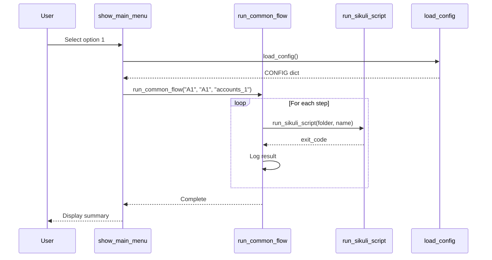

# 📡 API Documentation
## MapleStory M Auto Flow Launcher - Internal APIs

---

## 1. API Overview

MapleStory M Auto Launcher không expose external APIs nhưng có các **internal function interfaces** được sử dụng như API contracts giữa các modules.

| Layer | Purpose | Key Functions |
|-------|---------|---------------|
| **Configuration** | Settings management | `load_config()`, `save_config()` |
| **Execution** | Script running | `run_sikuli_script()`, `run_common_flow()` |
| **Flow Control** | Multi-server orchestration | `run_master_flow()` |
| **Device** | ADB operations | `run_adb_command()` |
| **UI** | Console output | `print_colored()`, `print_menu_tree()` |

---

## 2. Configuration API

### 2.1 load_config()

**Purpose:** Load configuration from JSON file or return defaults.

```python
def load_config() -> dict
```

| Attribute | Value |
|-----------|-------|
| **Location** | `new_gui_launcher.py:56-64` |
| **Parameters** | None |
| **Returns** | `dict` - Configuration object |
| **Exceptions** | Catches all, returns defaults on error |

**Response Structure:**
```json
{
    "SIKULI_PATH": "string",
    "SCRIPT_PATH": "string",
    "MIN_DELAY": "integer",
    "MAX_DELAY": "integer",
    "OPTIONAL_SCRIPTS": {
        "Script Name": "0 or 1"
    }
}
```

**Example:**
```python
CONFIG = load_config()
# Returns: {"SIKULI_PATH": "tools\\sikuli.jar", ...}
```

---

### 2.2 save_config()

**Purpose:** Persist configuration to JSON file.

```python
def save_config(config: dict) -> bool
```

| Attribute | Value |
|-----------|-------|
| **Location** | `new_gui_launcher.py:66-74` |
| **Parameters** | `config` - Configuration dict |
| **Returns** | `bool` - Success status |
| **Side Effects** | Writes to `launcher_config.json` |

**Example:**
```python
CONFIG["MIN_DELAY"] = 10
success = save_config(CONFIG)
# Returns: True if saved successfully
```

---

## 3. Script Execution API

### 3.1 run_sikuli_script()

**Purpose:** Execute a Sikuli script and return result.

```python
def run_sikuli_script(
    script_folder: str, 
    script_name: str, 
    account_group: str = None
) -> int
```

| Attribute | Value |
|-----------|-------|
| **Location** | `new_gui_launcher.py:172-209` |
| **Returns** | `int` - Exit code (0=success, 1=failure) |

**Parameters:**

| Parameter | Type | Required | Description |
|-----------|------|----------|-------------|
| `script_folder` | string | Yes | Subfolder under scripts/ |
| `script_name` | string | Yes | Python script filename |
| `account_group` | string | No | Account group for server change |

**Path Resolution Logic:**
```
if folder in ["accounts_1", "accounts_2", "accounts_3", "server", "adb"]:
    path = scripts/accounts_group/{folder}/{name}
elif folder.startswith("accounts_group/"):
    path = scripts/{folder}/{name}
else:
    path = scripts/{folder}/{name}
```

**Example:**
```python
result = run_sikuli_script("game_play", "auto_battle.py")
# Executes: java -jar sikuli.jar -r "scripts/game_play/auto_battle.py"
# Returns: 0 (success) or 1 (failure)
```

**Error Codes:**

| Code | Meaning |
|------|---------|
| `0` | Script executed successfully |
| `1` | Script not found or execution failed |

---

### 3.2 run_common_flow()

**Purpose:** Execute complete automation flow for a server.

```python
def run_common_flow(
    start_point: str, 
    server_type: str = "A1", 
    account_group: str = "accounts_1"
) -> None
```

| Attribute | Value |
|-----------|-------|
| **Location** | `new_gui_launcher.py:317-508` |
| **Returns** | None (prints to console) |

**Parameters:**

| Parameter | Type | Required | Description |
|-----------|------|----------|-------------|
| `start_point` | string | Yes | Starting step name |
| `server_type` | string | No | Server identifier (A1/US/EU/A2) |
| `account_group` | string | No | Account group to use |

**Valid Start Points:**
```python
["Start", "Auto Battle 1", "Guild 1", "Dimension 1",
 "Change Char 1", "Auto Battle 2", "Guild 2", "Dimension 2",
 "Change Char 2", "Auto Battle 3", "Guild 3", "Guild Dungeon", 
 "Dimension 3", "Elite Dungeon", "Logout"]
```

**Flow Execution Order:**


---

### 3.3 run_master_flow()

**Purpose:** Execute sequential flows for multiple servers.

```python
def run_master_flow(
    server_order: list, 
    account_group: str = "accounts_1"
) -> None
```

| Attribute | Value |
|-----------|-------|
| **Location** | `new_gui_launcher.py:611-684` |
| **Returns** | None |

**Parameters:**

| Parameter | Type | Required | Description |
|-----------|------|----------|-------------|
| `server_order` | list[str] | Yes | Ordered list of servers |
| `account_group` | string | No | Account group |

**Example:**
```python
run_master_flow(["A1", "US", "EU", "A2"], "accounts_1")
# Executes: A1 flow → delay → US flow → delay → EU flow → delay → A2 flow
```

---

## 4. Data Retrieval API

### 4.1 get_account_scripts()

**Purpose:** Get available account scripts for a group.

```python
def get_account_scripts(
    account_group: str = "accounts_1"
) -> dict
```

| Attribute | Value |
|-----------|-------|
| **Location** | `new_gui_launcher.py:212-249` |
| **Returns** | `dict` - Available scripts |

**Response Structure:**
```python
{
    "A1": ("A1", "accounts_1", "a1.py"),
    "US": ("US", "accounts_1", "us.py"),
    "EU": ("EU", "accounts_1", "eu.py"),
    "A2": ("A2", "accounts_1", "a2.py"),
    "A2_2": ("A2_2", "accounts_1", "a2_2.py"),
    # ... etc
}
```

---

### 4.2 get_all_scripts()

**Purpose:** Get all available scripts categorized.

```python
def get_all_scripts() -> tuple[list, dict]
```

| Attribute | Value |
|-----------|-------|
| **Location** | `new_gui_launcher.py:269-314` |
| **Returns** | `(all_scripts, categories_dict)` |

**Response Structure:**
```python
categories = {
    "Account": [(name, folder, file), ...],
    "Server": [...],
    "ADB": [...],
    "Gameplay": [...]
}
```

---

### 4.3 get_start_points()

**Purpose:** Get list of valid starting points.

```python
def get_start_points() -> list[str]
```

| Attribute | Value |
|-----------|-------|
| **Location** | `new_gui_launcher.py:260-267` |
| **Returns** | `list[str]` - Valid start points |

---

## 5. ADB API

### 5.1 run_adb_command()

**Purpose:** Execute an ADB command.

```python
def run_adb_command(command: str) -> int
```

| Attribute | Value |
|-----------|-------|
| **Location** | `new_gui_launcher.py:687-711` |
| **Returns** | `int` - Exit code |

**Example:**
```python
result = run_adb_command("devices")
# Executes: adb devices
# Returns: 0 (success) or 1 (failure)
```

---

## 6. UI Helper API

### 6.1 print_colored()

```python
def print_colored(
    text: str, 
    color: str = Colors.WHITE, 
    bold: bool = False, 
    newline: bool = True
) -> None
```

### 6.2 print_header()

```python
def print_header(text: str) -> None
# Prints 60-char centered header with borders
```

### 6.3 print_subheader()

```python
def print_subheader(text: str) -> None
# Prints 50-char centered subheader
```

### 6.4 print_menu_tree()

```python
def print_menu_tree(
    items: list[tuple], 
    indent: int = 0, 
    last_indices: list = None
) -> None
```

**Item Format:**
```python
items = [
    ("1", "Menu Text", "Description"),
    ("0", "Exit", None)  # None description = exit item
]
```

---

## 7. Logging API

### 7.1 setup_logging()

```python
def setup_logging() -> str
# Returns: Path to log file
```

**Log Format:**
```
2024-12-29 15:30:00 - Running: game_play/auto_battle.py
2024-12-29 15:30:15 - Completed: game_play/auto_battle.py with result: Thành công
```

---

## 8. Sequence Diagram: API Flow



---

## 9. Error Handling

All APIs follow consistent error handling:

| API | On Error | Return Value |
|-----|----------|--------------|
| `load_config()` | Return defaults | `DEFAULT_CONFIG` |
| `save_config()` | Print error | `False` |
| `run_sikuli_script()` | Log error | `1` |
| `run_common_flow()` | Prompt user | Continue or stop |
| `run_adb_command()` | Log error | `1` |

---

*Document maintained in: `BA_Portfolio/04_Interface_Integration/10_api_documentation.md`*
