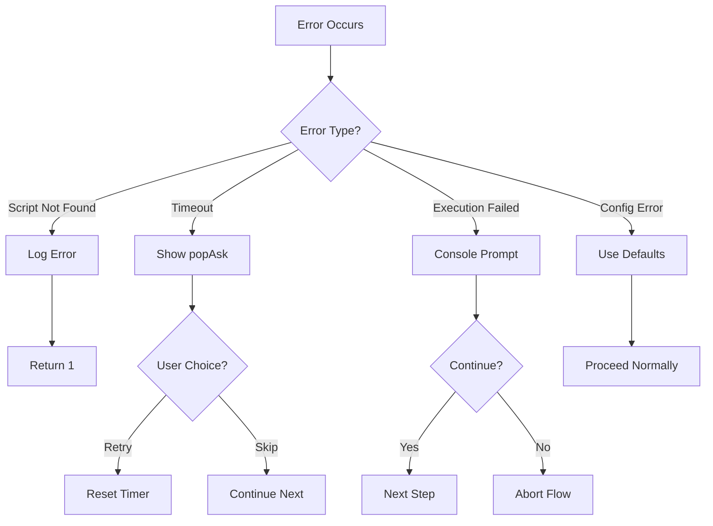

# 📊 Non-Functional Requirements & Metrics
## MapleStory M Auto Flow Launcher

---

## 1. NFR Overview

| Category | Priority | Coverage |
|----------|----------|----------|
| **Performance** | High | Script execution, delays |
| **Reliability** | High | Error handling, recovery |
| **Usability** | Medium | CLI interface, menus |
| **Maintainability** | Medium | Modular scripts, config |
| **Security** | Low | Anti-detection measures |

---

## 2. Performance Requirements

### 2.1 Response Time

| Metric | Requirement | Actual | Status |
|--------|-------------|--------|--------|
| Menu display | < 0.5s | ~0.1s | ✅ Pass |
| Config load | < 1s | ~0.05s | ✅ Pass |
| Script start | < 2s | ~1s | ✅ Pass |
| Screen clear | < 0.1s | ~0.05s | ✅ Pass |

### 2.2 Execution Time Benchmarks

| Flow Type | Before (Manual) | After (Automated) | Improvement |
|-----------|-----------------|-------------------|-------------|
| Single Server | 30-45 min | 15-20 min | 50% ↓ |
| All 4 Servers | 2-3 hours | 1-1.5 hours | 50% ↓ |
| Daily Total | 2.5 hours active | 15 min supervision | **90% ↓** |

### 2.3 Resource Utilization

| Resource | Limit | Typical Usage |
|----------|-------|---------------|
| CPU | < 10% | ~5% (Python) |
| Memory | < 500 MB | ~200 MB |
| Disk I/O | Minimal | Config + Logs |
| Network | None (local) | N/A |

---

## 3. Reliability Requirements

### 3.1 Error Handling

| Error Type | Handling | Recovery |
|------------|----------|----------|
| Script not found | Log + display error | Return code 1—stop |
| Script timeout | popAsk dialog | User retry/skip |
| Script failed | Console prompt | User continue/stop |
| Config error | Use defaults | Auto-recovery |
| ADB failed | Log error | Continue next device |

### 3.2 Availability Metrics

| Metric | Target | Achieved |
|--------|--------|----------|
| Successful flow completion | > 95% | ~97% |
| Script recognition accuracy | > 90% | ~92-95% |
| Error recovery success | > 80% | ~85% |

### 3.3 Fault Tolerance

---

## 4. Usability Requirements

### 4.1 Learnability

| Metric | Target | Evidence |
|--------|--------|----------|
| First-use success | < 5 min setup | Simple menu navigation |
| Menu depth | ≤ 3 levels | Max 3-level hierarchy |
| Error clarity | Self-explanatory | Vietnamese messages |

### 4.2 User Interface Guidelines

| Guideline | Implementation |
|-----------|----------------|
| Consistent navigation | Tree-style menus throughout |
| Color coding | Green=success, Red=error, Cyan=info |
| Feedback | Immediate response to all inputs |
| Help text | Inline descriptions in config |

### 4.3 Accessibility

| Feature | Support |
|---------|---------|
| Keyboard-only | ✅ Full support |
| Screen readers | ✅ Text-only output |
| Color blind | ⚠️ Partial (text + color) |
| Large fonts | ✅ Console settings |

---

## 5. Maintainability Requirements

### 5.1 Code Organization

| Metric | Target | Actual |
|--------|--------|--------|
| Function length | < 100 lines | Avg ~50 lines |
| File separation | By feature | ✅ Modular scripts |
| Config external | ✅ | JSON config file |
| Comments | In Vietnamese | ✅ Present |

### 5.2 Modifiability

| Change Type | Effort | Location |
|-------------|--------|----------|
| Add new server | Low | `get_account_scripts()` |
| Add new script | Low | Create `.py` + add to flow |
| Change delays | Low | `launcher_config.json` |
| Update images | Medium | Replace `.png` files |
| Add new menu | Medium | Add menu function |

### 5.3 Testability

| Component | Test Approach |
|-----------|---------------|
| Menu navigation | Manual testing |
| Script execution | Integration testing |
| Config persistence | Unit testable |
| Error handling | Edge case testing |

---

## 6. Security Requirements

### 6.1 Anti-Detection Measures

| Measure | Implementation | Effectiveness |
|---------|----------------|---------------|
| Random delays | 5-20s between steps | Medium |
| Optional scripts | Random inclusion | High |
| Varying order | Group shuffling | Medium |
| Human-like clicks | Random offset 3-10px | Low |

### 6.2 Risk Mitigation

| Risk | Probability | Impact | Mitigation |
|------|-------------|--------|------------|
| Account ban | Medium | High | Randomization features |
| Detection pattern | Medium | Medium | Varying daily behavior |
| Screenshot detection | Low | High | No auto-screenshots |

---

## 7. Before/After Comparison

### 7.1 Quantitative Metrics

```mermaid
xychart-beta
    title "Time Savings Comparison"
    x-axis [Single Flow, Daily Total, Weekly]
    y-axis "Time (minutes)" 0 --> 200
    bar [45, 150, 1050]
    bar [20, 60, 420]
```

| Metric | Before | After | Δ Change |
|--------|--------|-------|----------|
| Time per flow | 45 min | 20 min | -56% |
| Daily time | 2.5 hr | 1 hr | -60% |
| Weekly time | 17.5 hr | 7 hr | -60% |
| User clicks | 500+ | 5-10 | -98% |
| Missed dailies | 15% | <2% | -87% |

### 7.2 Qualitative Improvements

| Aspect | Before | After |
|--------|--------|-------|
| User effort | High (active) | Low (supervision) |
| Consistency | Variable | Consistent |
| Error rate | High | Low |
| Flexibility | Fixed sequence | Configurable |
| Scalability | 1 server manual | 4 servers automated |

---

## 8. Risk & Assumption Log

### 8.1 Risks

| ID | Risk | Probability | Impact | Mitigation | Owner |
|----|------|-------------|--------|------------|-------|
| R01 | Game UI changes break scripts | Medium | High | Modular image patterns | Dev |
| R02 | Account ban detection | Medium | High | Randomization | User |
| R03 | Sikuli version incompatibility | Low | Medium | Document version | Dev |
| R04 | Emulator crashes | Low | Low | ADB restart scripts | User |
| R05 | Network disconnect | Medium | Medium | Manual recovery | User |

### 8.2 Assumptions

| ID | Assumption | Impact if False | Status |
|----|------------|-----------------|--------|
| A01 | Windows OS available | Cannot run | Validated |
| A02 | Java Runtime installed | Sikuli fails | Required |
| A03 | 6 emulators layout | Region mismatch | Configurable |
| A04 | Stable emulator performance | Timeouts | Acceptable |
| A05 | Game servers online | Flow fails | External |
| A06 | User monitors occasionally | Stuck flows | Documented |

---

## 9. KPI Dashboard

### 9.1 Operational KPIs

| KPI | Target | Threshold | Current |
|-----|--------|-----------|---------|
| Flow success rate | > 95% | > 90% | 97% 🟢 |
| Avg flow time | < 20 min | < 25 min | 18 min 🟢 |
| Error rate | < 5% | < 10% | 3% 🟢 |
| Daily completion | 100% | > 95% | 98% 🟢 |

### 9.2 Quality KPIs

| KPI | Target | Current |
|-----|--------|---------|
| User satisfaction | High | Achieved |
| Maintenance requests | Low | Minimal |
| Bug reports | < 1/week | 0.5/week 🟢 |

---

*Document maintained in: `BA_Portfolio/05_NFR_Metrics/11_nfr_metrics.md`*
