# 📋 Software Requirements Specification (SRS)
## MapleStory M Auto Flow Launcher
### IEEE 830 Standard Format

---

## 1. Introduction

### 1.1 Purpose
Tài liệu này đặc tả yêu cầu phần mềm cho **MapleStory M Auto Flow Launcher** - hệ thống tự động hóa các tác vụ hàng ngày trong game MapleStory M.

### 1.2 Scope
| Attribute | Description |
|-----------|-------------|
| **Product Name** | MapleStory M Auto Flow Launcher |
| **Version** | 1.0 |
| **Platform** | Windows (Python + Sikuli) |
| **Users** | Game players managing multiple accounts |

### 1.3 Definitions & Acronyms

| Term | Definition |
|------|------------|
| **Sikuli** | Java-based visual automation tool |
| **ADB** | Android Debug Bridge |
| **Flow** | Complete automation sequence |
| **Region** | Screen area (1/6 of screen) |
| **Account Group** | Set of login scripts for devices |

### 1.4 References
- [01_business_case.md](../01_Business_Context/01_business_case.md)
- [02_user_story_map.md](../02_Requirements_Analysis/02_user_story_map.md)
- [04_use_case_diagram.md](../03_System_Design/04_use_case_diagram.md)

### 1.5 Overview
Phần còn lại của SRS được tổ chức theo:
- Section 2: Overall Description
- Section 3: Specific Requirements
- Section 4: Supporting Information

---

## 2. Overall Description

### 2.1 Product Perspective

```mermaid
flowchart TB
    subgraph External["External Systems"]
        Game["🎮 MapleStory M"]
        Emulator["📱 Android Emulator"]
        ADB["📟 ADB"]
    end
    
    subgraph System["MapleStory M Auto Launcher"]
        Launcher["Main Launcher"]
        Scripts["Sikuli Scripts"]
        Config["Configuration"]
    end
    
    Launcher --> Scripts
    Scripts --> Emulator
    Launcher --> ADB
    ADB --> Emulator
    Emulator <--> Game
    Config --> Launcher
```

### 2.2 Product Functions

| Function | Description |
|----------|-------------|
| **F1: Single Flow Execution** | Chạy automation cho một server |
| **F2: Multi-Server Flow** | Chạy tuần tự nhiều servers |
| **F3: Resume Flow** | Tiếp tục từ điểm bất kỳ |
| **F4: Configuration** | Cấu hình paths, delays, scripts |
| **F5: ADB Management** | Khởi động app trên emulators |

### 2.3 User Characteristics

| Characteristic | Description |
|----------------|-------------|
| **Technical Level** | Basic Windows user |
| **Game Knowledge** | MapleStory M player |
| **Expected Usage** | Daily, 1-4 times |

### 2.4 Constraints

| Type | Constraint |
|------|------------|
| **Platform** | Windows only |
| **Dependencies** | Java Runtime, Python 3.x |
| **Hardware** | PC running 6 emulators |
| **Screen Layout** | Fixed 6-region (3x2 grid) |

### 2.5 Assumptions & Dependencies

| Assumption | Dependency |
|------------|------------|
| Game UI stable | Sikuli patterns |
| Emulators running | ADB connection |
| Network stable | Game server access |

---

## 3. Specific Requirements

### 3.1 Functional Requirements

#### 3.1.1 Account Management (FR-ACC)

| ID | Requirement | Priority |
|----|-------------|----------|
| FR-ACC-01 | System shall support login automation for A1, US, EU, A2 servers | High |
| FR-ACC-02 | System shall support 3 separate account groups | High |
| FR-ACC-03 | System shall auto-retry with server change on login failure | High |
| FR-ACC-04 | System shall support A2 variants (A2_2, A2_3, A2_4) | Medium |

#### 3.1.2 Flow Execution (FR-FLOW)

| ID | Requirement | Priority |
|----|-------------|----------|
| FR-FLOW-01 | System shall execute complete flow: Login → Tasks → Logout | High |
| FR-FLOW-02 | System shall randomize task group execution order | High |
| FR-FLOW-03 | System shall support starting from any step | Medium |
| FR-FLOW-04 | System shall support sequential multi-server flows | High |
| FR-FLOW-05 | System shall randomly select from optional scripts | High |
| FR-FLOW-06 | System shall apply random delays between steps (2-5s) | High |
| FR-FLOW-07 | System shall apply longer delays between servers (10-30s) | Medium |

#### 3.1.3 Gameplay Scripts (FR-GAME)

| ID | Requirement | Priority |
|----|-------------|----------|
| FR-GAME-01 | System shall execute Start script to enter game | High |
| FR-GAME-02 | System shall execute Auto Battle with popup handling | High |
| FR-GAME-03 | System shall execute Guild tasks | High |
| FR-GAME-04 | System shall execute Dimension dungeons | High |
| FR-GAME-05 | System shall execute character switch (x2) | High |
| FR-GAME-06 | System shall execute optional: Elite, Mulung, Daily | Medium |
| FR-GAME-07 | System shall execute Logout | High |

#### 3.1.4 Configuration (FR-CFG)

| ID | Requirement | Priority |
|----|-------------|----------|
| FR-CFG-01 | System shall allow configuring SikuliX path | Medium |
| FR-CFG-02 | System shall allow configuring script path | Medium |
| FR-CFG-03 | System shall allow setting min/max delays | Medium |
| FR-CFG-04 | System shall allow toggling optional script status | High |
| FR-CFG-05 | System shall persist configuration to JSON file | High |

#### 3.1.5 ADB Management (FR-ADB)

| ID | Requirement | Priority |
|----|-------------|----------|
| FR-ADB-01 | System shall read device list from file | Medium |
| FR-ADB-02 | System shall launch app on multiple devices | Medium |
| FR-ADB-03 | System shall support separate device lists per group | Low |

### 3.2 Non-Functional Requirements

#### 3.2.1 Performance (NFR-PERF)

| ID | Requirement | Target |
|----|-------------|--------|
| NFR-PERF-01 | Menu response time | < 0.5s |
| NFR-PERF-02 | Config load time | < 1s |
| NFR-PERF-03 | Script start time | < 2s |
| NFR-PERF-04 | Flow completion time | < 20 min/server |

#### 3.2.2 Reliability (NFR-REL)

| ID | Requirement | Target |
|----|-------------|--------|
| NFR-REL-01 | Flow success rate | > 95% |
| NFR-REL-02 | Error recovery rate | > 80% |
| NFR-REL-03 | Script recognition accuracy | > 90% |

#### 3.2.3 Usability (NFR-USE)

| ID | Requirement | Target |
|----|-------------|--------|
| NFR-USE-01 | First-use setup time | < 5 min |
| NFR-USE-02 | Menu navigation depth | ≤ 3 levels |
| NFR-USE-03 | Error message clarity | Self-explanatory |

#### 3.2.4 Maintainability (NFR-MNT)

| ID | Requirement | Target |
|----|-------------|--------|
| NFR-MNT-01 | Average function length | < 100 lines |
| NFR-MNT-02 | Modular script structure | Separate files |
| NFR-MNT-03 | External configuration | JSON file |

### 3.3 Interface Requirements

#### 3.3.1 User Interface (UI)

| ID | Requirement |
|----|-------------|
| UI-01 | CLI-based interface with ANSI colors |
| UI-02 | Tree-style menu navigation |
| UI-03 | Vietnamese language messages |
| UI-04 | Progress display during execution |
| UI-05 | Time summary on completion |

#### 3.3.2 Hardware Interface (HW)

| ID | Requirement |
|----|-------------|
| HW-01 | Support 6-emulator screen layout (3x2) |
| HW-02 | ADB connection to emulators |

#### 3.3.3 Software Interface (SW)

| ID | Requirement |
|----|-------------|
| SW-01 | Sikuli JAR execution via Java |
| SW-02 | Python 3.x runtime |
| SW-03 | ADB command execution |

### 3.4 Design Constraints

| Constraint | Description |
|------------|-------------|
| DC-01 | Must use Sikuli for image recognition |
| DC-02 | Must support Windows OS |
| DC-03 | Must work with 6-region screen layout |
| DC-04 | Configuration in JSON format |

---

## 4. Supporting Information

### 4.1 Traceability Matrix

| Requirement | Use Case | User Story | Code File |
|-------------|----------|------------|-----------|
| FR-ACC-01 | UC-08 | ACC-01,02,03 | `accounts_1/a1.py, us.py` |
| FR-FLOW-01 | UC-01 | FLOW-01 | `run_common_flow()` |
| FR-FLOW-04 | UC-02 | FLOW-02 | `run_master_flow()` |
| FR-GAME-02 | UC-09 | GAME-02 | `game_play/auto_battle.py` |
| FR-CFG-04 | UC-05 | CFG-03 | `configure_optional_scripts()` |
| FR-ADB-02 | UC-06 | ADB-01 | `adb/script_adb.py` |

### 4.2 Document Cross-References

| Document | Content | Link |
|----------|---------|------|
| Business Case | Problem, Solution, Scope | [01_business_case.md](../01_Business_Context/01_business_case.md) |
| User Stories | Epics, Stories, Criteria | [02_user_story_map.md](../02_Requirements_Analysis/02_user_story_map.md) |
| BPMN | AS-IS vs TO-BE | [03_bpmn_diagrams.md](../02_Requirements_Analysis/03_bpmn_diagrams.md) |
| Use Cases | Diagram & Relationships | [04_use_case_diagram.md](../03_System_Design/04_use_case_diagram.md) |
| Use Case Specs | Detailed Flows | [05_use_case_specs.md](../03_System_Design/05_use_case_specs.md) |
| Activity Diagrams | Workflow Details | [06_activity_diagram.md](../03_System_Design/06_activity_diagram.md) |
| State Diagrams | State Machines | [07_state_diagram.md](../03_System_Design/07_state_diagram.md) |
| ERD | Data Design | [08_erd_data_design.md](../03_System_Design/08_erd_data_design.md) |
| Interface Specs | UI Design | [09_interface_specs.md](../04_Interface_Integration/09_interface_specs.md) |
| API Docs | Internal APIs | [10_api_documentation.md](../04_Interface_Integration/10_api_documentation.md) |
| NFR Metrics | Performance, KPIs | [11_nfr_metrics.md](../05_NFR_Metrics/11_nfr_metrics.md) |

### 4.3 Appendix: Requirement Summary

| Category | Count | High Priority |
|----------|-------|---------------|
| Account Management | 4 | 3 |
| Flow Execution | 7 | 5 |
| Gameplay Scripts | 7 | 6 |
| Configuration | 5 | 2 |
| ADB Management | 3 | 0 |
| **Total Functional** | **26** | **16** |
| Performance | 4 | - |
| Reliability | 3 | - |
| Usability | 3 | - |
| Maintainability | 3 | - |
| **Total NFR** | **13** | - |

---

### 4.4 Approval

| Role | Name | Date | Signature |
|------|------|------|-----------|
| Business Analyst | _____________ | ____/____/____ | _____________ |
| Technical Lead | _____________ | ____/____/____ | _____________ |
| Project Manager | _____________ | ____/____/____ | _____________ |

---

*Document maintained in: `BA_Portfolio/06_SRS/12_SRS_Document.md`*
*Version: 1.0 | Last Updated: December 2024*
