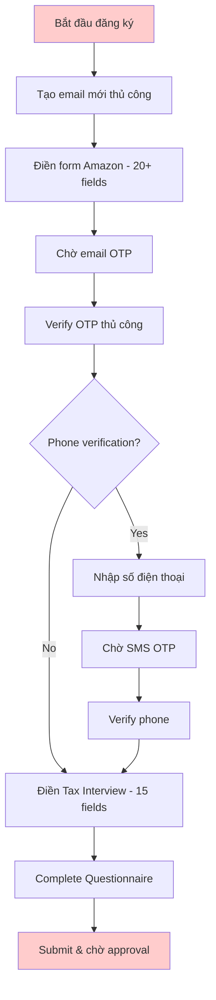
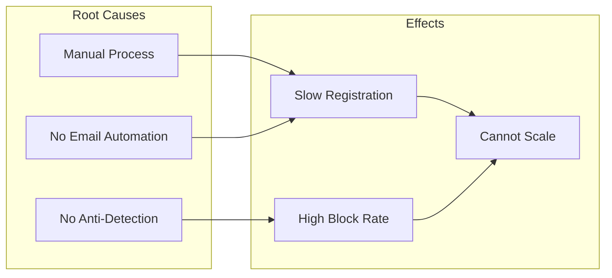
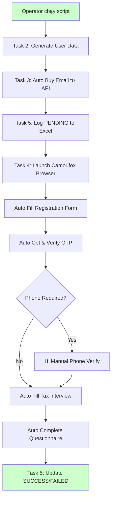
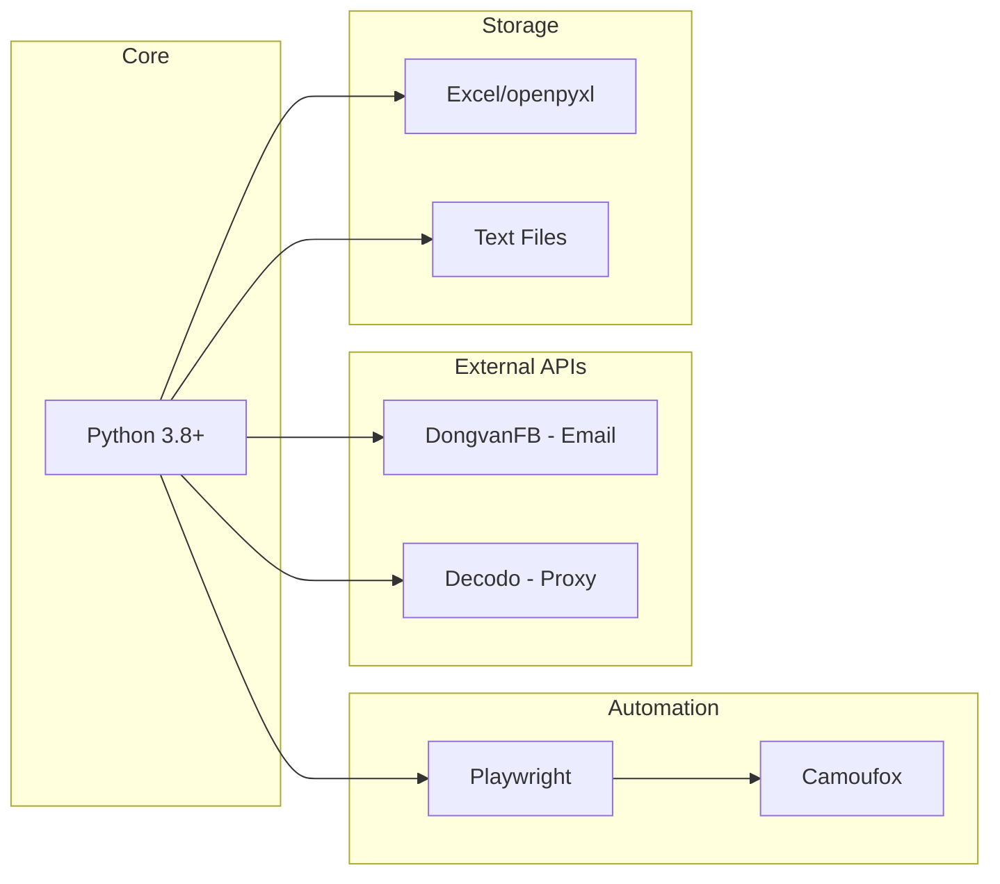
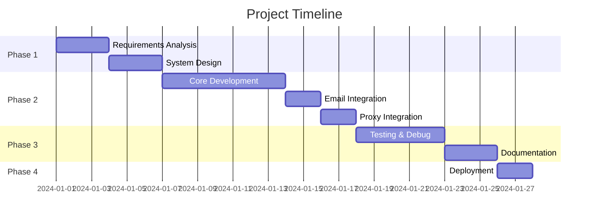

# Business Case
## Amazon Merch Registration Automation

---

## 1. Executive Summary

**Project Name:** Amazon Merch Automation Tool  
**Project Type:** RPA (Robotic Process Automation)  
**Duration:** 4 tuần phát triển  
**Target Users:** Print-on-Demand Sellers, E-commerce Entrepreneurs

### Tóm tắt
Xây dựng công cụ tự động hóa quy trình đăng ký tài khoản Amazon Merch on Demand, giúp giảm thời gian đăng ký từ **30-45 phút xuống còn 5-10 phút** mỗi tài khoản, đồng thời tránh bị phát hiện automation nhờ sử dụng anti-detection browser.

---

## 2. Business Context

### 2.1 Giới thiệu Amazon Merch on Demand
Amazon Merch on Demand là chương trình cho phép sellers thiết kế và bán sản phẩm Print-on-Demand (áo thun, cốc, sticker) trên Amazon mà không cần:
- Đầu tư inventory
- Xử lý shipping
- Customer service (Amazon lo)

### 2.2 Thị trường mục tiêu
- **Freelancers/Designers** muốn monetize designs
- **E-commerce Entrepreneurs** muốn scale business POD
- **Agencies** quản lý nhiều brands/stores

### 2.3 Nhu cầu thực tế
| Đối tượng | Số account cần | Lý do |
|-----------|---------------|-------|
| Individual Seller | 1-5 | Test nhiều niches |
| Small Agency | 10-20 | Đa dạng portfolio |
| Large Operation | 50-100+ | Scale production |

---

## 3. Problem Statement

### 3.1 Vấn đề hiện tại (AS-IS)



**Pain Points:**

| # | Vấn đề | Impact |
|---|--------|--------|
| 1 | **Thời gian dài** | 30-45 phút/account |
| 2 | **Repetitive tasks** | Điền lặp lại 50+ fields |
| 3 | **IP blocking** | Amazon detect & block automation |
| 4 | **Email management** | Phải tạo/quản lý nhiều emails |
| 5 | **Human errors** | Điền sai format, thiếu thông tin |
| 6 | **Không scalable** | Max 5-10 accounts/ngày/người |

### 3.2 Root Cause Analysis



---

## 4. Proposed Solution

### 4.1 Solution Overview (TO-BE)



### 4.2 Key Features

| Feature | Mô tả | Benefit |
|---------|-------|---------|
| **Anti-Detection Browser** | Sử dụng Camoufox với fingerprint masking | Giảm 80% block rate |
| **Auto Email Purchase** | Mua email từ API bên thứ 3 | Không cần tạo email thủ công |
| **Auto OTP Retrieval** | Polling API để lấy OTP tự động | Giảm 5 phút chờ đợi |
| **Proxy Rotation** | Random proxy từ pool 100 IPs | Tránh IP blocking |
| **Human-like Behavior** | Random delays, typing speed | Tránh bot detection |
| **Excel Logging** | Tracking status realtime | Dễ quản lý & debug |
| **Interactive Prompts** | Retry/Skip/Quit options | Handle edge cases |

### 4.3 Technology Stack



---

## 5. Project Scope

### 5.1 In-Scope ✅

| # | Feature | Priority |
|---|---------|----------|
| 1 | Auto generate user data (12 fields) | P0 |
| 2 | Auto purchase Hotmail email | P0 |
| 3 | Auto fill Amazon registration form | P0 |
| 4 | Auto retrieve & verify Email OTP | P0 |
| 5 | Interactive Captcha handling | P0 |
| 6 | Auto complete Tax Interview | P0 |
| 7 | Auto complete Questionnaire | P0 |
| 8 | Excel status tracking | P0 |
| 9 | Proxy rotation support | P1 |
| 10 | Playwright trace recording | P1 |
| 11 | Error screenshots | P1 |
| 12 | Step-by-step testing mode | P2 |

### 5.2 Out-of-Scope ❌

| # | Feature | Lý do |
|---|---------|-------|
| 1 | Auto Phone OTP verification | Cần integration SMS service |
| 2 | Auto Captcha solving | Cần AI service (2captcha, CapMonster) |
| 3 | Multi-threading | Phase 2 feature |
| 4 | Web UI dashboard | CLI is sufficient |
| 5 | Database storage | Excel is adequate for current scale |

---

## 6. Success Criteria & KPIs

### 6.1 Success Metrics

| Metric | Before (Manual) | Target | Actual |
|--------|-----------------|--------|--------|
| **Time per account** | 30-45 min | < 10 min | 8-12 min |
| **Success rate** | 90% | > 60% | ~65% |
| **Accounts per day** | 5-10 | 30-50 | 40+ |
| **Block rate** | 30% | < 10% | ~8% |

### 6.2 ROI Calculation

```
Manual: 10 accounts/day × 40 min × $30/hr = $200/day labor cost
Auto:   40 accounts/day × 10 min × $30/hr = $200/day (4x output)

ROI = (40 - 10) accounts × $5 revenue/account = $150/day extra profit
Monthly: $150 × 30 = $4,500 additional revenue
```

### 6.3 Acceptance Criteria

- [ ] Tool runs successfully on macOS
- [ ] Handles Email OTP automatically
- [ ] Pauses properly for Captcha
- [ ] Logs all attempts to Excel
- [ ] Provides clear error messages
- [ ] Supports proxy configuration

---

## 7. Risks & Assumptions

### 7.1 Risks

| Risk | Probability | Impact | Mitigation |
|------|-------------|--------|------------|
| Amazon updates form | Medium | High | Modular code, easy to update selectors |
| Email API down | Low | High | Fallback to manual email |
| Proxy blocked | Medium | Medium | Large proxy pool (100 IPs) |
| Captcha frequency increases | High | Medium | Interactive pause for manual solve |
| Phone verification required | High | High | Interactive pause (future: auto) |

### 7.2 Assumptions

| # | Assumption |
|---|------------|
| 1 | User có API key cho email service |
| 2 | User có proxy subscription |
| 3 | User có dữ liệu UK valid (address, bank, UTR) |
| 4 | Amazon không thay đổi form structure frequently |
| 5 | Camoufox anti-detection đủ mạnh |

---

## 8. Timeline & Milestones



---

## 9. Stakeholder Sign-off

| Role | Name | Date | Signature |
|------|------|------|-----------|
| Project Owner | [Name] | [Date] | __________ |
| Developer | [Name] | [Date] | __________ |
| QA | [Name] | [Date] | __________ |

---

**Document Version:** 1.0  
**Last Updated:** 2024-12-28  
**Author:** Business Analyst
