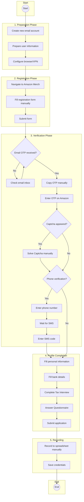
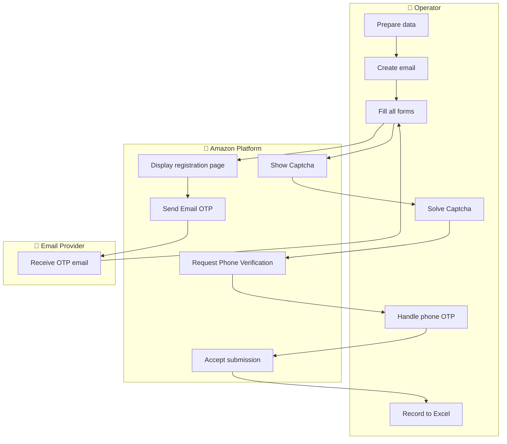
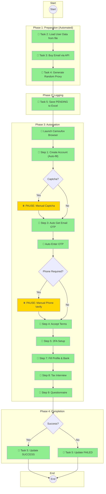
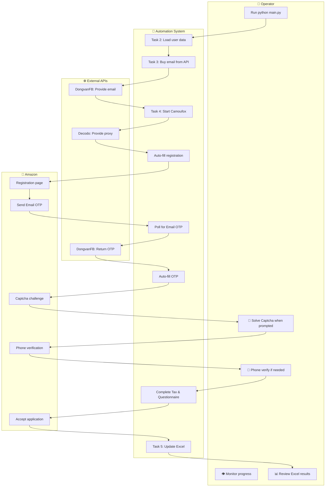
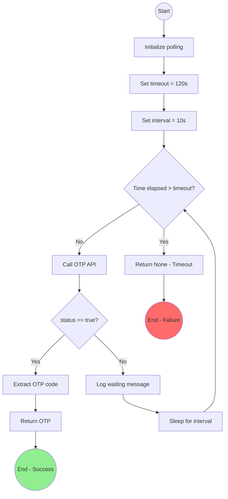
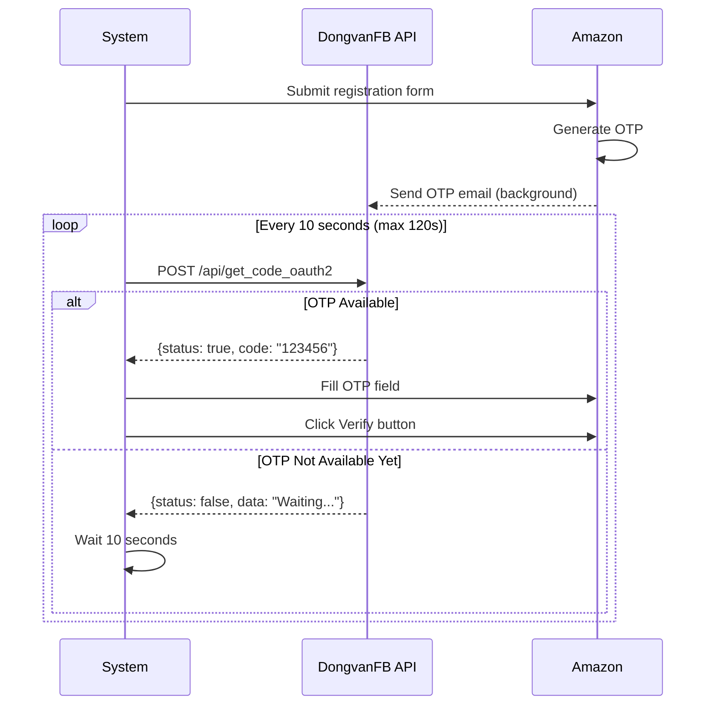
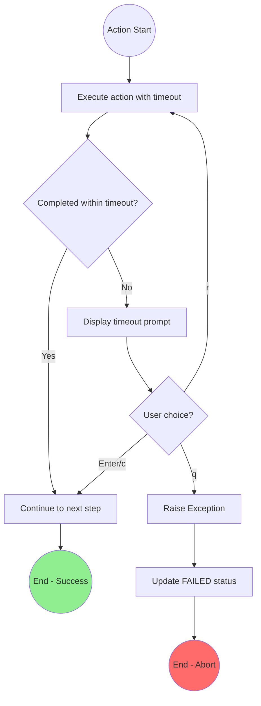
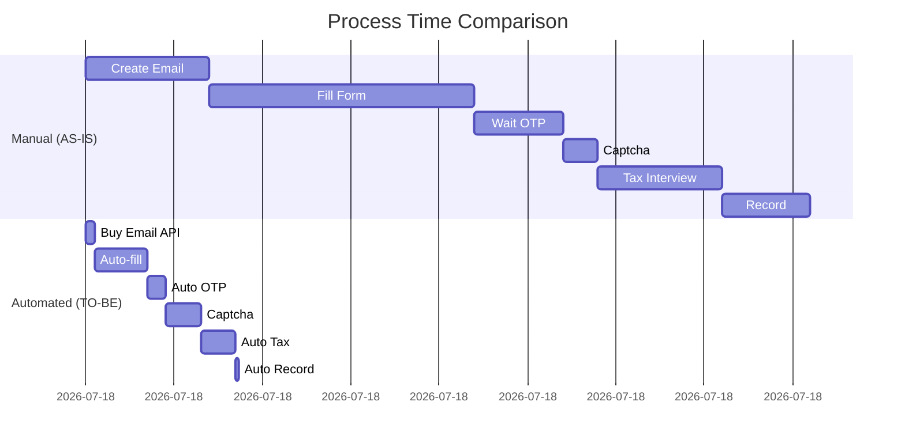
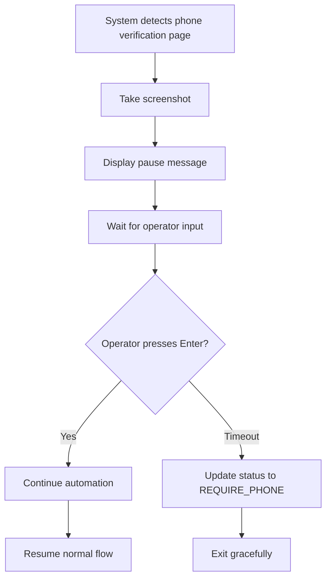
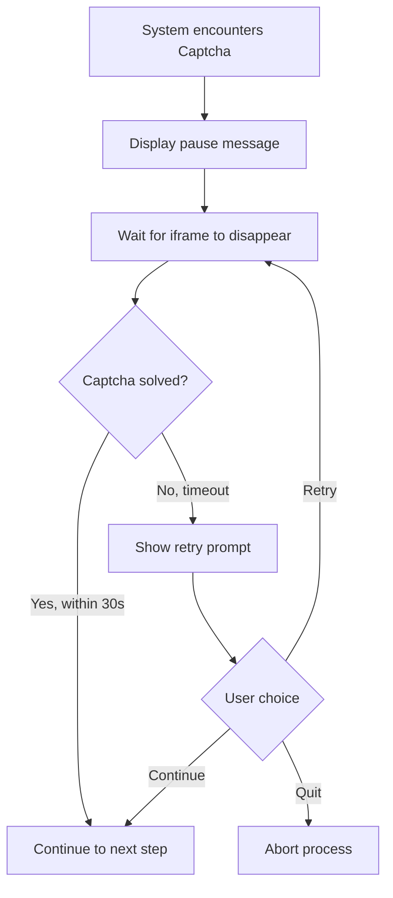

# BPMN Process Diagrams
## Amazon Merch Registration Automation

---

## 1. Overview

Tài liệu này mô tả quy trình nghiệp vụ **trước (AS-IS)** và **sau (TO-BE)** khi triển khai hệ thống automation.

---

## 2. AS-IS Process: Manual Registration

### 2.1 High-Level Process



### 2.2 Pain Points Analysis

| Step | Pain Point | Time Impact | Error Rate |
|------|------------|-------------|------------|
| Create email | Manual creation, verification | 5-7 min | Low |
| Fill form | 20+ fields, repetitive | 10-15 min | Medium |
| Wait for OTP | Check inbox constantly | 2-5 min | Low |
| Solve Captcha | Must be present | 1-2 min | Low |
| Phone verify | SMS delays, manual entry | 3-5 min | Low |
| Tax Interview | 15 fields, complex | 5-7 min | High |
| Record results | Copy/paste to spreadsheet | 3-5 min | Medium |
| **Total** | | **30-45 min** | **15-20%** |

### 2.3 Swim Lane Diagram



---

## 3. TO-BE Process: Automated Registration

### 3.1 High-Level Process



**Legend:**
- 🟢 Green = Fully Automated
- 🟡 Yellow = Manual Intervention Required

### 3.2 Automation Coverage

| Step | Manual (AS-IS) | Automated (TO-BE) | Time Saved |
|------|----------------|-------------------|------------|
| Create email | ❌ Manual | ✅ API call | 5-7 min |
| Load user data | ❌ Manual copy | ✅ File parsing | 3-5 min |
| Fill registration | ❌ 20+ fields | ✅ Auto-fill | 10-15 min |
| Get Email OTP | ❌ Check inbox | ✅ API polling | 2-5 min |
| Enter OTP | ❌ Manual | ✅ Auto-fill | 1 min |
| Solve Captcha | ❌ Manual | ⏸️ Still manual | 0 |
| Phone verify | ❌ Manual | ⏸️ Still manual | 0 |
| Fill Tax form | ❌ Manual | ✅ Auto-fill | 5-7 min |
| Record results | ❌ Manual | ✅ Auto Excel | 3-5 min |
| **Total Time** | **30-45 min** | **8-12 min** | **~25 min** |

### 3.3 Detailed Swim Lane Diagram



---

## 4. Sub-Process: Email OTP Handling

### 4.1 BPMN Diagram



### 4.2 Sequence Diagram



---

## 5. Sub-Process: Error Handling with Timeout

### 5.1 Interactive Prompt Flow



### 5.2 Timeout Handling Code Mapping

```
Prompt Display:
⏱️  TIMEOUT - Bước X: <step_name>
   Đã đợi 30s nhưng chưa hoàn thành
======================================================================
   👉 Nhấn Enter hoặc 'c': Continue (tiếp tục bước tiếp)
   👉 Nhấn 'r': Retry (thử lại bước này)
   👉 Nhấn 'q': Quit (thoát script)
======================================================================
```

**Traceability:**
- File: `task4_camoufox_workflow.py`
- Function: `wait_with_timeout()`
- Lines: 34-80

---

## 6. Process Metrics Comparison

### 6.1 Time Comparison



### 6.2 Efficiency Metrics

| Metric | AS-IS | TO-BE | Improvement |
|--------|-------|-------|-------------|
| Time per account | 35 min | 10 min | **71% faster** |
| Accounts per hour | 1.7 | 6 | **3.5x more** |
| Manual effort | 100% | 20% | **80% reduction** |
| Error rate | 15% | 5% | **67% reduction** |
| Scalability | Low | High | **Significant** |

---

## 7. Exception Handling Processes

### 7.1 Phone Verification Required



### 7.2 Captcha Challenge



---

**Document Version:** 1.0  
**Last Updated:** 2024-12-28  
**Author:** Business Analyst
