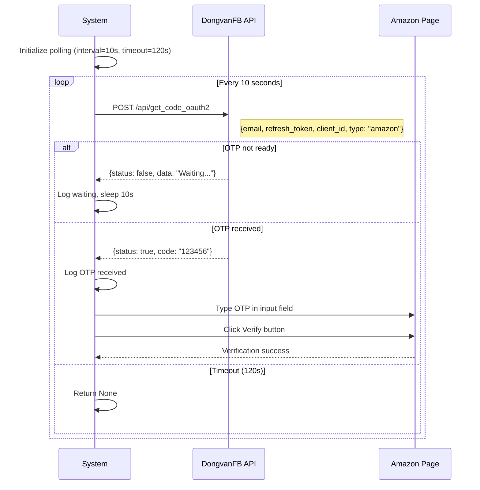
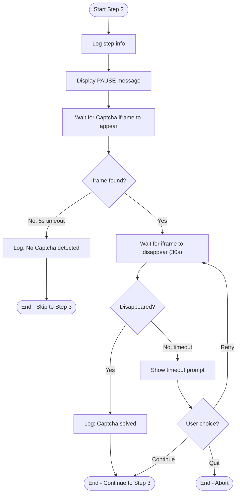

# Use Case Specifications
## Amazon Merch Registration Automation

---

## UC-01: Run Full Automation

### Basic Information

| Attribute | Value |
|-----------|-------|
| **Use Case ID** | UC-01 |
| **Use Case Name** | Run Full Automation |
| **Actor(s)** | Operator (Primary) |
| **Priority** | P0 - Critical |
| **Status** | ✅ Implemented |
| **Last Updated** | 2024-12-28 |

### Description
Operator khởi chạy quy trình automation tự động đăng ký tài khoản Amazon Merch, từ việc chuẩn bị dữ liệu đến khi hoàn thành đăng ký và ghi nhận kết quả.

### Preconditions
| # | Precondition |
|---|--------------|
| 1 | File `info_text.txt` tồn tại và có ít nhất 1 dòng dữ liệu hợp lệ |
| 2 | API key cho DongvanFB đã được cấu hình trong `task3_mail_service.py` |
| 3 | Camoufox đã được cài đặt (`camoufox fetch`) |
| 4 | Proxy credentials đã được cấu hình (optional) |
| 5 | Python 3.8+ và các dependencies đã được cài đặt |

### Postconditions
| # | Postcondition (Success) |
|---|-------------------------|
| 1 | Tài khoản Amazon Merch đã được tạo thành công |
| 2 | Email đã được verify bằng OTP |
| 3 | Tax Interview đã hoàn thành |
| 4 | Questionnaire đã submit |
| 5 | Excel log có 1 dòng mới với status = SUCCESS |
| 6 | Dòng user data đã dùng bị xóa khỏi `info_text.txt` |

| # | Postcondition (Failure) |
|---|-------------------------|
| 1 | Excel log có 1 dòng mới với status = FAILED hoặc REQUIRE_PHONE |
| 2 | Error message được ghi vào cột Error_Message |
| 3 | Screenshot lỗi được lưu (nếu có) |
| 4 | Playwright trace được lưu để debug |

### Trigger
Operator chạy lệnh: `python main.py`

### Basic Flow (Happy Path)

| Step | Actor | System | Data |
|------|-------|--------|------|
| 1 | Chạy `python main.py` | | |
| 2 | | Đọc và parse dữ liệu từ `info_text.txt` | user_data (12 fields) |
| 3 | | Gọi API mua email từ DongvanFB | mail_data (mail, password, token, clientid) |
| 4 | | Generate random proxy từ pool | proxy_config |
| 5 | | Ghi trạng thái PENDING vào Excel | row_index |
| 6 | | Khởi động Camoufox browser với proxy | browser, page |
| 7 | | Navigate đến Amazon Merch registration | |
| 8 | | Auto-fill form: name, email, password | |
| 9 | | Submit form và chờ Captcha | |
| 10 | Giải Captcha thủ công | Detect Captcha solved | |
| 11 | | Poll API để lấy Email OTP | otp_code |
| 12 | | Auto-fill OTP và verify | |
| 13 | | Chấp nhận Terms & Conditions | |
| 14 | | Setup 2FA và lưu backup code | backup_code |
| 15 | | Điền Profile & Bank information | |
| 16 | | Hoàn thành Tax Interview | |
| 17 | | Submit Questionnaire | |
| 18 | | Cập nhật Excel: status = SUCCESS | |
| 19 | | Đóng browser | |
| 20 | Xem kết quả trong Excel | | |

### Alternative Flows

#### AF-1: Phone Verification Required

| Condition | At Step 12, Amazon yêu cầu phone verification |
|-----------|---------------------------------------------|
| Step | Action |
| 12a | System hiển thị thông báo yêu cầu phone verification |
| 12b | System pause và chờ Operator nhập số điện thoại |
| 12c | Operator nhập số điện thoại và chờ SMS OTP |
| 12d | Operator nhập SMS OTP và verify |
| 12e | Operator nhấn Enter để tiếp tục |
| 12f | Return to Step 13 |

#### AF-2: Timeout - Retry

| Condition | Bất kỳ bước nào timeout (30s) |
|-----------|-------------------------------|
| Step | Action |
| Xa | System hiển thị prompt: Continue/Retry/Quit |
| Xb | Operator chọn 'r' (Retry) |
| Xc | System thực hiện lại bước X |
| Xd | Return to Step X |

#### AF-3: Timeout - Skip

| Condition | Bất kỳ bước nào timeout (30s) |
|-----------|-------------------------------|
| Step | Action |
| Xa | System hiển thị prompt: Continue/Retry/Quit |
| Xb | Operator chọn 'c' hoặc Enter (Continue) |
| Xc | System bỏ qua bước hiện tại |
| Xd | Continue to Step X+1 |

### Exception Flows

#### EF-1: No User Data

| Condition | File `info_text.txt` rỗng hoặc không tồn tại |
|-----------|---------------------------------------------|
| Step | Action |
| 2a | System log: "❌ File không tồn tại" hoặc "❌ File rỗng" |
| 2b | Function return None |
| 2c | Main function log: "❌ Không lấy được user data!" |
| 2d | Exit với code 1 |

#### EF-2: Email Purchase Failed

| Condition | API mua email thất bại |
|-----------|------------------------|
| Step | Action |
| 3a | System log: "❌ Không mua được mail!" |
| 3b | Function return None |
| 3c | Main function exit |
| 3d | No Excel entry created |

#### EF-3: OTP Timeout

| Condition | Không nhận được OTP trong 120s |
|-----------|-------------------------------|
| Step | Action |
| 11a | System log: "❌ Timeout! Đã chờ 120s nhưng không nhận được OTP" |
| 11b | get_otp() return None |
| 11c | System hiển thị timeout prompt |
| 11d | Tùy thuộc vào lựa chọn của Operator |

#### EF-4: Quit Requested

| Condition | Operator chọn 'q' tại bất kỳ timeout prompt nào |
|-----------|-----------------------------------------------|
| Step | Action |
| Xa | Operator nhập 'q' |
| Xb | System raise Exception("User quit") |
| Xc | Exception caught in main() |
| Xd | update_failed() ghi status = FAILED |
| Xe | Exit với code 1 |

### Business Rules

| Rule ID | Rule Description |
|---------|------------------|
| BR-01 | Tuổi người dùng phải từ 28-52 (DOB generated) |
| BR-02 | Mỗi dòng user data chỉ được sử dụng 1 lần (Pop mechanism) |
| BR-03 | PENDING phải được ghi trước khi chạy automation |
| BR-04 | Timeout cho mỗi action là 30 giây |
| BR-05 | OTP polling interval là 10 giây, timeout 120 giây |

### Non-Functional Requirements

| NFR | Value |
|-----|-------|
| Performance | Hoàn thành 1 account trong < 15 phút |
| Reliability | Ghi log ngay cả khi fail ở bất kỳ bước nào |
| Usability | Clear prompts khi cần human intervention |

### Traceability

| Artifact | Reference |
|----------|-----------|
| Source Code | `main.py` → `main()` |
| User Stories | US-1.1, US-1.5, US-2.1, US-2.5, US-4.1 |
| Test Cases | TC-01, TC-02, TC-03 |

---

## UC-07: Verify Email OTP

### Basic Information

| Attribute | Value |
|-----------|-------|
| **Use Case ID** | UC-07 |
| **Use Case Name** | Verify Email OTP |
| **Actor(s)** | System (Primary), Email API (Secondary) |
| **Priority** | P0 - Critical |
| **Status** | ✅ Implemented |
| **Last Updated** | 2024-12-28 |

### Description
Hệ thống tự động lấy OTP từ email thông qua API và điền vào form verification của Amazon.

### Preconditions
| # | Precondition |
|---|--------------|
| 1 | Email đã được mua thành công (mail_data có đầy đủ token, clientid) |
| 2 | Amazon đã gửi OTP email |
| 3 | API endpoint OTP hoạt động bình thường |

### Postconditions
| # | Postcondition (Success) |
|---|-------------------------|
| 1 | OTP đã được retrieve từ API |
| 2 | OTP đã được điền vào form |
| 3 | Verification thành công, chuyển sang bước tiếp |

| # | Postcondition (Failure) |
|---|-------------------------|
| 1 | Timeout sau 120s chờ OTP |
| 2 | Hiển thị prompt cho Operator |

### Trigger
Amazon hiển thị trang yêu cầu OTP verification.

### Basic Flow

| Step | System Action | API Response |
|------|---------------|--------------|
| 1 | Khởi tạo polling với interval=10s, timeout=120s | |
| 2 | Gọi POST /api/get_code_oauth2 với email, refresh_token, client_id | |
| 3 | | {status: false, data: "Waiting..."} |
| 4 | Log "⏳ Waiting..., chờ 10s..." | |
| 5 | Sleep 10 giây | |
| 6 | Lặp lại bước 2-5 | |
| 7 | | {status: true, code: "123456"} |
| 8 | Log "✅ Nhận được OTP: 123456" | |
| 9 | Locate OTP input field | |
| 10 | Gõ OTP với human-like delay | |
| 11 | Click button Verify | |
| 12 | Chờ page transition | |

### Alternative Flows

#### AF-1: Multiple OTP Attempts

| Condition | API trả về status: false nhiều lần |
|-----------|-----------------------------------|
| Step | Action |
| 2-6 | Lặp lại polling mỗi 10 giây |
| | Tối đa 12 lần (120s / 10s) |

### Exception Flows

#### EF-1: API Timeout

| Condition | 120 giây không nhận được OTP |
|-----------|------------------------------|
| Step | Action |
| Xa | Log "❌ Timeout! Đã chờ 120s nhưng không nhận được OTP" |
| Xb | Return None |
| Xc | Caller hiển thị timeout prompt |

#### EF-2: API Error

| Condition | HTTP status != 200 |
|-----------|-------------------|
| Step | Action |
| 2a | Log "⚠️ HTTP {status_code}, thử lại..." |
| 2b | Sleep 10 giây |
| 2c | Retry bước 2 |

### Sequence Diagram



### Data Format

**API Request:**
```json
{
    "email": "xxx@hotmail.com",
    "refresh_token": "0.AQoA...",
    "client_id": "f44b1140...",
    "type": "amazon"
}
```

**API Response (Success):**
```json
{
    "status": true,
    "code": "123456"
}
```

**API Response (Waiting):**
```json
{
    "status": false,
    "data": "Đang chờ mail..."
}
```

### Traceability

| Artifact | Reference |
|----------|-----------|
| Source Code | `task3_mail_service.py` → `get_otp()` |
| | `task4_camoufox_workflow.py` → `step_3_verify_email()` |
| User Stories | US-2.10, US-2.11, US-2.12 |
| Test Cases | TC-07-01, TC-07-02 |

---

## UC-06: Handle Captcha

### Basic Information

| Attribute | Value |
|-----------|-------|
| **Use Case ID** | UC-06 |
| **Use Case Name** | Handle Captcha |
| **Actor(s)** | Operator (Primary), System |
| **Priority** | P1 - Important |
| **Status** | ✅ Implemented |
| **Last Updated** | 2024-12-28 |

### Description
Khi Amazon hiển thị Captcha, hệ thống tạm dừng và chờ Operator giải Captcha thủ công. Sau khi Captcha được giải, hệ thống tự động phát hiện và tiếp tục.

### Preconditions
| # | Precondition |
|---|--------------|
| 1 | Browser đang mở và ở trang Amazon registration |
| 2 | Captcha iframe xuất hiện trên trang |
| 3 | Operator đang theo dõi tiến trình |

### Postconditions
| # | Postcondition (Success) |
|---|-------------------------|
| 1 | Captcha đã được giải |
| 2 | Captcha iframe biến mất |
| 3 | Hệ thống tiếp tục bước tiếp theo |

### Trigger
Amazon hiển thị Captcha challenge (iframe với selector `iframe[title="call]`).

### Basic Flow

| Step | Actor | System | UI Update |
|------|-------|--------|-----------|
| 1 | | Detect Captcha iframe xuất hiện | |
| 2 | | Log "📋 BƯỚC 2: XỬ LÝ CAPTCHA" | |
| 3 | | Hiển thị thông báo PAUSE | Console: "⏸️ PAUSE: HÃY GIẢI CAPTCHA THỦ CÔNG" |
| 4 | Nhìn thấy thông báo | | |
| 5 | Giải Captcha trong browser | | Captcha widget |
| 6 | Hoàn thành Captcha | | |
| 7 | | Detect Captcha iframe biến mất | |
| 8 | | Log "✅ Bước 2 hoàn thành: Captcha đã được giải" | |
| 9 | | Tiếp tục bước tiếp theo | |

### Alternative Flows

#### AF-1: No Captcha Required

| Condition | Không có Captcha iframe sau 5 giây |
|-----------|-----------------------------------|
| Step | Action |
| 1a | System chờ 5 giây |
| 1b | Không tìm thấy Captcha iframe |
| 1c | Log "ℹ️ Không phát hiện Captcha, tiếp tục..." |
| 1d | Skip to next step |

### Exception Flows

#### EF-1: Captcha Timeout

| Condition | Captcha không được giải trong 30s |
|-----------|-----------------------------------|
| Step | Action |
| 7a | Timeout chờ iframe disappear |
| 7b | Hiển thị timeout prompt |
| 7c | Operator chọn: Retry / Continue / Quit |

### UI Mockup (Console)

```
======================================================================
📋 BƯỚC 2: XỬ LÝ CAPTCHA
======================================================================
⏸️  PAUSE: HÃY GIẢI CAPTCHA THỦ CÔNG
   👉 Giải Captcha trên trình duyệt
   👉 Sau khi giải xong, script sẽ tự động tiếp tục
======================================================================
```

### Activity Diagram



### Traceability

| Artifact | Reference |
|----------|-----------|
| Source Code | `task4_camoufox_workflow.py` → `step_2_handle_captcha()` |
| User Stories | US-3.1, US-3.2, US-3.3 |
| Test Cases | TC-06-01 |

---

**Document Version:** 1.0  
**Last Updated:** 2024-12-28  
**Author:** Business Analyst
