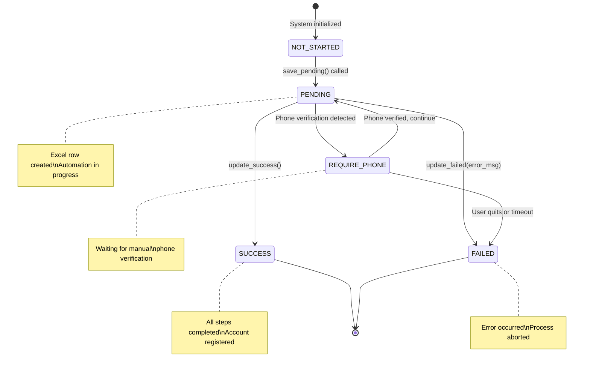
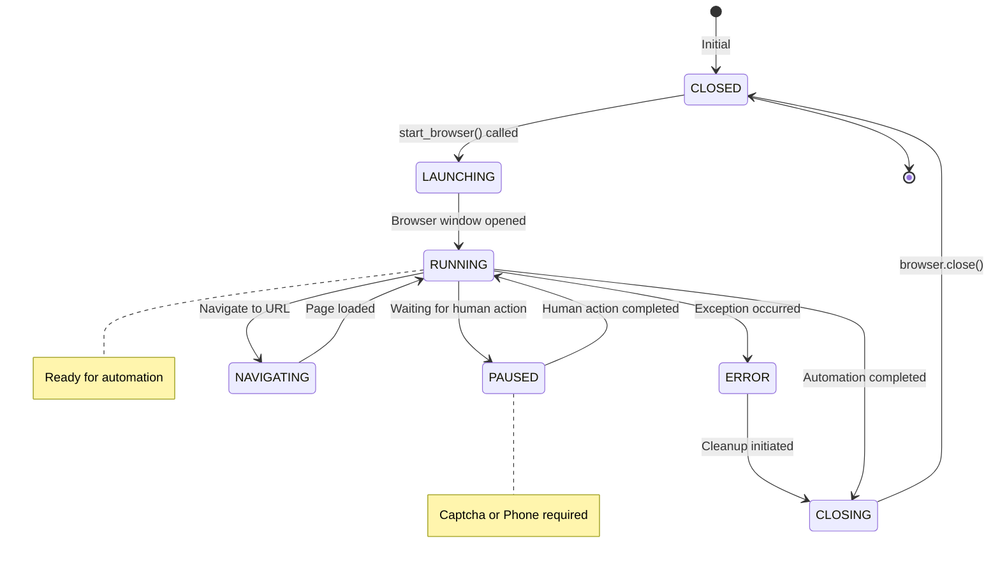
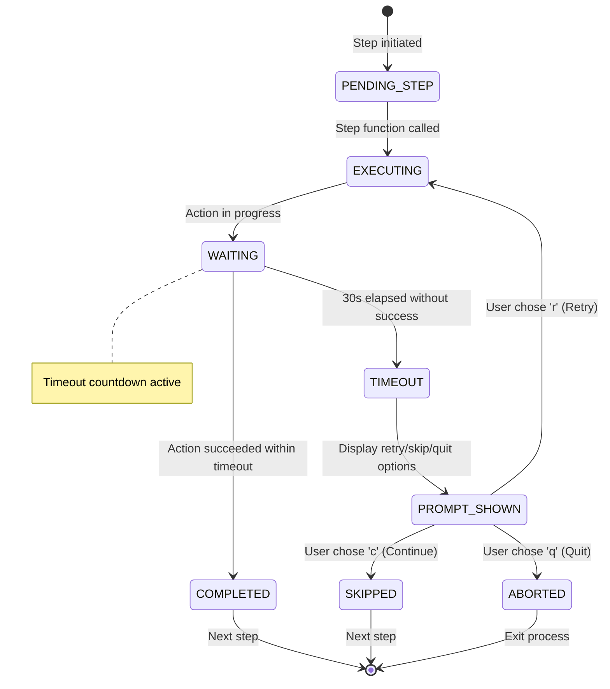
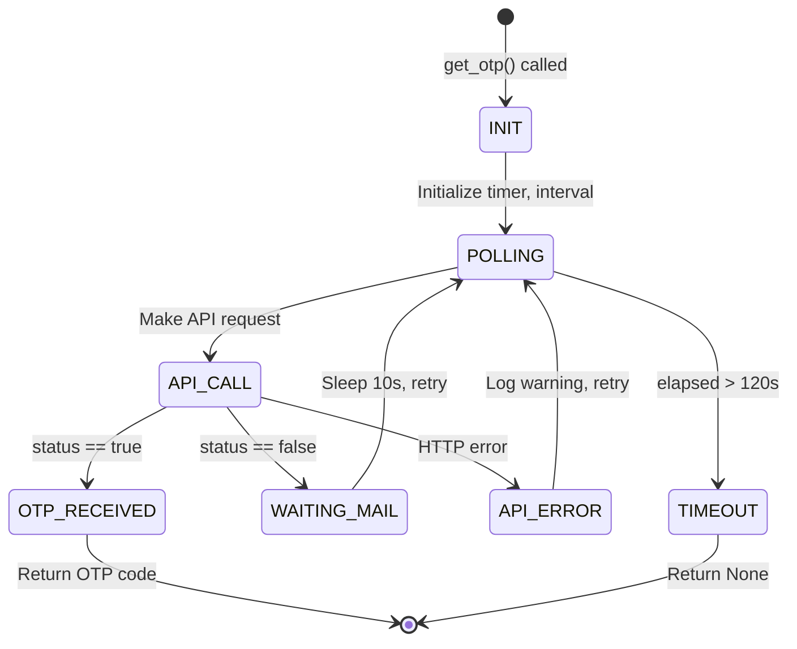
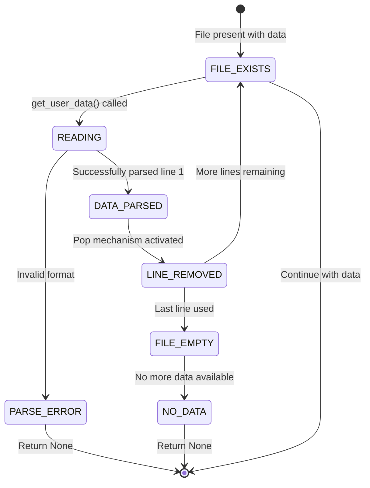
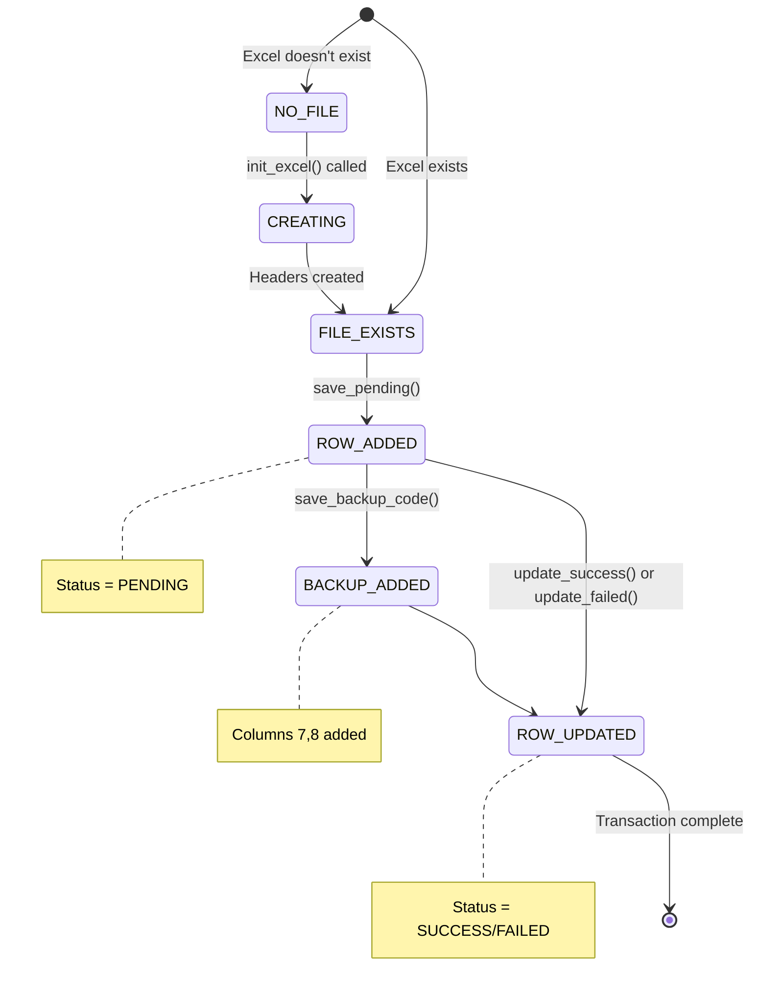

# State Machine Diagram
## Amazon Merch Registration Automation

---

## 1. Registration Status State Machine

### 1.1 Primary State Diagram

### 1.2 State Definitions

| State | Description | Excel Status | Actions |
|-------|-------------|--------------|---------|
| **NOT_STARTED** | Initial state, no row in Excel | N/A | Preparing data |
| **PENDING** | Automation running | `PENDING` | Executing steps |
| **REQUIRE_PHONE** | Phone verification required | `REQUIRE_PHONE` | Manual intervention needed |
| **SUCCESS** | Registration completed | `SUCCESS` | Account created |
| **FAILED** | Process failed | `FAILED` | Error logged |

### 1.3 State Transitions

| From State | To State | Trigger | Guard Condition | Action |
|------------|----------|---------|-----------------|--------|
| NOT_STARTED | PENDING | User runs main.py | Data valid, email purchased | save_pending() |
| PENDING | SUCCESS | Step 9 completed | result.success == true | update_success() |
| PENDING | FAILED | Exception raised | Any error | update_failed(error) |
| PENDING | REQUIRE_PHONE | Phone page detected | URL contains phone verification | update_status("require_phone") |
| REQUIRE_PHONE | PENDING | Enter pressed | Phone verified manually | Resume automation |
| REQUIRE_PHONE | FAILED | User quits | 'q' pressed | update_failed("User quit") |

---

## 2. Browser Session State Machine

### 2.1 Browser States

### 2.2 Browser State Definitions

| State | Description | User Visible |
|-------|-------------|--------------|
| **CLOSED** | No browser instance | No |
| **LAUNCHING** | Starting Camoufox with config | Flash of window |
| **RUNNING** | Browser active, automation in progress | Yes |
| **NAVIGATING** | Loading new page | Loading spinner |
| **PAUSED** | Waiting for manual input | Yes, console prompt |
| **ERROR** | Exception caught | Error message |
| **CLOSING** | Saving trace, closing | Brief |

---

## 3. Automation Step State Machine

### 3.1 Individual Step States

### 3.2 Step State Transitions

| From | To | Event | Action |
|------|-----|-------|--------|
| PENDING_STEP | EXECUTING | Step N called | Log step info |
| EXECUTING | WAITING | Async action started | Start 30s timer |
| WAITING | COMPLETED | Success within timeout | Log success |
| WAITING | TIMEOUT | 30s elapsed | Log timeout |
| TIMEOUT | PROMPT_SHOWN | Display prompt | Show options |
| PROMPT_SHOWN | EXECUTING | 'r' pressed | Reset timer, retry |
| PROMPT_SHOWN | SKIPPED | 'c' or Enter | Continue to next |
| PROMPT_SHOWN | ABORTED | 'q' pressed | Raise exception |

---

## 4. Email OTP Polling State Machine

### 4.1 OTP States

### 4.2 OTP State Definitions

| State | Description | Console Output |
|-------|-------------|----------------|
| **INIT** | Starting OTP retrieval | "📱 Đang lấy OTP..." |
| **POLLING** | Loop active | - |
| **API_CALL** | HTTP request in flight | - |
| **OTP_RECEIVED** | Got valid OTP | "✅ Nhận được OTP: XXXXXX" |
| **WAITING_MAIL** | Email not arrived yet | "⏳ Đang chờ mail..., chờ 10s..." |
| **API_ERROR** | Request failed | "⚠️ HTTP XXX, thử lại..." |
| **TIMEOUT** | 120s exceeded | "❌ Timeout!" |

---

## 5. Data File State Machine

### 5.1 info_text.txt States

### 5.2 Excel Log States

---

## 6. Composite State Machine

### 6.1 Full System States

```mermaid
stateDiagram-v2
    [*] --> IDLE
    
    state IDLE {
        [*] --> Ready
        Ready --> ConfigCheck: Verify dependencies
    }
    
    state PREPARATION {
        [*] --> LoadingData
        LoadingData --> BuyingEmail: Data loaded
        BuyingEmail --> GeneratingProxy: Email purchased
        GeneratingProxy --> LoggingPending: Proxy configured
    }
    
    state AUTOMATION {
        [*] --> BrowserStarting
        BrowserStarting --> StepsRunning: Browser ready
        
        state StepsRunning {
            [*] --> Step1
            Step1 --> Step2: Complete
            Step2 --> Step3: Captcha solved
            Step3 --> Step4: OTP verified
            Step4 --> Step5: Terms accepted
            Step5 --> Step6: 2FA setup
            Step6 --> Step7: Phone (if needed)
            Step7 --> Step8: Profile filled
            Step8 --> Step9: Tax done
            Step9 --> [*]: Questionnaire done
        }
    }
    
    state COMPLETION {
        [*] --> Updating
        Updating --> Saving: Status updated
        Saving --> Closing: Trace saved
        Closing --> Done: Browser closed
    }
    
    IDLE --> PREPARATION: main() called
    PREPARATION --> AUTOMATION: Prep complete
    AUTOMATION --> COMPLETION: Steps done
    COMPLETION --> [*]: Process finished
    
    PREPARATION --> [*]: Error
    AUTOMATION --> [*]: Error
```

---

## 7. State Persistence

### 7.1 State Storage Locations

| State Type | Storage | Format |
|------------|---------|--------|
| Registration Status | Excel (column D) | String: PENDING/SUCCESS/FAILED/REQUIRE_PHONE |
| Timestamp | Excel (column E) | DateTime: YYYY-MM-DD HH:MM:SS |
| Error Message | Excel (column F) | String |
| Backup Code | Excel (column G) | String |
| Trace Data | File (trace_*.zip) | Playwright trace format |
| Logs | File (merch_automation.log) | Text with timestamps |

### 7.2 State Recovery

| Scenario | State to Recover | Recovery Method |
|----------|------------------|-----------------|
| Script restarted | PENDING rows | Review Excel, decide manually |
| Browser crashed | Mid-automation | Check trace file, restart manually |
| Network error | API call failed | Automatic retry (built-in) |

---

**Document Version:** 1.0  
**Last Updated:** 2024-12-28  
**Author:** Business Analyst
