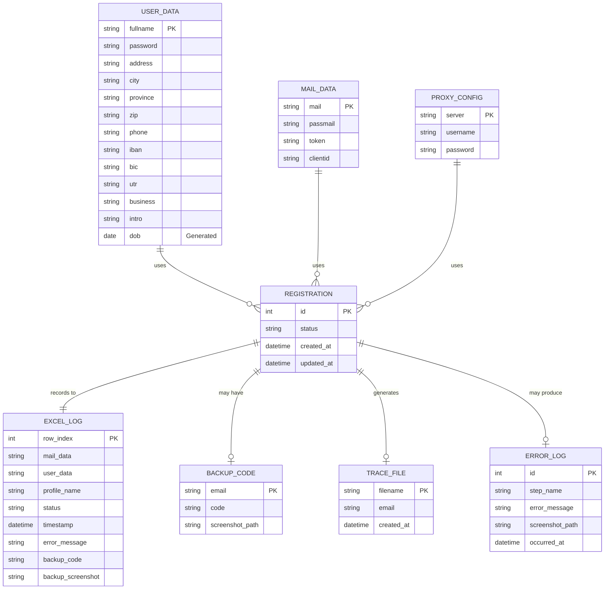
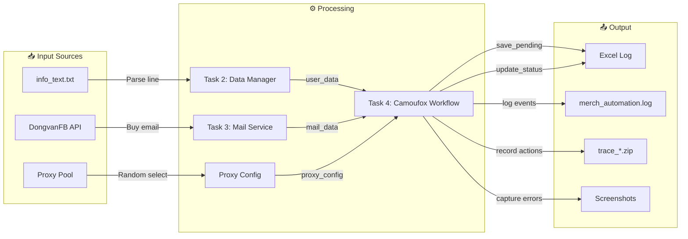
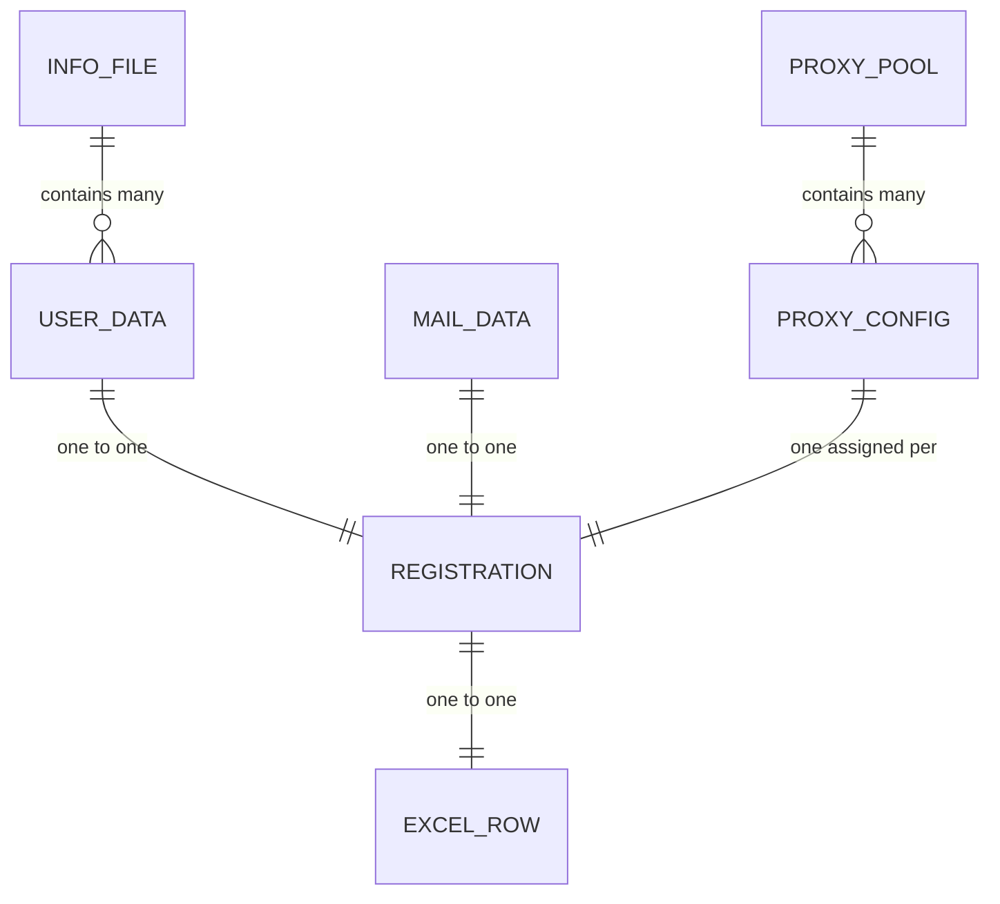

# ERD - Data Design
## Amazon Merch Registration Automation

---

## 1. Entity Relationship Diagram

### 1.1 Conceptual ERD



---

## 2. Data Structures Detail

### 2.1 User Data (user_data)

**Source:** `info_text.txt`  
**Parser:** `task2_data_manager.py` → `get_user_data()`

| Field | Type | Format | Example | Required | Notes |
|-------|------|--------|---------|----------|-------|
| fullname | string | First Last | "John Smith" | Yes | Used for Amazon name |
| password | string | Any | "SecurePass123!" | Yes | Amazon account password |
| address | string | Street address | "123 High Street" | Yes | UK format |
| city | string | City name | "London" | Yes | |
| province | string | UK county/region | "Greater London" | Yes | |
| zip | string | UK postcode | "SW1A 1AA" | Yes | |
| phone | string | UK phone | "+447123456789" | Yes | |
| iban | string | UK IBAN | "GB82WEST12345698765432" | Yes | For bank info |
| bic | string | SWIFT/BIC | "WESTGB2L" | Yes | Bank code |
| utr | string | 10 digits | "1234567890" | Yes | UK tax reference |
| business | string | Business name | "Smith Designs" | Yes | |
| intro | string | Text | "Designer with 10 years..." | Yes | Questionnaire answer |
| dob | string | MM/DD/YYYY | "03/15/1985" | Generated | Auto-generated 28-52 years old |

**File Format:**
```
fullname|password|address|city|province|zip|phone|iban|bic|utr|business|intro
```

**Example Line:**
```
John Smith|Pass123!|123 High St|London|Greater London|SW1A 1AA|+447123456789|GB82WEST12345698765432|WESTGB2L|1234567890|Smith Designs|Designer with 10 years experience
```

---

### 2.2 Mail Data (mail_data)

**Source:** DongvanFB API  
**Parser:** `task3_mail_service.py` → `buy_hotmail()`

| Field | Type | Format | Example | Notes |
|-------|------|--------|---------|-------|
| mail | string | email | "user123@hotmail.com" | Primary email address |
| passmail | string | password | "mailPass456" | Email password |
| token | string | OAuth refresh token | "0.AQoA..." (long string) | For OTP API |
| clientid | string | UUID | "f44b1140-bc5e-..." | For OTP API |

**API Response Format:**
```json
{
    "status": true,
    "data": {
        "list_data": ["mail|passmail|token|clientid"]
    }
}
```

---

### 2.3 Proxy Config (proxy_config)

**Source:** `proxy_config.py` → `generate_random_proxy()`

| Field | Type | Format | Example | Notes |
|-------|------|--------|---------|-------|
| server | string | http://host:port | "http://gb.decodo.com:30045" | Random port 30001-30100 |
| username | string | session string | "user-xxx-sessionduration-30" | |
| password | string | token | "outOZJ4BqNTov..." | |

**Generated Format:**
```python
{
    "server": "http://gb.decodo.com:30045",
    "username": "user-khuong5989-sessionduration-30",
    "password": "outOZJ4BqNTov1+N9t"
}
```

---

### 2.4 Excel Log (Excel Columns)

**File:** `merch_registration_log.xlsx`  
**Manager:** `task5_excel_reporter.py`

| Column | Name | Type | Example | Notes |
|--------|------|------|---------|-------|
| A (1) | Mail_Data | string | "email\|pass\|token\|clientid" | Pipe-delimited |
| B (2) | User_Data | string | "name\|pass\|addr..." | 12 fields pipe-delimited |
| C (3) | Profile_Name | string | "Camoufox" | Browser identifier |
| D (4) | Status | string | "PENDING/SUCCESS/FAILED/REQUIRE_PHONE" | Current state |
| E (5) | Timestamp | datetime | "2024-12-28 14:30:00" | Last update time |
| F (6) | Error_Message | string | "Timeout at Step 3" | Only for FAILED |
| G (7) | Backup_Code | string | "ABCD-EFGH-IJKL..." | 2FA backup code |
| H (8) | Backup_Screenshot | string | "/path/to/screenshot.png" | Path to screenshot |

**Status Values:**

| Status | Meaning |
|--------|---------|
| PENDING | Automation in progress |
| SUCCESS | Registration completed |
| FAILED | Error occurred |
| REQUIRE_PHONE | Waiting for manual phone verification |
| ERROR | General error without specific type |

---

## 3. Data Flow Diagram

### 3.1 Data Flow Overview



### 3.2 Data Transformation

| Stage | Input | Transformation | Output |
|-------|-------|----------------|--------|
| 1 | `info_text.txt` line | Split by `\|`, generate DOB | `user_data` dict |
| 2 | API response | Parse JSON, extract list_data[0] | `mail_data` dict |
| 3 | Proxy constants | Random host + port | `proxy_config` dict |
| 4 | `user_data` + `mail_data` | Combine to pipe-delimited strings | Excel row data |
| 5 | Registration result | Map to status string | Status column |

---

## 4. Data Dictionary

### 4.1 Complete Field Reference

| Entity | Field | Data Type | Length | Nullable | Default | Description |
|--------|-------|-----------|--------|----------|---------|-------------|
| USER_DATA | fullname | varchar | 100 | No | - | Full name for registration |
| USER_DATA | password | varchar | 50 | No | - | Account password |
| USER_DATA | address | varchar | 200 | No | - | Street address |
| USER_DATA | city | varchar | 50 | No | - | City name |
| USER_DATA | province | varchar | 50 | No | - | Region/County |
| USER_DATA | zip | varchar | 10 | No | - | Postal code |
| USER_DATA | phone | varchar | 20 | No | - | Phone number |
| USER_DATA | iban | varchar | 34 | No | - | Bank IBAN |
| USER_DATA | bic | varchar | 11 | No | - | Bank SWIFT code |
| USER_DATA | utr | varchar | 10 | No | - | Tax reference |
| USER_DATA | business | varchar | 100 | No | - | Business name |
| USER_DATA | intro | text | 500 | No | - | Introduction text |
| USER_DATA | dob | varchar | 10 | No | Generated | MM/DD/YYYY |
| MAIL_DATA | mail | varchar | 100 | No | - | Email address |
| MAIL_DATA | passmail | varchar | 50 | No | - | Email password |
| MAIL_DATA | token | text | 2000 | No | - | OAuth refresh token |
| MAIL_DATA | clientid | varchar | 50 | No | - | OAuth client ID |
| PROXY | server | varchar | 100 | No | - | http://host:port |
| PROXY | username | varchar | 100 | No | - | Proxy username |
| PROXY | password | varchar | 100 | No | - | Proxy password |
| EXCEL_LOG | row_index | int | - | No | Auto | Excel row number |
| EXCEL_LOG | mail_data | text | 3000 | No | - | Serialized mail data |
| EXCEL_LOG | user_data | text | 1000 | No | - | Serialized user data |
| EXCEL_LOG | profile_name | varchar | 50 | No | "Camoufox" | Browser profile |
| EXCEL_LOG | status | varchar | 20 | No | "PENDING" | Registration status |
| EXCEL_LOG | timestamp | datetime | - | No | Now() | Last update time |
| EXCEL_LOG | error_message | text | 500 | Yes | "" | Error details if failed |
| EXCEL_LOG | backup_code | varchar | 100 | Yes | - | 2FA backup code |
| EXCEL_LOG | backup_screenshot | varchar | 200 | Yes | - | Screenshot path |

---

## 5. Data Validation Rules

### 5.1 Input Validation

| Field | Rule | Error Handling |
|-------|------|----------------|
| info_text.txt | Must have at least 1 line | Return None, exit |
| Line format | Must have 12 fields separated by `\|` | Log error, return None |
| IBAN | Must start with "GB" for UK | Not validated (assumed correct) |
| Phone | Must be valid format | Not validated |
| DOB | Generated 28-52 years old | Always valid |

### 5.2 Output Validation

| Field | Rule | Enforcement |
|-------|------|-------------|
| Status | Must be one of: PENDING, SUCCESS, FAILED, REQUIRE_PHONE | Enum-like string |
| Timestamp | Valid datetime format | datetime.now().strftime() |
| Excel row_index | Must be > 1 (row 1 is header) | max_row + 1 |

---

## 6. Data Relationships

### 6.1 Cardinality



### 6.2 Relationship Rules

| Relationship | Rule |
|--------------|------|
| USER_DATA → REGISTRATION | Each user data line used exactly once (Pop mechanism) |
| MAIL_DATA → REGISTRATION | Each purchased email used for one registration |
| REGISTRATION → EXCEL_ROW | Each registration creates exactly one Excel row |
| PROXY_CONFIG → REGISTRATION | Random proxy assigned, may be reused across registrations |

---

**Document Version:** 1.0  
**Last Updated:** 2024-12-28  
**Author:** Business Analyst
