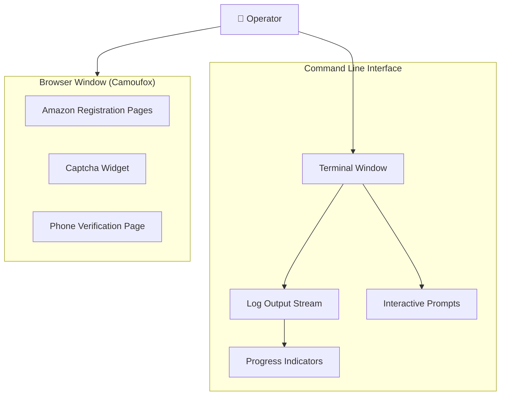

# Interface Specifications
## Amazon Merch Registration Automation

---

## 1. User Interface Overview

### 1.1 Interface Type
Hệ thống sử dụng **Command Line Interface (CLI)** với interactive prompts.

### 1.2 Interface Components



---

## 2. CLI Interface Specifications

### 2.1 Main Script Execution

**Command:** `python main.py`

**Console Output Pattern:**
```
======================================================================
🚀 BẮT ĐẦU QUY TRÌNH ĐĂNG KÝ AMAZON MERCH (CAMOUFOX)
======================================================================

======================================================================
📋 GIAI ĐOẠN 1: CHUẨN BỊ DỮ LIỆU
======================================================================

🔹 Task 2: Lấy user data...
======================================================================
📋 TASK 2: ĐỌC USER DATA
======================================================================
📄 Đọc dòng đầu tiên...
✅ Đã parse dữ liệu:
   Fullname: John Smith
   DOB: 03/15/1985 (Generated)
   Address: 123 High Street
   City: London
   Phone: +447123456789
   IBAN: GB82WEST12345698765432
   Business: Smith Designs

🗑️  Đang xóa dòng vừa đọc khỏi file...
✅ Đã xóa dòng! Còn lại 5 dòng trong file

🔹 Task 3: Mua mail...
======================================================================
📧 TASK 3: MUA HOTMAIL
======================================================================
🔗 Đang gọi API mua mail...
   URL: https://api.dongvanfb.net/user/buy
   Account Type: 5 (Hotmail/Outlook)
   Quality: 1
   Type: full
📋 Response từ API:
   Status: True
   Message: Success
✅ Mua mail thành công!
   Email: user123@hotmail.com
   Password: mailPass456
   Token: 0.AQoA...
   Client ID: f44b1140...

✅ Giai đoạn 1 hoàn tất!
   Email: user123@hotmail.com
   Fullname: John Smith
```

### 2.2 Progress Indicators

| Indicator | Symbol | Meaning |
|-----------|--------|---------|
| Task Start | `🔹` | Starting a task |
| Success | `✅` | Task/step completed successfully |
| Error | `❌` | Task/step failed |
| Warning | `⚠️` | Non-critical issue |
| Waiting | `⏳` | Waiting for something (OTP, etc.) |
| Pause | `⏸️` | Manual intervention required |
| Info | `📋` | Information display |
| Phase | `======` | Major phase separator |

### 2.3 Interactive Prompt: Timeout Handler

**Trigger:** Any action exceeds 30 second timeout

**Display:**
```
⏱️  TIMEOUT - Bước 3: XÁC THỰC EMAIL OTP
   Đã đợi 30s nhưng chưa hoàn thành
======================================================================
   👉 Nhấn Enter hoặc 'c': Continue (tiếp tục bước tiếp)
   👉 Nhấn 'r': Retry (thử lại bước này)
   👉 Nhấn 'q': Quit (thoát script)
======================================================================
⏸️  Lựa chọn của bạn: _
```

**User Actions:**

| Input | Action | Result |
|-------|--------|--------|
| `Enter` or `c` | Continue | Skip current step, move to next |
| `r` | Retry | Retry current step from beginning |
| `q` | Quit | Raise exception, update FAILED, exit |

### 2.4 Interactive Prompt: Captcha Handler

**Trigger:** Captcha iframe detected

**Display:**
```
======================================================================
📋 BƯỚC 2: XỬ LÝ CAPTCHA
======================================================================
⏸️  PAUSE: HÃY GIẢI CAPTCHA THỦ CÔNG
   👉 Giải Captcha trên trình duyệt
   👉 Sau khi giải xong, script sẽ tự động tiếp tục
======================================================================
```

**Behavior:**
- No user input required
- System automatically detects when Captcha is solved
- Console shows: `✅ Bước 2 hoàn thành: Captcha đã được giải`

### 2.5 Interactive Prompt: Phone Verification

**Trigger:** Phone verification page detected

**Display:**
```
======================================================================
📱 PHÁT HIỆN YÊU CẦU PHONE OTP!
======================================================================
⏸️  PAUSE: HÃY VERIFY PHONE THỦ CÔNG
======================================================================
   👉 Nhập số điện thoại trong trình duyệt
   👉 Nhận OTP qua SMS
   👉 Nhập OTP và verify
   👉 Sau khi verify xong, quay lại terminal
======================================================================
⏸️  Nhấn Enter sau khi đã verify phone xong... _
```

**User Actions:**

| Step | On Browser | On Terminal |
|------|------------|-------------|
| 1 | Enter phone number | Watch and wait |
| 2 | Receive SMS OTP | - |
| 3 | Enter SMS OTP | - |
| 4 | Click verify | - |
| 5 | Wait for success | Press Enter |

---

## 3. Step-by-Step Testing Interface

### 3.1 Test Menu

**Command:** `python test_steps.py`

**Display:**
```
======================================================================
🧪 AMAZON MERCH AUTOMATION - STEP-BY-STEP TESTING
======================================================================
Current Status:
   Browser: ❌ Not Started
   User Data: ❌ Not Loaded
   Email: ❌ Not Purchased
======================================================================
Menu:
   0️⃣  Setup (Generate data + Buy email + Start browser)
   c️⃣  Codegen Mode (Record actions với Playwright Inspector)
   1️⃣  Step 1: Create Account
   2️⃣  Step 2: Solve Captcha
   3️⃣  Step 3: Verify Email OTP
   4️⃣  Step 4: Accept Terms
   5️⃣  Step 5: Setup 2FA
   6️⃣  Step 6: Phone Verification
   7️⃣  Step 7: Fill Profile & Bank
   8️⃣  Step 8: Tax Interview
   9️⃣  Step 9: Final Submit
   q️⃣  Close Browser & Quit
======================================================================
👉 Chọn step (0-9, c, q): _
```

### 3.2 Menu Navigation

| Key | Action | Prerequisites |
|-----|--------|---------------|
| `0` | Run setup phase | None |
| `c` | Open Codegen mode | Setup complete |
| `1-9` | Run specific step | Setup complete |
| `q` | Quit and cleanup | None |

---

## 4. Browser Interface (Camoufox)

### 4.1 Browser Window Behavior

| Phase | Browser State | User Visibility |
|-------|---------------|-----------------|
| Launch | Opens new window | Full window visible |
| Navigation | Loading pages | Loading indicator |
| Form Fill | Auto-typing | Visible character entry |
| Captcha | Pause | Interactive widget |
| Phone | Pause | Interactive page |
| Completion | Auto-close | Brief flash |

### 4.2 Human-like Interactions

**Typing Simulation:**
```python
async def type_human_like(locator, text, min_delay=50, max_delay=150):
    """Type each character with random delay"""
    for char in text:
        await locator.type(char, delay=random.randint(min_delay, max_delay))
```

**Click Delay:**
```python
async def human_delay(min_sec=1, max_sec=3):
    """Random delay between actions"""
    await asyncio.sleep(random.uniform(min_sec, max_sec))
```

### 4.3 Screenshots

**Error Screenshots:**
| Scenario | Filename | Content |
|----------|----------|---------|
| General error | `error_general.png` | Full page at error point |
| Phone required | `require_phone.png` | Phone verification page |
| Timeout | `timeout_step_X.png` | Page at timeout |

---

## 5. Log File Interface

### 5.1 Log File Structure

**File:** `merch_automation.log`

**Format:**
```
2024-12-28 14:30:00 - INFO - ======================================================================
2024-12-28 14:30:00 - INFO - 🚀 BẮT ĐẦU QUY TRÌNH ĐĂNG KÝ AMAZON MERCH (CAMOUFOX)
2024-12-28 14:30:00 - INFO - ======================================================================
2024-12-28 14:30:01 - INFO - 🔹 Task 2: Lấy user data...
2024-12-28 14:30:01 - INFO - ✅ Đã parse dữ liệu:
2024-12-28 14:30:01 - INFO -    Fullname: John Smith
2024-12-28 14:30:05 - ERROR - ❌ Lỗi: Timeout waiting for element
2024-12-28 14:30:05 - ERROR - Traceback (most recent call last):
...
```

### 5.2 Log Levels

| Level | Usage | Example |
|-------|-------|---------|
| INFO | Normal operations | Task start, success messages |
| WARNING | Non-critical issues | Retry attempts, skipped steps |
| ERROR | Failures | Exceptions, timeouts |
| DEBUG | Development | Detailed step info (not enabled by default) |

---

## 6. Excel Output Interface

### 6.1 Excel Layout

**File:** `merch_registration_log.xlsx`

| Row | A | B | C | D | E | F | G | H |
|-----|---|---|---|---|---|---|---|---|
| 1 | Mail_Data | User_Data | Profile_Name | Status | Timestamp | Error_Message | Backup_Code | Backup_Screenshot |
| 2 | email\|pass\|token\|clientid | name\|pass\|... | Camoufox | PENDING | 2024-12-28 14:30:00 | | | |
| 3 | email2\|... | name2\|... | Camoufox | SUCCESS | 2024-12-28 14:45:00 | | ABC-DEF | /path/backup.png |
| 4 | email3\|... | name3\|... | Camoufox | FAILED | 2024-12-28 15:00:00 | Timeout at Step 3 | | |

### 6.2 Status Color Coding (Suggested)

| Status | Suggested Color | Meaning |
|--------|-----------------|---------|
| PENDING | Yellow | In progress |
| SUCCESS | Green | Completed |
| FAILED | Red | Error |
| REQUIRE_PHONE | Orange | Needs attention |

---

## 7. Playwright Trace Interface

### 7.1 Viewing Trace

**Command:**
```bash
python -m playwright show-trace trace_user123@hotmail.com.zip
```

**Trace Viewer Features:**
- Timeline of all actions
- Screenshots at each step
- Network requests
- Console logs
- DOM snapshots

### 7.2 Trace File Naming

**Pattern:** `trace_{email}.zip`

**Example:** `trace_user123@hotmail.com.zip`

---

## 8. Interface Accessibility

### 8.1 Terminal Requirements

| Requirement | Minimum | Recommended |
|-------------|---------|-------------|
| Width | 80 characters | 120+ characters |
| Color support | Basic (16 colors) | 256 colors |
| Unicode | Required (emojis) | Full Unicode |
| Encoding | UTF-8 | UTF-8 |

### 8.2 Font Recommendations

- Monospace fonts for alignment
- Emoji support for icons
- Examples: JetBrains Mono, Fira Code, Cascadia Code

---

**Document Version:** 1.0  
**Last Updated:** 2024-12-28  
**Author:** Business Analyst
