# Software Requirements Specification (SRS)
## Amazon Merch Registration Automation

---

**Document Version:** 1.0  
**Date:** 2024-12-28  
**Author:** Business Analyst  
**Status:** Approved  

---

## Table of Contents

1. [Introduction](#1-introduction)
2. [Overall Description](#2-overall-description)
3. [Specific Requirements](#3-specific-requirements)
4. [System Features](#4-system-features)
5. [External Interface Requirements](#5-external-interface-requirements)
6. [Non-Functional Requirements](#6-non-functional-requirements)
7. [System Models](#7-system-models)
8. [Appendices](#8-appendices)

---

## 1. Introduction

### 1.1 Purpose

This Software Requirements Specification (SRS) document provides a comprehensive description of the **Amazon Merch Registration Automation Tool**. It is intended for:

- Developers implementing the system
- QA engineers testing the system
- Business stakeholders understanding capabilities
- Portfolio reviewers assessing BA documentation

### 1.2 Scope

**Product Name:** Amazon Merch Automation Tool  
**Product Type:** RPA (Robotic Process Automation) Script  

**What it does:**
- Automates the Amazon Merch on Demand registration process
- Purchases emails from third-party API
- Fills registration forms with anti-detection measures
- Handles OTP verification automatically
- Tracks registration status in Excel

**What it doesn't do:**
- Automatic Captcha solving (manual required)
- Automatic phone verification (manual required)
- Multi-threaded execution (single account at a time)

### 1.3 Definitions & Acronyms

| Term | Definition |
|------|------------|
| RPA | Robotic Process Automation |
| OTP | One-Time Password |
| 2FA | Two-Factor Authentication |
| POD | Print on Demand |
| Camoufox | Anti-detection browser based on Firefox |
| CLI | Command Line Interface |
| DOB | Date of Birth |
| IBAN | International Bank Account Number |
| BIC | Bank Identifier Code |
| UTR | Unique Taxpayer Reference (UK) |

### 1.4 References

| Document | Location |
|----------|----------|
| Business Case | [01_business_case.md](../01_Business_Context/01_business_case.md) |
| User Story Map | [02_user_story_map.md](../02_Requirements_Analysis/02_user_story_map.md) |
| BPMN Diagrams | [03_bpmn_diagrams.md](../02_Requirements_Analysis/03_bpmn_diagrams.md) |
| Use Case Diagram | [04_use_case_diagram.md](../03_System_Design/04_use_case_diagram.md) |
| Use Case Specs | [05_use_case_specs.md](../03_System_Design/05_use_case_specs.md) |
| Activity Diagram | [06_activity_diagram.md](../03_System_Design/06_activity_diagram.md) |
| State Diagram | [07_state_diagram.md](../03_System_Design/07_state_diagram.md) |
| ERD | [08_erd_data_design.md](../03_System_Design/08_erd_data_design.md) |
| Interface Specs | [09_interface_specs.md](../04_Interface_Integration/09_interface_specs.md) |
| API Documentation | [10_api_documentation.md](../04_Interface_Integration/10_api_documentation.md) |
| NFR & Metrics | [11_nfr_metrics.md](../05_NFR_Metrics/11_nfr_metrics.md) |

### 1.5 Overview

This SRS follows the IEEE 830-1998 standard structure and consolidates all requirements from supporting documentation.

---

## 2. Overall Description

### 2.1 Product Perspective


**System Context:**
- Standalone Python application
- Integrates with external email and proxy APIs
- Interacts with Amazon web platform
- Outputs to Excel file

### 2.2 Product Functions

| Function ID | Function Name | Description |
|-------------|---------------|-------------|
| F-01 | Load User Data | Parse user information from text file |
| F-02 | Generate DOB | Create valid date of birth (28-52 years) |
| F-03 | Purchase Email | Buy Hotmail email via API |
| F-04 | Configure Proxy | Select random proxy from pool |
| F-05 | Launch Browser | Start Camoufox with anti-detection |
| F-06 | Fill Registration | Auto-fill Amazon registration form |
| F-07 | Handle Captcha | Pause for manual Captcha solving |
| F-08 | Verify Email OTP | Retrieve and enter OTP automatically |
| F-09 | Handle Phone | Pause for manual phone verification |
| F-10 | Complete Tax | Fill Tax Interview form |
| F-11 | Submit Survey | Complete questionnaire and submit |
| F-12 | Track Status | Log status to Excel (PENDING/SUCCESS/FAILED) |

### 2.3 User Characteristics

| User Type | Technical Level | Primary Tasks |
|-----------|-----------------|---------------|
| **Operator** | Intermediate (CLI experience) | Run script, solve captcha, phone verify |

**User Profile:**
- Familiar with command line operations
- Understands e-commerce/Amazon ecosystem
- Can troubleshoot basic issues
- Available to monitor automation

### 2.4 Constraints

| Constraint | Description |
|------------|-------------|
| C-01 | Requires Python 3.8+ environment |
| C-02 | Requires Camoufox browser installed |
| C-03 | Requires active internet connection |
| C-04 | Requires valid API keys for email service |
| C-05 | Requires proxy subscription |
| C-06 | UK-focused (UK addresses, IBAN, UTR) |
| C-07 | Single-threaded execution |

### 2.5 Assumptions and Dependencies

**Assumptions:**

| ID | Assumption |
|----|------------|
| A-01 | info_text.txt contains valid UK user data |
| A-02 | Email API has sufficient credits |
| A-03 | Amazon form structure remains stable |
| A-04 | Camoufox anti-detection is effective |
| A-05 | Proxy service provides UK IPs |

**Dependencies:**

| ID | Dependency | Type |
|----|------------|------|
| D-01 | DongvanFB API | External Service |
| D-02 | Decodo Proxy | External Service |
| D-03 | Amazon Platform | External Service |
| D-04 | Camoufox | Library |
| D-05 | Playwright | Library |
| D-06 | openpyxl | Library |

---

## 3. Specific Requirements

### 3.1 Functional Requirements

#### 3.1.1 Data Management (F-01, F-02)

| REQ ID | Requirement | Priority |
|--------|-------------|----------|
| FR-01 | System SHALL read user data from info_text.txt | P0 |
| FR-02 | System SHALL parse 12 pipe-delimited fields per line | P0 |
| FR-03 | System SHALL generate random DOB (age 28-52) | P0 |
| FR-04 | System SHALL delete used data line after reading | P1 |
| FR-05 | System SHALL validate field count (minimum 12) | P1 |

#### 3.1.2 Email Acquisition (F-03)

| REQ ID | Requirement | Priority |
|--------|-------------|----------|
| FR-06 | System SHALL call DongvanFB API to purchase email | P0 |
| FR-07 | System SHALL store email, password, token, clientid | P0 |
| FR-08 | System SHALL handle API errors gracefully | P1 |
| FR-09 | System SHALL log API response for debugging | P2 |

#### 3.1.3 Proxy Configuration (F-04)

| REQ ID | Requirement | Priority |
|--------|-------------|----------|
| FR-10 | System SHALL select random proxy from configured pool | P0 |
| FR-11 | System SHALL support port range 30001-30100 | P1 |
| FR-12 | System SHALL include proxy credentials in config | P0 |

#### 3.1.4 Browser Automation (F-05, F-06)

| REQ ID | Requirement | Priority |
|--------|-------------|----------|
| FR-13 | System SHALL launch Camoufox with humanize mode | P0 |
| FR-14 | System SHALL configure proxy in browser context | P0 |
| FR-15 | System SHALL navigate to Amazon Merch registration | P0 |
| FR-16 | System SHALL type with human-like delays (50-150ms) | P0 |
| FR-17 | System SHALL add random delays between actions (1-3s) | P0 |
| FR-18 | System SHALL record Playwright trace | P2 |

#### 3.1.5 Captcha Handling (F-07)

| REQ ID | Requirement | Priority |
|--------|-------------|----------|
| FR-19 | System SHALL detect Captcha iframe appearance | P0 |
| FR-20 | System SHALL display pause message for manual solving | P0 |
| FR-21 | System SHALL auto-detect Captcha completion | P0 |
| FR-22 | System SHALL continue automation after Captcha solved | P0 |

#### 3.1.6 OTP Verification (F-08)

| REQ ID | Requirement | Priority |
|--------|-------------|----------|
| FR-23 | System SHALL poll OTP API every 10 seconds | P0 |
| FR-24 | System SHALL timeout OTP retrieval after 120 seconds | P0 |
| FR-25 | System SHALL auto-fill OTP field when received | P0 |
| FR-26 | System SHALL click verify button | P0 |

#### 3.1.7 Phone Verification (F-09)

| REQ ID | Requirement | Priority |
|--------|-------------|----------|
| FR-27 | System SHALL detect phone verification requirement | P0 |
| FR-28 | System SHALL display pause message with instructions | P0 |
| FR-29 | System SHALL wait for operator Enter key | P0 |
| FR-30 | System SHALL take screenshot of phone page | P1 |

#### 3.1.8 Tax Interview (F-10)

| REQ ID | Requirement | Priority |
|--------|-------------|----------|
| FR-31 | System SHALL select United Kingdom as country | P0 |
| FR-32 | System SHALL select Individual tax classification | P0 |
| FR-33 | System SHALL enter UTR number | P0 |
| FR-34 | System SHALL fill all personal information | P0 |
| FR-35 | System SHALL submit tax interview | P0 |

#### 3.1.9 Questionnaire (F-11)

| REQ ID | Requirement | Priority |
|--------|-------------|----------|
| FR-36 | System SHALL fill business description fields | P0 |
| FR-37 | System SHALL enter introduction text | P0 |
| FR-38 | System SHALL submit final application | P0 |

#### 3.1.10 Status Tracking (F-12)

| REQ ID | Requirement | Priority |
|--------|-------------|----------|
| FR-39 | System SHALL create Excel file if not exists | P0 |
| FR-40 | System SHALL write PENDING status when starting | P0 |
| FR-41 | System SHALL update to SUCCESS on completion | P0 |
| FR-42 | System SHALL update to FAILED on error | P0 |
| FR-43 | System SHALL record error message on failure | P0 |
| FR-44 | System SHALL record timestamp for all updates | P1 |
| FR-45 | System SHALL store backup codes if available | P1 |

---

## 4. System Features

### 4.1 Feature: Full Automation Workflow

**Description:** Execute complete registration from data load to submission.

**Stimulus/Response:**

| Stimulus | Response |
|----------|----------|
| `python main.py` | Complete 9-step registration |
| Captcha detected | Pause, wait for manual solve |
| Phone required | Pause, wait for Enter |
| Completion | Update Excel status |

**Priority:** P0 - Critical

**User Stories:** US-1.1, US-1.5, US-2.1, US-2.5, US-4.1

### 4.2 Feature: Interactive Timeout Handling

**Description:** Allow operator to retry, skip, or quit on timeout.

**Stimulus/Response:**

| Stimulus | Response |
|----------|----------|
| 30s timeout | Display prompt |
| 'r' pressed | Retry current step |
| 'c' or Enter | Continue to next step |
| 'q' pressed | Exit with FAILED status |

**Priority:** P0 - Critical

**User Stories:** US-3.1, US-3.5

### 4.3 Feature: Step-by-Step Testing

**Description:** Run individual steps for debugging.

**Stimulus/Response:**

| Stimulus | Response |
|----------|----------|
| `python test_steps.py` | Display interactive menu |
| Number key (0-9) | Execute specific step |
| 'c' key | Enter codegen mode |
| 'q' key | Quit |

**Priority:** P2 - Enhancement

---

## 5. External Interface Requirements

### 5.1 User Interfaces

| Interface | Type | Description |
|-----------|------|-------------|
| CLI | Command Line | Primary operator interface |
| Console Output | Text | Progress and status messages |
| Interactive Prompts | Text Input | Timeout, captcha, phone handling |
| Browser Window | GUI | Camoufox for visual automation |

**Console Output Design:**
- Emoji icons for status (✅ ❌ ⚠️ ⏳)
- Phase separators (======)
- Clear step numbering
- Vietnamese language for operator

### 5.2 Hardware Interfaces

| Interface | Requirement |
|-----------|-------------|
| Display | Standard monitor for browser visibility |
| Keyboard | For interactive prompts |
| Network | Stable internet connection |

### 5.3 Software Interfaces

| Interface | Protocol | Purpose |
|-----------|----------|---------|
| DongvanFB Buy API | HTTPS GET | Purchase emails |
| DongvanFB OTP API | HTTPS POST | Retrieve OTP |
| Decodo Proxy | HTTP Proxy | Residential proxy |
| Amazon Platform | HTTPS | Registration forms |

### 5.4 Communications Interfaces

| Protocol | Usage |
|----------|-------|
| HTTP/HTTPS | All API communications |
| WebSocket | Playwright browser control |

---

## 6. Non-Functional Requirements

### 6.1 Performance Requirements

| ID | Requirement | Target |
|----|-------------|--------|
| NFR-01 | Registration completion time | < 15 minutes |
| NFR-02 | OTP polling interval | 10 seconds |
| NFR-03 | Action timeout threshold | 30 seconds |
| NFR-04 | Browser launch time | < 15 seconds |

### 6.2 Safety Requirements

| ID | Requirement |
|----|-------------|
| NFR-05 | System SHALL log all operations |
| NFR-06 | System SHALL update Excel on any exit |
| NFR-07 | System SHALL not lose data on crash |

### 6.3 Security Requirements

| ID | Requirement |
|----|-------------|
| NFR-08 | System SHALL use anti-detection browser |
| NFR-09 | System SHALL rotate proxies |
| NFR-10 | System SHALL simulate human behavior |
| NFR-11 | Credentials SHOULD be externalized |

### 6.4 Software Quality Attributes

| Attribute | Requirement |
|-----------|-------------|
| **Reliability** | Handle all errors gracefully |
| **Availability** | Dependent on external APIs |
| **Maintainability** | Modular architecture (5 task files) |
| **Portability** | Python 3.8+, cross-platform |
| **Usability** | Clear prompts, intuitive menu |

---

## 7. System Models

### 7.1 Use Case Model

```mermaid
flowchart TB
    OP["👤 Operator"]
    
    UC1([Run Full Automation])
    UC2([Handle Captcha])
    UC3([Handle Phone Verification])
    UC4([Run Step-by-Step Test])
    
    OP --> UC1
    OP --> UC2
    OP --> UC3
    OP --> UC4
```



*See [Use Case Diagram](../03_System_Design/04_use_case_diagram.md) for details.*

### 7.2 State Model


*See [State Diagram](../03_System_Design/07_state_diagram.md) for details.*

### 7.3 Data Model


*See [ERD](../03_System_Design/08_erd_data_design.md) for details.*

---

## 8. Appendices

### 8.1 File Structure

```
auto_merch/
├── main.py                      # Entry point
├── proxy_config.py              # Proxy management
├── task2_data_manager.py        # User data parsing
├── task3_mail_service.py        # Email API integration
├── task4_camoufox_workflow.py   # Browser automation
├── task5_excel_reporter.py      # Excel logging
├── test_steps.py                # Step-by-step testing
├── test_get_2fa.py              # 2FA testing
├── info_text.txt                # Input: User data
├── merch_registration_log.xlsx  # Output: Status log
└── BA_Portfolio/                # Documentation folder
    ├── 01_Business_Context/
    ├── 02_Requirements_Analysis/
    ├── 03_System_Design/
    ├── 04_Interface_Integration/
    ├── 05_NFR_Metrics/
    └── 06_SRS/
```

### 8.2 Glossary

| Term | Definition |
|------|------------|
| Amazon Merch | Amazon's Print-on-Demand program |
| Camoufox | Anti-detection Firefox-based browser |
| DongvanFB | Email service provider API |
| Decodo | Residential proxy service |
| Pop mechanism | Delete data after use |
| Humanize mode | Simulate human behavior |

### 8.3 Change History

| Version | Date | Author | Changes |
|---------|------|--------|---------|
| 1.0 | 2024-12-28 | Business Analyst | Initial release |

### 8.4 Approval

| Role | Name | Date | Signature |
|------|------|------|-----------|
| Project Owner | __________ | __________ | __________ |
| Developer | __________ | __________ | __________ |
| QA Lead | __________ | __________ | __________ |

---

## Document Control

**Classification:** Internal  
**Distribution:** Project Team  
**Review Cycle:** Quarterly  
**Next Review:** 2025-03-28  

---

*End of Software Requirements Specification*
